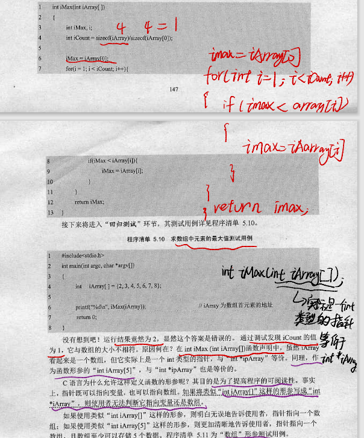

# 开发过程中遇到的BUG

## 1.Segmentation fault (core dumped) 

使用以下命令对一个`.c`进行`gdb`调试：

```cmd
gcc -g [文件名] # 以debug方式编译C语言文件
apt install gdb # 下载gdb调试器

gdb [编译好的可执行文件] # 进入gdb调试
# gdb调试命令
b [行号] # 在某一行添加断点
b [函数名] # 在函数入口处添加断点

del [断点序号] # 删除断点

run # 运行函数
s # 进入函数内部
n # 进入下一行
p &[变量] # 打印变量地址
```

`tip`：使用`gdb`调试检查程序段错误`Segmentation fault (core dumped)`。

```cmd
root@iZbp11t02fism5k702usgjZ:/home/257class/BasiC/BasiC/pointer# gcc -g demoCharPointer.c
root@iZbp11t02fism5k702usgjZ:/home/257class/BasiC/BasiC/pointer# gdb a.out
GNU gdb (Ubuntu 12.1-0ubuntu1~22.04) 12.1
Copyright (C) 2022 Free Software Foundation, Inc.
License GPLv3+: GNU GPL version 3 or later <http://gnu.org/licenses/gpl.html>
This is free software: you are free to change and redistribute it.
There is NO WARRANTY, to the extent permitted by law.
Type "show copying" and "show warranty" for details.
This GDB was configured as "x86_64-linux-gnu".
Type "show configuration" for configuration details.
For bug reporting instructions, please see:
<https://www.gnu.org/software/gdb/bugs/>.
Find the GDB manual and other documentation resources online at:
--Type <RET> for more, q to quit, c to continue without paging--c
    <http://www.gnu.org/software/gdb/documentation/>.

For help, type "help".
Type "apropos word" to search for commands related to "word"...
Reading symbols from a.out...
(gdb) run
Starting program: /home/257class/BasiC/BasiC/pointer/a.out 
[Thread debugging using libthread_db enabled]
Using host libthread_db library "/lib/x86_64-linux-gnu/libthread_db.so.1".
len:8

Program received signal SIGSEGV, Segmentation fault.
0x0000555555555192 in main (argc=1, argv=0x7fffffffe198) at demoCharPointer.c:12
12          strcpy(ptr, "hello world");
(gdb) 
```

会在末尾处打印段错误信息。

## 3.野指针

在创建指针类型数据时，若不需要赋初值，则需要将它的初始值设置为`NULL`。否则会导致内存泄漏程序崩溃等严重问题。

## 4.脏数据

在声明数组变量时，由于操作系统是随机分配内存空间，因此在新开辟的内存空间中可能会有之前遗留下来的脏数据。因此需要更新数组的初始值，用`memset`函数即可。

## 5.数组作为函数参数传递

数组作为函数参数传递时，所传递的是一个大小为`4字节`的指针数据，传递的数据是`int *array`其大小为4个字节。因此在C语言函数中，如果需要传递数组变量，则应该传递`数组指针`以及`数组大小`两个数据才可以。

