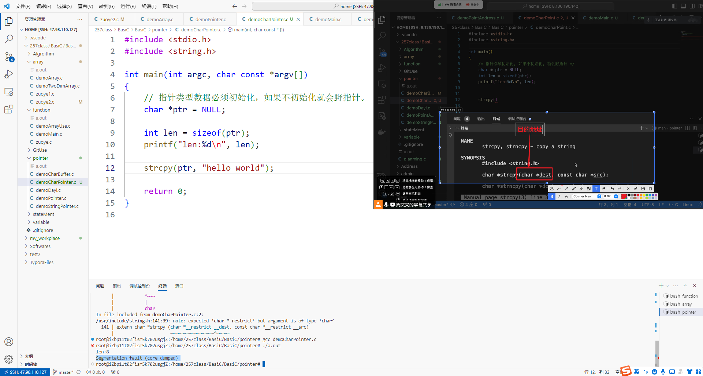

# 开发过程中遇到的BUG

## 1.Segmentation fault (core dumped) 

遇到段错误一定是地址问题

使用gdb调试

1.  循环条件有误导致死循环，需要修改循环语句中的跳出语句，以及增量是否合理。
2.  

## 2.重复定义变量

修改变量名或者取消数据类型声明即可。

## 3.野指针

在创建指针类型数据时，若不需要赋初值，则需要将它的初始值设置为`NULL`。否则会导致内存泄漏程序崩溃等严重问题。

## 4.脏数据

在声明数组变量时，由于操作系统是随机分配内存空间，因此在新开辟的内存空间中可能会有之前遗留下来的脏数据。因此需要更新数组的初始值，用`memset`函数即可。

## 5.数组作为函数参数传递

数组作为函数参数传递时，所传递的是一个大小为`4字节`的指针数据，传递的数据是`int *array`其大小为4个字节。因此在C语言函数中，如果需要传递数组变量，则应该传递`数组指针`以及`数组大小`两个数据才可以。

