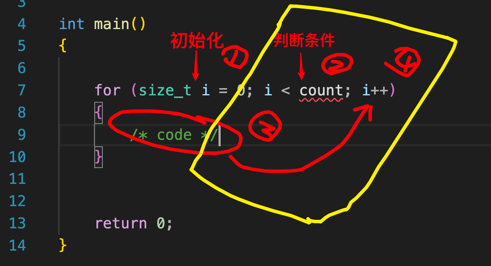
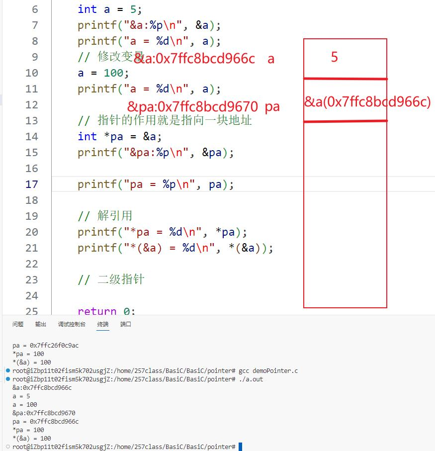
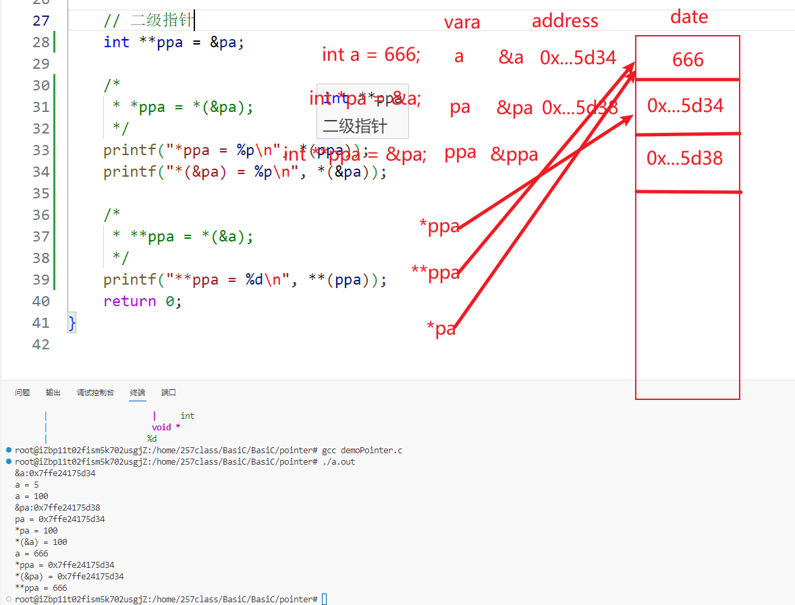
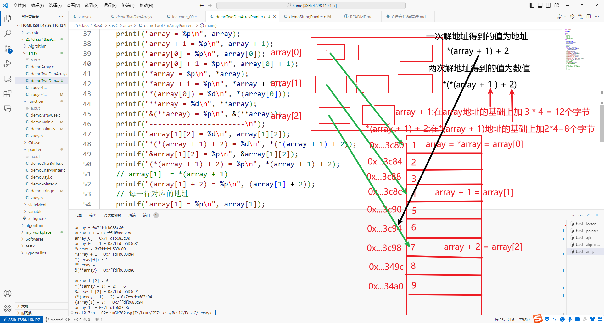
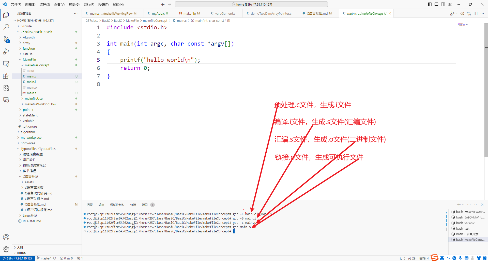
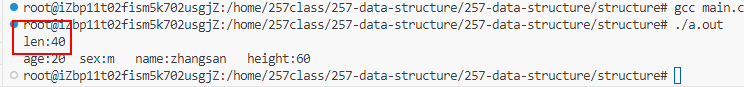
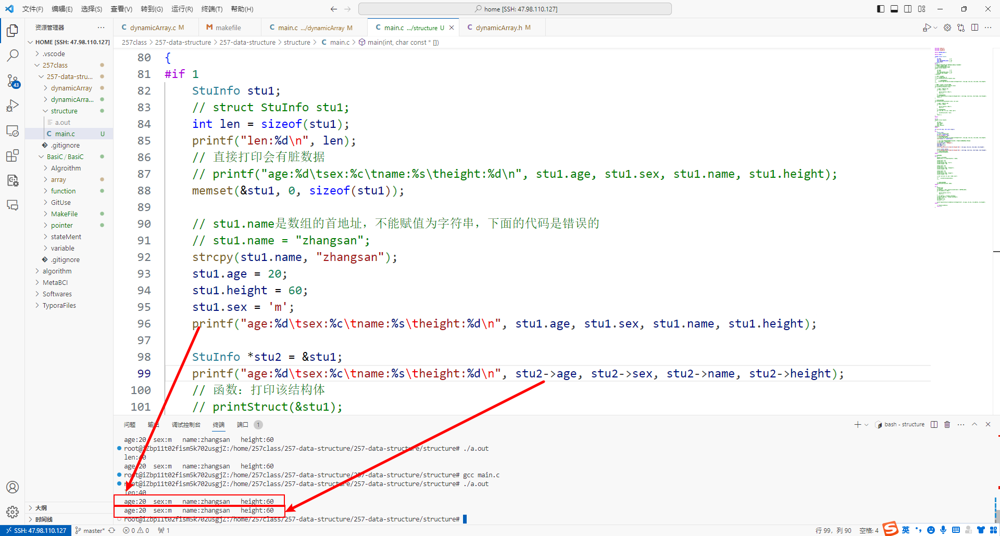
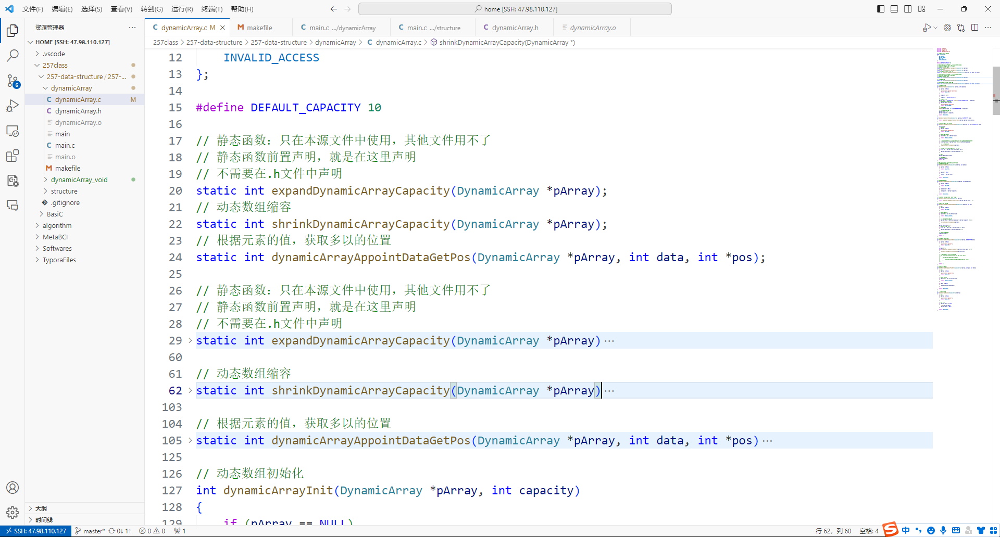

# C语言基础

## 0. 变量命名

C语言变量命名规则

1. 以字母或者下划线开始

2. 由数字 字母 下划线组成

3. 不能与C语言关键字相冲突

   **附.[C语言32个关键字](./C语言关键字.md)**

变量命名的原则

- 见名知意

------

## 1. C语言基本数据类型

**计算机内存**

- 一个字节(bytes) = 8位(bits) `无符号`：**0~255** `有符号`：**-128~127。**
- 一个字节表示的数的最小值：0000 0000 for 0  means 0。
- 一个字节表示的数的最大值：1111 1111 for 255 means 2 ^ 8 - 1。
- 两个字节(bytes) = 16位(bits) `无符号`：**0-65535** `有符号` ：**-32768~32767。**
- 两个字节表示的数的最小值：0000 0000 0000 0000 for 0   means 0。
- 两个字节表示的数的最大值：1111 1111 1111 1111 for 65535 means 2 ^ 16 - 1。
- 四个字节(bytes) = 32位(bits) `无符号`：**0~4294967295** `有符号` **-2147483648~2147483647。**
- 四个字节表示的数的最小值：0000 0000 0000 0000 0000 0000 0000 0000。
- 四个字节表示的数的最大值：1111 1111 1111 1111 1111 1111 1111 1111。
- 八个字节(bytes) = 64位(bits) **很大的数** 。
- 八个字节表示的数的最小值：0000 0000 0000 0000 0000 0000 0000 0000 0000 0000 0000 0000 0000 0000 0000 0000。
- 八个字节表示的数的最大值：1111 1111 1111 1111 1111 1111 1111 1111 1111 1111 1111 1111 1111 1111 1111 1111。

`tip`：`IPv6`：**16个字节**

**基本的进制运算**

- 16进制：`0x121` = 1 * 16 ^ 2 + 2 * 16 ^ 1 + 1 * 16 ^ 0 。

- 8进制：`0121` = 1 * 8 ^ 2 + 2 * 8 ^ 1 + 1 * 8 ^0。

- 二进制：`10011100` = `0x9C` = 9 * 16 ^ 1 + 12 * 16 ^ 0 = 156。

| 十六进制 |     0     |     1     |     2     |     3     |     4     |     5     |     6     |     7     |     8     |     9     |     A     |     B     |     C     |     D     |     E     |     F     |     G     |
| :------: | :-------: | :-------: | :-------: | :-------: | :-------: | :-------: | :-------: | :-------: | :-------: | :-------: | :-------: | :-------: | :-------: | :-------: | :-------: | :-------: | :-------: |
|  十进制  |     0     |     1     |     2     |     3     |     4     |     5     |     6     |     7     |     8     |     9     |    10     |    11     |    12     |    13     |    14     |    15     |    16     |
|  八进制  |     0     |     1     |     2     |     3     |     4     |     5     |     6     |     7     |    10     |    11     |    12     |    13     |    14     |    15     |    16     |    17     |    20     |
|  二进制  | 0000 0000 | 0000 0001 | 0000 0010 | 0000 0011 | 0000 0100 | 0000 0101 | 0000 0110 | 0000 0111 | 0000 1000 | 0000 1001 | 0000 1010 | 0000 1011 | 0000 1100 | 0000 1101 | 0000 1110 | 0000 1111 | 0001 0000 |

**基本数据类型**

- `int` 类型(integer)，整形，占4个字节，32位bit，表示范围 **-2147483648~2147483647。**
- `short` 类型，短整型，占2个字节，16位bit，表示范围  **-32768~32767**。
- `long` 类型，长整型，占8个字节，64位bit，表示范围 **很大**。
- `char` 类型，字符类型，占1个字节，8位，表示范围：**0~255**，可以表示共256个字符，其中/0用作字符串的结束符。
- `float` 类型，浮点型，占4个字节，32位，`1位数符`，`8位阶码` ，`23位尾数`。
- `double` 类型，双精度浮点型，占8个字节，64位，`1位数符`，`11位阶码` ，`52位尾数`。
- 

------

## 2. C语言运算符和表达式

**`tip`：左值和右值**

- 左值：

  - **能够出现在赋值语句左侧的表达式**：

    C语言中的左值（Lvalue，意为左值表达式）指的是`能出现在赋值语句左边`的表达式，即指向一个明确存储位置的表达式。左值表示的是对象的身份，它引用的是内存中一个具体而持久的位置。

  - 可以将左值视为**可以被赋值的实体**，因为它指向的是一个可变更的存储位置。

  - **左值不仅限于变量，它也可以是更复杂的表达式**
    - 数组元素的引用；
    - 解引用指针操作得到的结果；
    - 只要一个变量或者表达式指向一个确切的存储位置，并且可以被赋值。

- 右值：，右值是指不能位于赋值语句左边的表达式，它通常代表数据值，而不是存储位置。简单来说，右值是表达式计算后的值，或者是无法被赋值的临时量。字面常量 `10` 或者`运算符的结果`都是右值。
- `&` 运算符只能作用于一个左值。

`tip`：运算符的本质：在底层实现上，运算符代表着编译器在编译代码时应当生成何种机器指令来执行这些运算。例如，加法运算符会对应生成将两个数相加的机器指令。

运算符作用的结果：为一个右值，可以是一个常量也可以是一个变量。

```c
int a = 5;
int b = 2;
int result = a + b; // 结果取决于a和b的值 是一个变量
int result = 3 + 4; // 结果为一个常量
int result =  rand() % 10; // 结果是一个随机数，依然是一个变量
```

**算数运算符**

以下以：X = 100，Y = 30 为例

| 运算符 |                      描述                      |                             备注                             |
| :----: | :--------------------------------------------: | :----------------------------------------------------------: |
|   +    |        两个操作数相加，其结果为一个右值        |                        X+Y的结果为130                        |
|   -    |     第一个数减去第二个数，其结果是一个右值     |                        X-Y的结果为70                         |
|   *    |        两个操作数相乘，其结果是一个右值        |                        X*Y的结果是300                        |
|   /    | 左侧的操作数除以右侧的操作数，其结果是一个右值 | X/Y的结果为3，两个整数相除，其结果为一个整数，舍弃小数部分；只有两个浮点数相除时，其结果才会是小数。 |
|   %    |         取模运算，含义上为整除后的余数         |                        X%Y的结果为10                         |
|   ++   |    自加运算，作用于整数，结果为原操作数加1     |                          X++得到101                          |
|   --   |    自加运算，作用于整数，结果为原操作数减1     |                          X--得到99                           |

```C
int numX = 100;
int numY = 30;

int sum;
printf("sum:%d\n", sum = num1 + num2); // 运算符加法 打印sum的值
printf("sum:%d\n", sum); // 打印sum的值 为130
```

**关于`++X`和`X++`：**

- X++：先取X的值，后执行+1操作；
- ++X：先执行+1操作，后取X的值。

------

**逻辑运算符**

| 运算符 |                 描述                 |                       真值表                       |
| :----: | :----------------------------------: | :------------------------------------------------: |
|   &&   | 逻辑**与**运算符，全真为真，有假为假 | 0 && 0 -> 0，0 && 1 -> 0，1 && 0 -> 0，1 && 1 -> 1 |
|  \|\|  | 逻辑**或**运算符，有真为真，全假为假 | 0 && 0 -> 0，0 && 1 -> 1，1 && 0 -> 1，1 && 1 -> 1 |
|   ！   | 逻辑**非**运算符，真变为假，假变为真 |                 ! 0 -> 1，! 1 -> 0                 |

`tip`：关于`||`运算，如果左边以及确定为真，那么右边的运算符则会默认不执行。

------

**条件表达式**

`tip`：条件表达式的结果只能为`1`或`0`。

| 表达式 |                描述                |                             备注                             |
| :----: | :--------------------------------: | :----------------------------------------------------------: |
|   ==   | 判断左侧表达式与右侧编码上是否相等 | `char`类型的本质是`0~255`的数字，因此部分数字与char类型判断可能是相等的，例如`0=='\0'`的输出结果为`1`. |
|        |                                    |                                                              |

------

## 3. C语言条件语句

```C
if (/* 条件语句1 */)
{
    /* 条件语句1返回值为1执行代码 */
}
else if(/* 条件语句2 */)
{
	/* 条件语句1返回值为0,条件语句2返回值为1执行代码 */
}
else
{
    /* 条件语句1和2返回值都为0执行代码 */
}    
```

------

## 4. C语言条件选择语句

```c
switch (/* 表达式 */)
{
case /* 常量表达式1 */:
    /* 满足常量表达式1时的执行代码 */
    break;
case /* 常量表达式2 */:
    /* 不满足常量表达式1,但满足常量表达式2时的执行代码 */
    break;
……
……
default:
    /* 所有常量表达式都不满足时，执行代码 */
    break;
}
```

`switch`表达式的每一个`case`条件下都需要在代码执行结尾执行一个`break`语句，否则代码会顺序执行到下一个`break`语句或者知道代码段结束。

`tip`：`switch`选择的表达式只能是`整数`或者`字符串`。

------

## 5. C语言预编译

**#后的内容为预编译语句**

- `#ifndef` `#define` `#endif` 哟版用于`.h`头文件，用来防止重复定义头文件

```c
#ifndef __MYADD_H__
#define __MYADD_H__

int myAdd(int num1, int num2);

#endif
```

- `#define` 在程序预编译时对程序中的预编译的内容进行替换。

- `#if...#elif...#eles...#endif` 条件编译。
  - `if 0`自动注释后面的代码，编译时不生成机器指令。


------

## 6. C语言格式化输出

- `%d` 格式化输出整数。
- `%s` 格式化输出字符串。
- `%p` 格式化输出地址。
- `%c` 格式化输出字符。
- `%f` 格式化输出浮点型。

------

## 7. C语言循环语句

**C语言的三种循环语句：**

- `while` 一般用于循环次数未知的情况。‘
- `do while` 先运行一次函数体，在执行条件判断语句，先执行后判断。
- `for` 一般用于循环次数已知或者可以预测的情况。

**`for`循环执行顺序如下，初始化语句只执行一次：**



------

## 8. C语言数组

- 数组一般是一个连续的地址空间。
- 数组中存放相同的数据类型。
- 在初始化数组时，需要对数组中的脏数据进行清理，一般使用`memset`函数惊醒清理。
- 数组在定义时需要指定数组的元素个数。
- `数组名`的本质是数组的`首地址`，也是`第一个数组元素`所存放的地址。
- 数组长度为数组类型所占的字节数 * 数组中变量的个数。
- 数组作为`函数变量`时会自动退化为`指针`，因此数组作为函数变量时必须指定数组的长度。

------

## 9. C语言内存

内存共有四个分区

1. 非法地址区：`0~4个字节`
2. 全局区：没有大小概念，存储字符串常量。全局区或静态区用于存储全局变量、静态变量和常量。在程序启动时就已经分配好，直到程序结束才会被释放。全局区的特点是可以被整个程序访问，而且在程序的生命周期内都存在。
3. 堆区：堆区的大小与内存条大小有关，对程序员可见，`malloc`申请内存空间。
4. 栈区：`8MB`，系统自动分配，主要存放函数调用过程中的一些局部变量或者临时参数。

`tip`：C语言函数中的所有普通变量(数据类型修饰的变量)都存放在栈区。

------

## 10. C语言函数

C语言函数的三要素：

- 函数名：见名知意

- 函数参数：

  - 传入参数

    在函数中可以被修改或者引用的参数。

    - `整形数据`：没有指针修饰的就是传入参数，即`值传递`
    - `字符串`：没有`const`修饰的变量就是传入参数，这样的变量在函数中可以自由被修改。

  - 传出参数：

    由于函数只有一个返回值，当需要对多个参数进行修改时，就会用到传出参数，即参数本生一般没有值或者是在函数中需要进行更改的变量。

    - `整形数据`：有指针修饰的就是传出参数，即`地址传递`

    - `字符串`：被`const`修饰的变量就是传出参数。

      `tip`：const修饰的是`char *`，即不能被修改的是 字符指针变量而不是字符串本身，因此在函数中字符串还是可以被修改并作为传出参数的。

- 函数返回值

------

## 11. C语言字符串

- 字符串存放位置：`全局区`

C语言字符串的4中声明类型：

- 其中`赋值方式2`和`赋值方式3`由于是双引号声明的变量，因此在结尾会加一个`\0`
- `tip`：`strlen`与`sizeof`的区别

`sizeof`:

一般来说，`sizeof`用于计算数据的长度，即所占字节数。

|           用途           | 举例                         |         结果         |                             解释                             |
| :----------------------: | ---------------------------- | :------------------: | :----------------------------------------------------------: |
|   `sizeof(字符串指针)`   | char *pa = "hello world"     |          8           | 作为字符串指针，那么它的数据类型为指针类型，指针类型固定占8字节内存。 |
|  `sizeof(基本数据类型)`  | int a = 100                  | 数据类型所占的字节数 |                              /                               |
| `sizeof(不定长字符数组)` | char array[] = "hello world" |          12          | 当需要计算的数据类型是数组时，`sizeof(array)`所代表的是一整个数组的长度(字符串长度加上一个`\0`，`11 + 1 = 12`)，数组的声明实际上相当于`char[] array = "hello world"`，即整个`char[]`为array的数据类型。 |
|  `sizeof(定长字符数组)`  | char array[20]               |          20          | 含义同上，相当于`char[20] array`。其结果为20个`char`类型变量的总长度。 |

`sizeof`和`strlen`的区别于联系：

|          |       用途       |                        字符数组的大小                        |
| :------: | :--------------: | :----------------------------------------------------------: |
| `sizeof` |   计算数据大小   | 当声明字符数组时`声明了字符数组的大小`，那么结果就是所声明的大小；如果`未指定字符数组的大小`，那么计算结果就是字符串的长度加上一个`\0`的大小，例如"hello world"，字符串长度为11个字节，加上一个`\0`为12个字节。 |
| `strlen` | 计算字符串的长度 | 这个函数返回的是当前字符串的长度，不包含`\0`，因此同样对于一个字符串"hello world"，这个函数的计算结果则是`11`。然而，由于`strlen`函数的特性，并且只有以被`双引号`包起来的字符串才`会在末尾自动加一个\0`。当没有找到`\0`时，它就会一直往下计算，因此当一个函数声明了多个字符数组，或者存在脏数据时，这个函数会产生运算错误。 |

```C
/* 字符数组 */
char buffer[BUFFER_SIZE];
/* 清理脏数据 */
memset(buffer, 0, sizeof(buffer));

// 字符赋值方式1:
buffer[0] = 'h';
buffer[1] = 'e';

// 字符赋值方式2:
/* strcpy 目的操作数 源操作数 */
strcpy(buffer, "hello world");
printf("buffer:%s\n", buffer);

// 字符赋值方式3:直接赋值
char buffer2[BUFFER_SIZE] = "hello world"; 
printf("buffer2:%s\n", buffer2);

// 字符赋值方式4:直接赋值
char buffer3[BUFFER_SIZE] = {'h', 'e', 'l','l', 'o'}; 
printf("buffer3:%s\n", buffer3);
```

------

## 12. C语言指针

介绍两个指针相关的运算符。

- `*` 既可以充当指针变量的声明，也是运算符`解引用`符号。
- `&` 取地址符号。

只有指针类型的变量才能与`*`运算符结合，结合后得到的内容是当前指针指向的内存空间所保存的数据，可能是任何类型的数据。

只有保存在内存空间中的数据才能与`&`运算符结合，结合后得到的内容是当前数据所在的地址空间，是一个之战类型的数据。

`tip`：指针类型的数据本质就是`地址`，占`8个字节`，但是由于操作系统分页存储的原因，在打印时一般只显示6字节的地址内容，高16位表示页号。

`tip`：所有`指针`类型数据就是`地址`，`地址`也是`指针`类型的数据。但是指针所指向的内容要看指针所指向的内存空间的数据类型，可能是任意类型数据。



**二级指针**

- 二级指针的本质也是指针。
- 该二级指针修饰的类型是 `int **`，变量名为`ppa`。
- `*`作用于二级指针所得到的数据还是一个地址，或者说还是一个指针类型数据。
- 二级指针指向的指针数据为`*ppa`，在内容上与`pa`相同。



**使用指针**

- 声明指针类型数据必须进行初始化，如果暂时不能确定指针所指向的地址空间，则需要对指针赋值`NULL`，指向地址空间`0x00`，但是这块地址空间是非法的，对这块内存空间进行任何操作都会导致段错误`Segmentation fault (core dumped)`。

- 在使用指针作为函数参数时，在函数中第一步必须进行判空。

  **判空后操作**

  - 如果空指针在这个函数中是非法的，那么需要立即终值函数。

    - 终止操作：

      `perror("错误信息");`

      `exit(-1);`

  - 如果后续需要使用到这个指针，那么必须对这个指针数据`pointer`进行初始化。

    - 假设这个指针为：`char *pointer = NULL;`

      `pointer = (char *)malloc(size);`

      `size`必须以参数的形式通过函数传递。

------

## 13. **gdb**调试

使用以下命令对一个`.c`进行`gdb`调试：

```cmd
gcc -g [文件名] # 以debug方式编译C语言文件
apt install gdb # 下载gdb调试器

gdb [编译好的可执行文件] # 进入gdb调试
# gdb调试命令
b [行号] # 在某一行添加断点
b [函数名] # 在函数入口处添加断点
b [文件名]: [行号] # 在某个文件的某一行处加断点

del [断点序号] # 删除断点
call [函数名] # 查看函数信息

run # 运行函数
s # 进入函数内部
n # 进入下一行
p &[变量] # 打印变量地址
bt # 查看函数栈调用过程，显示栈帧
f # 到指定的栈帧
set pr pr # 设置打印格式
info thread # 查看进程
thread [线程序号] # 进入指定的线程
l # 查看代码
```

`tip`：使用`gdb`调试检查程序段错误`Segmentation fault (core dumped)`。

```cmd
gcc -g demoCharPointer.c
gdb a.out
run
# 会在末尾处打印段错误信息。
```

```cmd
root@iZbp11t02fism5k702usgjZ:/home/257class/BasiC/BasiC/pointer# gcc -g demoCharPointer.c
root@iZbp11t02fism5k702usgjZ:/home/257class/BasiC/BasiC/pointer# gdb a.out
GNU gdb (Ubuntu 12.1-0ubuntu1~22.04) 12.1
Copyright (C) 2022 Free Software Foundation, Inc.
License GPLv3+: GNU GPL version 3 or later <http://gnu.org/licenses/gpl.html>
This is free software: you are free to change and redistribute it.
There is NO WARRANTY, to the extent permitted by law.
Type "show copying" and "show warranty" for details.
This GDB was configured as "x86_64-linux-gnu".
Type "show configuration" for configuration details.
For bug reporting instructions, please see:
<https://www.gnu.org/software/gdb/bugs/>.
Find the GDB manual and other documentation resources online at:
--Type <RET> for more, q to quit, c to continue without paging--c
    <http://www.gnu.org/software/gdb/documentation/>.

For help, type "help".
Type "apropos word" to search for commands related to "word"...
Reading symbols from a.out...
(gdb) run
Starting program: /home/257class/BasiC/BasiC/pointer/a.out 
[Thread debugging using libthread_db enabled]
Using host libthread_db library "/lib/x86_64-linux-gnu/libthread_db.so.1".
len:8

Program received signal SIGSEGV, Segmentation fault.
0x0000555555555192 in main (argc=1, argv=0x7fffffffe198) at demoCharPointer.c:12
12          strcpy(ptr, "hello world");
(gdb) 
```

------

## 14. 字符串与字符数组

**字符串存放位置**：`全局区`

`字符串`：

- 所有用双引号括起来的都是字符串。
- 所有字符串都会在末尾处添加一个`\0`作为结束标志。
- 字符串长度为：`字符个数+1`

`字符数组`：

- 字符数组的大小为数组大小。
- 使用以下两种方式初始化字符数组时，不会在末尾自动添加`\0`：

```C
char buffer[BUFFER_SIZE];
/* 清理脏数据 */
memset(buffer, 0, sizeof(buffer));
// 字符赋值方式1:
buffer[0] = 'h';
buffer[1] = 'e';
// 字符赋值方式4:
char buffer3[BUFFER_SIZE] = {'h', 'e', 'l','l', 'o'}; 
```

- 使用以下方式初始化字符数组会在末尾添加`\0`：

```c
// 字符赋值方式2:
strcpy(buffer, "hello world");
// 字符赋值方式3:
char buffer2[BUFFER_SIZE] = "hello world"; 
```

- 对字符数组=赋值时，后面跟着的字符串长度可能会超出字符数组的大小，这个时候就有可能访问到一些不能被访问的内存，这个操作就叫做`踩内存`，而这种操作是不被允许的。

字符串和字符数组的内存分配：

- 字符数组在声明时自动在`栈`空间分配内存，这也是其他基本数据类型的分配内存方式；
- 字符串指针初始化时，如果不对其赋初值，那么必须使其指向`NULL`，其内存空间为`0x00`;
- 系统中程序员分配的空间为堆空间，可以使用`malloc`函数初始化申请空间。并且所有malloc申请的内存空间都要进行`判空`操作，且在用完后都要进行`free`释放内存。


------

## 15. 堆泄漏

**有三种堆泄漏的情况**

- `野指针`：声明指针类型数据，但是没有初始化，如`char *ptr;`。
- `malloc申请的内存空间没有释放`。
- `踩内存`：访问了原本不属于变量自己的内存空间就叫做踩内存，一般发生在数组中。
  - `int array[20]; array[21] = 0;`。
  - `for`循环数组下表访问不当也会引起这样的问题。

**检查内存泄漏的命令：**

```cmd
valgrind --tool=memcheck --leak-check=yes --show-reachable=yes ./[需要检查的.exe文件]
```

------

## 16. 指针即数组

声明数组变量：

```c
int arrray[20];
```

上述代码等价于`int[20] array `

- 表示变量`array`是一个有`20个int空间`的数组类型变量。
- 同时`array`也是这20个数组空间的首地址。
- `array`与`&array[0]`是相同的。
- 同时`array`与`&array[0]`都是地址数据，同时也是指针类型的变量。

`tip`：数组作为函数变量时会自动退化为指针，因此数组作为函数变量时必须指定数组的长度。

例如：

```c
int main(int argc, char const *argv[])
{
    return 0;
}
```

- `argc`为传入参数的个数

- `argv`为传入参数的地址列表

------

## 17. 二维数组与二维指针

**二维数组是由一维数组构成的：**

`int array[ROW][COLUMN]`，`加一`作用于不同的变量，它加上的值是不同的：

- `array`，array为二级指针，即指向指针的指针。`+1`作用于`array`，`array`的值加上`4 * COLUMN`。
- `*array`或者`array[x]`，它们都是一级指针。`+1`作用于它们，它们的值加上`4`.

```c
#include <stdio.h>
#include <string.h>

#define ROW 3
#define COLUMN 3

// 二维数组
int main()
{
#if 0
    int array[3];

    array[0] = 1;
    array[1] = 1;
    array[2] = 1;
    // 不是自己的空间不能放
    array[3] = 1;
#endif

#if 1
    int array[ROW][COLUMN];
    memset(array, 0, sizeof(array));
    /*  1.占用内存大小 */
    int len = sizeof(array);
    printf("len:%d\n", len);

    /*  2.赋值 */
    // a[0][0] = 0;
    int value = 1;
    for (int idx = 0; idx < ROW; idx++)
    {
        for (int jdx = 0; jdx < COLUMN; jdx++)
        {
            array[idx][jdx] = value++;
        }
    }

    printf("array = %p\n", array);
    printf("array + 1 = %p\n", array + 1);
    printf("array[0] = %p\n", array[0]);
    printf("array[0] + 1 = %p\n", array[0] + 1);
    printf("*array = %p\n", *array);
    printf("*array + 1 = %p\n", *array + 1);
    printf("*(array[0]) = %d\n", *(array[0]));
    printf("**array = %d\n", **array);
    printf("&(**array) = %p\n", &(**array));

    printf("-----------------------\n");

    printf("array[1][2] = %d\n", array[1][2]);
    printf("*(*(array + 1) + 2) = %d\n", *(*(array + 1) + 2));

    printf("&array[1][2] = %p\n", &array[1][2]);
    printf("(*(array + 1) + 2) = %p\n", *(array + 1) + 2);

    // array[1]  = *(array + 1)
    printf("(array[1] + 2) = %p\n", (array[1] + 2));
    // 每一行对应的地址
    printf("array[1] = %p\n", array[1]);
#endif
}
```

上述代码打印结果：

```cmd
root@iZbp11t02fism5k702usgjZ:/home/257class/BasiC/BasiC/array# ./a.out
len:36
array = 0x7ffdfb683c80
array + 1 = 0x7ffdfb683c8c
array[0] = 0x7ffdfb683c80
array[0] + 1 = 0x7ffdfb683c84
*array = 0x7ffdfb683c80
*array + 1 = 0x7ffdfb683c84
*(array[0]) = 1
**array = 1
&(**array) = 0x7ffdfb683c80
-----------------------
array[1][2] = 6
*(*(array + 1) + 2) = 6
&array[1][2] = 0x7ffdfb683c94
(*(array + 1) + 2) = 0x7ffdfb683c94
(array[1] + 2) = 0x7ffdfb683c94
array[1] = 0x7ffdfb683c8c
root@iZbp11t02fism5k702usgjZ:/home/257class/BasiC/BasiC/array# 
```

###### 

------

## 18. C语言文件编译的过程

`预编译->编译->汇编->链接`

1. ##### 预编译

   C++文件：`gcc -E [文件名.cpp] > [预处理文件名.ii]`：生成`.ii`文件

   C语言文件：`gcc -E [文件名.c] > [预处理文件名.i]`：生成`.i`文件

   预编译的工作内容

   - 展开头文件 ：`#include <stdio.h>`
   - 宏替换
   - 去掉代码中的注释
   - 条件编译

2. ##### 编译

   目标：生成`.s`文件(汇编文件)

   `gcc -S [预处理文件名.i]`

3. ##### 汇编

   目标：生成`.o`文件

   `gcc -c [编译文件名.s]`

4. **链接**

   目标：生成`.exe`文件

   `gcc [汇编文件名.o]`

```cmd
# 示例代码
gcc -E main.c > main.i
gcc -S main.i
gcc -c main.s
gcc main.o
```



------

## 19. C语言结构体

- ##### 结构体的大小：

  结构体数据的大小，会默认向结构体成员中最大的那个数据类型对齐。结构体的大小总会是最大的数据类型的大小的整数倍。

  ```c
  typedef struct StuInfo
  {
      int age;                 // 4
      int sex;                 // 1
      char name[BUFFER_SIZE];  // 32
      char height;   			// 1
  };
  ```

  C语言的结构体有独特的内存对齐机制。这样有利于快速查找某个结构体变量在内存空间中所在的位置。

  因此，打印上述代码结构体类型的大小，其结果会是40。

  

- ##### 结构体的声明

  - 使用`typedef`定义结构体的别名，下面都用这个别名来声明结构体。
  - 直接使用`struct [结构体名称]`来声明结构体。

  ```C
  typedef struct StuInfo
  {
      int age;                // 4
      int sex;                // 1
      char name[BUFFER_SIZE]; // 32
      unsigned char height;   // 1
  } StuInfo;
  
  int main()
  {
      struct StuInfo stu;
      StuInfo stu1;
  }
  ```

- ##### 获取结构体成员变量

  - 对于结构体变量，使用运算符`.`来获取结构体变量的某一个成员变量。
  - 对于结构体指针，使用运算符`->`来获取结构体指针所指向的那个结构体的成员变量。

  
  
- **结构体作为函数参数**

  一般来说，结构体的大小会比较大，因此当结构体作为函数参数时，需要使用结构体指针来传递变量，这样既可以满足函数修改的需要，又可以节约系统带宽资源。

- **需要特别注意的，结构体指针成员变量**

  当指针作为结构体成员变量时，声明结构体变量之后需要对这些结构体指针成员进行初始化。

  包括但不限于：

  - `malloc`初始化。
  - 判断`malloc`初始化是否成功。
  - 除脏数据。

## 20. 静态函数

与其他函数不同，静态函数需要在源文件，即`.c`文件中进行声明与定义。声明与定义都在源文件宏定义的下方，其他函数的上方。

与其他函数不同，静态函数只对程序员可见，因此在确定没有问题的情况下，静态函数传入的指针变量可以不进行判空。



## 21. 静态变量

静态声明的变量全局有效。

## 22. 


