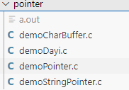

# C语言语法规范

## 1. 文件命名

必须以`驼峰式`命名：

第一个单词的首字母小写，其他单词首字母大写

------

## 2. 变量命名

命名规范：

- `见名知意`：能从变量名推测出变量的含义。
- `驼峰式命名`。
- 用`英文命名`而不要用拼音。

## 3. 代码规范

- 所有的代码中不能出现`魔数`：除了`-1,0,1`以外的其他数组。
- 数组大小用`#define BUFFER_SIZE`宏定义代替。
- 所有的`运算符两边`要有`空格`。
- for循环语句中的变量只能用`idx`的形式。
- 所有的数组声明后需要用`memset`函数处理脏数据。

- 

- 

- 
