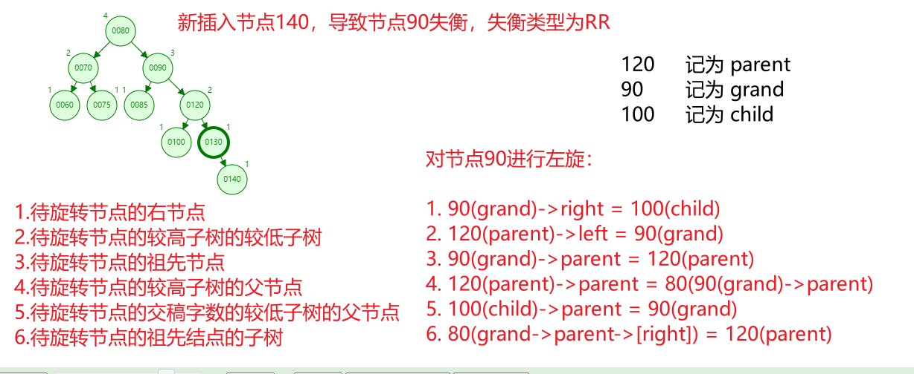
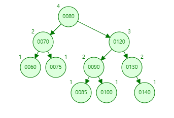
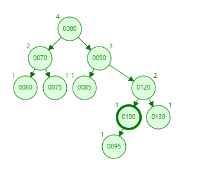
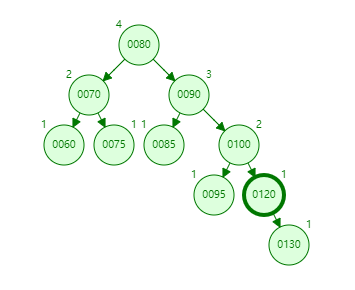
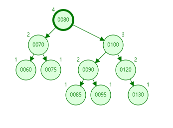
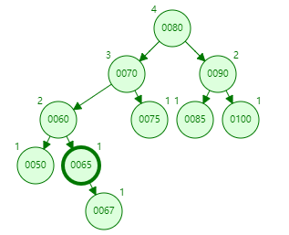
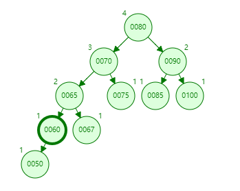
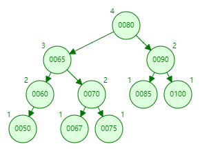

# `AVL`

## 一、平衡因子

- 平衡因子：`AVL`节点的左子树节点的高度与右子树节点的高度的差。

- 节点的平衡：当节点的平衡因子的值为`1`，`0`，`-1`时，节点是平衡的。

------

## 二、`AVL`区别于二叉排序树

- `AVL`结点需要一个节点高度属性来判断当前节点是否平衡。
- 只有插入和删除操作会对`AVL`节点的平衡属性产生影响。
  - 删除操作会影响插入位置的一系列的祖先节点，包括`insertNode->parent`，`insertNode->parent->parent`等。

### `AVL`的插入

当插入节点时：

- 新增的节点一定是叶子节点，即新插入的节点高度一定为`1`。
- 只会影响其`祖父`节点及其以上的`祖先`节点的不平衡。
- 只需要将最低的不平衡节点恢复平衡，上面的节点会自动恢复平衡。

- 新增节点一定`不`会导致`父节点`失衡。

根据以上特性，确定插入操作的基本算法：

1. 插入节点。
2. 向上更新每一个`祖先`结点的节点高度。
3. 在更新高度的同时判断节点是否失衡。
4. 若失衡，执行相关旋转操作并更新节点高度。
5. 继续向上更新节点高度，直到根结点。

### `AVL`的删除

当删除节点时：

- 会导致父节点及其以上的祖先节点失衡。
- 当删除一个节点时，会导致其父节点失衡，父节点调整完毕后，有可能导致祖父失衡，触发连锁反应。

根据以上特性，确定删除操作的一般步骤：

1. 删除节点。
2. 向上更新每一个祖先节点的高度。
3. 在更新节点高度的同时判断节点是否失衡。
4. 若失衡，判断失衡的类型，并执行相应的旋转操作。
5. 重复执行`2->3->4`操作直到遍历到根结点。

## 三、`AVL`失衡分类

### `RR`

- 不平衡节点的右子树更高。
- 不平衡节点的右子树一定是一个平衡节点，这个平衡节点的右子树更高。

以上两点可以确定这个节点的失衡类型为`RR`。

#### 调整办法：

- 将那个不平衡节点进行左旋(将90左旋)。

旋转后的二叉树：

### `RL`

- 不平衡节点的右子树更高。
- 不平衡节点的右子树一定是一个平衡节点，这个平衡节点的左子树更高。

以上两点可以确定这个节点的失衡类型为`RL`。

#### 调整办法：

- 先对不平衡节点的右孩子结点进行右旋(将120左旋)。
- 再对不平衡节点进行左旋(将90右旋)。

右旋后的二叉树：

先右旋再左旋后的二叉树：

### `LR`

- 不平衡节点的左子树更高。
- 不平衡节点的左子树一定是一个平衡节点，这个平衡节点的右子树更高。

以上两点可以确定这个节点的失衡类型为`LR`。

#### 调整办法：

- 先对不平衡节点的右孩子结点进行左旋(将60左旋)。
- 再对不平衡节点进行右旋(将70右旋)。

左旋后的二叉树：

先左旋后右旋后的二叉树：

### `LL`

- 不平衡节点的左子树更高。
- 不平衡节点的左子树一定是一个平衡节点，这个平衡节点的左子树更高。

以上两点可以确定这个节点的失衡类型为`LL`。

#### 调整办法：

- 将那个不平衡节点进行右旋(将70右旋)。

- 节点`65`记为 `parent`
- 节点`70`记为 `grand`
- 节点`67`记为 `child`

对节点`70`进行右旋：

1. 70(grand)->right = 67(child)
2. 65(parent)->left = 70(grand)
3. 70(grand)->parent = 65(parent)
4. 65(parent)->parent = 80(70(grand)->parent)
5. 67(child)->parent = 70(grand)
6. 80(grand->parent)->[right] = 65(parent)

旋转后的二叉树：

