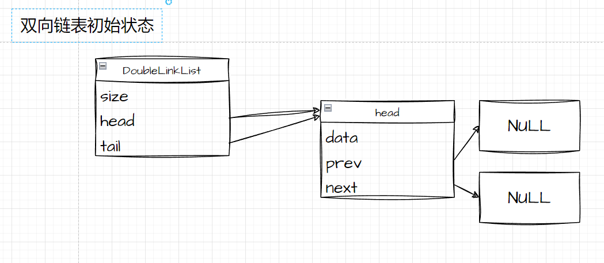
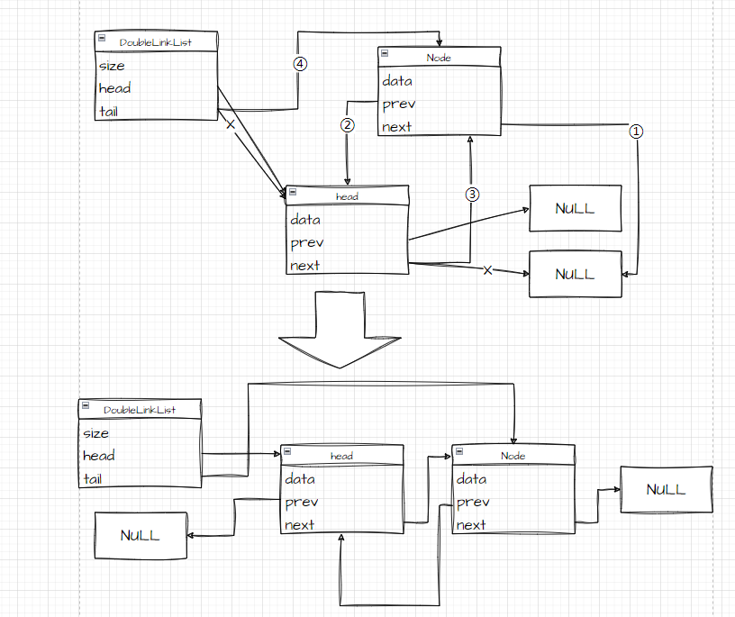
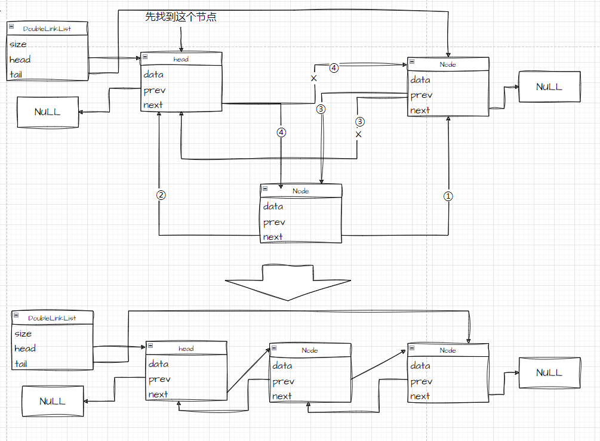
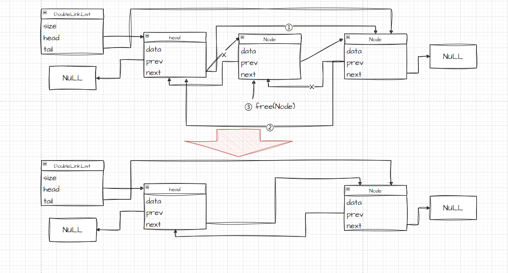
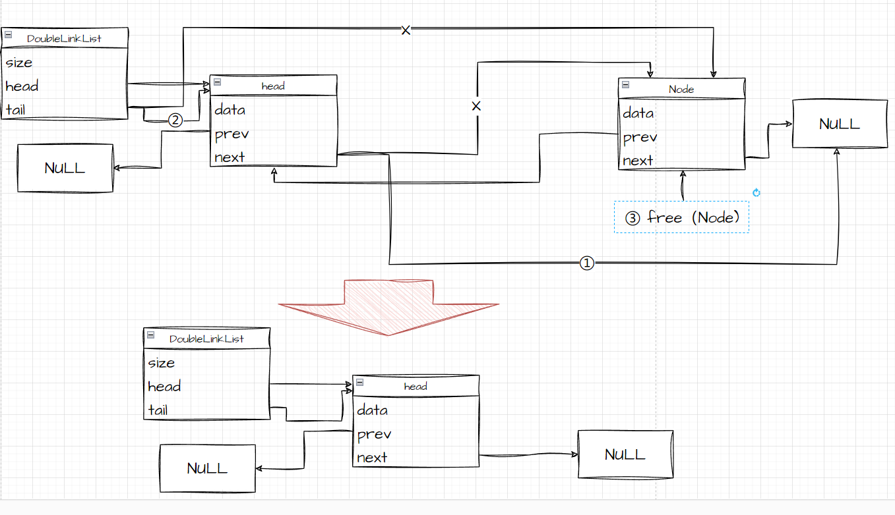

## 一、 数据结构

```c
struct DoubleLinkNode
{
    // 数据域
    ELEMENTTYPE data;
    // 指针域
    struct DoubleLinkNode *next; // 前驱指针
    struct DoubleLinkNode *prev; // 后继指针
};

struct DoubleLinkList
{
    // 节点个数
    int size;
    // 链表头结点(虚拟头结点)
    DoubleLinkNode *head;
    // 链表尾指针
    DoubleLinkNode *tail;
};
```



------

## 二、在单向链表基础上修改的函数

#### 初始化链表

```c
/* 链表初始化
 * @param *pList 要初始化的链表
 * @return 非零表示初始化失败
 */
int doubleLinkListInit(DoubleLinkList **pList);
```

- 在单向链表初始化的基础上，将双链表的尾指针指向头结点。

#### 创建新节点

```c
/* 创建一个链表节点
 * @param data 需要插入的数据
 * @return 返回一个链表节点，为新申请的内存空间
 */
static DoubleLinkNode *createDoubleLinkNode(ELEMENTTYPE data);
```

- `malloc`动态申请一个新的结点。
- 判空并清除脏数据。
- 数据域指针设置为参数`data`。
- `next`与`prev`分别指向NULL。

#### 插入节点

```c
/* 链表任意位置插
 * @param *pList 要插入数据的链表
 * @param data 要插入的数据
 * @param pos 要插入的位置
 * @return 非零表示插入失败
 */
int doubleLinkListAppointPosInsert(DoubleLinkList *pList, int pos, ELEMENTTYPE data);
```

- 先判断是否需要移动尾指针。
- 根据是否需要移动尾指针做不同的节点插入操作。

**需要移动尾指针：**



**不需要移动尾指针：**



#### 删除节点

```c
/* 链表删除任意位置
 * @param *pList 要查询的数组
 * @param pos 删除的位置信息
 * @return 非零表示查询失败
 */
int doubleLinkListAppointPosDelete(DoubleLinkList *pList, int pos);
```

- 根据是否需要移动尾指针来做不同的删除操作。

**不需要移动尾指针：**



**需要移动尾指针：**




