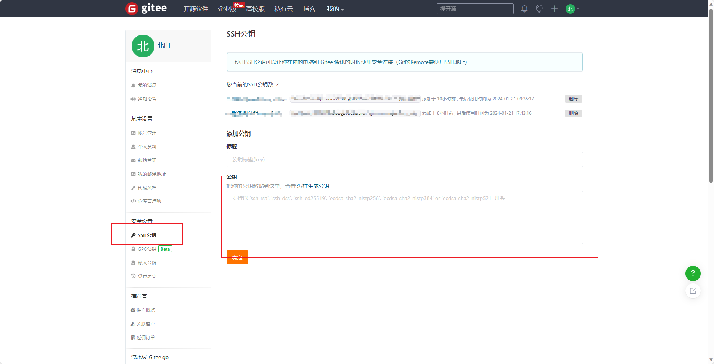

# 云服务器+gitee部署工作区及Git基础

## 一、搭建云服务器/虚拟机(以云服务器为例)

进入阿里云官网 `https://cn.aliyun.com/ `

点击免费试用，进入云服务器 ECS试用。


产品规格选择1核2GB内存，操作系统选择`Ubuntu`。


完成云服务器创建后，点击前往控制台，进入云服务器管理控制台，点击实例查看当前创建的服务器。


按上述步骤，重置实例密码后点击远程连接->立即登录进入服务器终端窗口。

这样就搭建完了一个基础的阿里云服务器。

------

## 二、 获取服务器公钥

输入`ssh-keygen`获取ssh公钥

因为ssh协议是加密协议，发送和接收的数据都需要通过本地的ssh公钥进行加密和解密。并且为了安全考虑，防止数据在发送过程中被他人获取解密，ssh协议传输数据时不会发送公钥，而是在第一次进行连接时就将公钥保存到本地，后续的收发操作只需要在本地使用公钥加密后，将加密后的秘文发送到网络上即可。

输入ssh-keygen命令就是使用ssh协议进行第一次连接的过程，秘钥文件会被保存到用户工作目录下的.ssh文件夹下。


输入 `cd ~/.ssh/` 进入.ssh文件夹。

输入 `cat id_rsa.pub` 查看ssh公钥，并将公钥内容复制下来。


```cmd
ssh-keygen
cd ~/.ssh/
cat id_rsa.pub
```

------

## 三、 部署git仓库到云服务器上

进入gitee官网，点击账号设置下的ssh公钥界面，将复制的ssh公钥粘贴到下方并设置公钥名称。




这样就将公钥部署到了git上，以后就可以使用git进行数据的传送和接收了。

------

## 四、 新建仓库

点击右上角加号新建仓库，根据你的需要设置仓库名称和路径，并初始化你的仓库。

值得注意的是，你的仓库名称和路径名称是接下来你呀创建的工作目录的路径并且仓库路径的下一级才是你的工作目录，因此有必要对仓库名称和路径名称做个性化的更改，防止后续操作的问题。

`../仓库名称/路径名称/工作目录`


复制你的域名(推荐选择ssh协议)。


------

## 五、部署git仓库到云服务器

执行 `cd /home`并在当前目录创建一个你未来需要经常使用的工作文件夹，这里以TyporaFiles为例。

```
cd /home
mkdir TyporaFile
cd TyporaFile
git clone [上一步复制的域名]
```

等待项目部署完成即可，这样你就将你的工作仓库部署到云服务器上了。

------

## 六、 使用VSCode远程连接云服务器

打开VSCode，下载`Remote - ssh`远程连接拓展


下载完成后，点击左下角进行远程连接，选择连接到主机。


在上方输入 `root@[你的云服务器IP地址]`  ，并输入密码进行连接。


连接完成后选择打开文件夹，进入/home文件夹，再次输入密码，这样你就完成了部署git仓库到VSCode的全部操作。

------

## 七、 提交本地工程到服务器

在提交文件之前，需要进行个人信息配置以确保当前文档的提交人是你。

```cmd
git config --global user.email "你的邮箱"
git config --global user.name "你的用户名"
```

当你完成了你的工作并想把工作文件提交到git仓库时，右键选择你所需要的提交的工程文件所在的文件夹，点击在集成终端中打开。


在下方打开的终端中输入：

```cmd
git add zuoye.c
git commit -m "提交文档的日志信息"
git push
git status 
```

`git add [文件名]`，将工作区文件添加到暂存区。

`git commit -m` ，将暂存区文档部署git到对象区。

`git push` ，将本地对象区文档部署到git仓库。

`git status` ，查看当前目录下的文件所在的git分区。


当你发现 `git commit -m "提交文档的日志信息"` 的文档信息有误时，可以使用 `git commit amend -m "修改描述"` 修改你的描述信息。

当发现提交的文档有误时，可以使用 git log 查询你所需要回退的版本ID，并使用 `git reset --hard  +  git push -f "commitid"` 回退到你所需要的版本

```cmd
git log 
git commit amend -m "修改描述"
git reset --hard  +  git push -f "版本回退id"
```


------

## 八、 配置云服务器安全组

