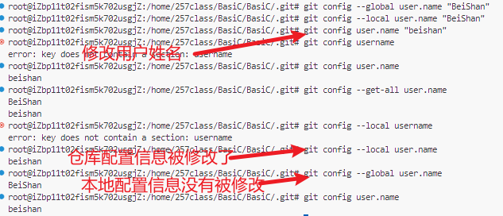
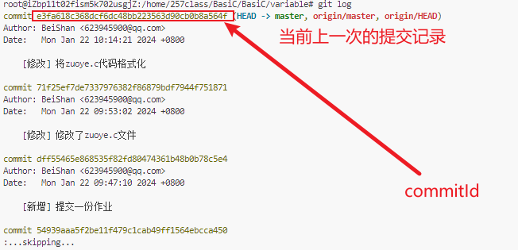

# Git 学习日记

------

## 零、 git底层的数据结构(图)

------

## 一、 git 工作区

git的三个区：

​	1.工作区 红色

​	2.暂存区 绿色

​	3.对象区 紫色

从工作区部署git文档到暂存区：`git add`

从暂存区部署git文档到对象区：`git commit -m "[修改描述]"`，-m 添加此次修改描述

从对象区部署git文档到远程仓库：`git push`

------

## 二、git config 配置工具 

命令格式：`git config [参数]`

常用参数：`--system` `--global` `--local` `--list` `--get` `--add`

Tip：Ubuntu系统自带Git，因此不需要下载，这也就是为什么课上没有下载Git但是可以使用git命令的原因。

### git配置文件参数

​	权限层级：`--system` `--global` `--local`

​	1.`/etc/gitconfig` 文件，下载git时在git安装目录下，这个配置文件包含了Git官方的基本配置信息，也是不做任何修改默认的配置信息。可以通过 `--system`选项再加上你要读取或修改的**配置项**来让 Git 读写此文件。

​	2.`~/.gitconfig` 或 `~/.config/git/config` 文件：只针对当前用户。 可以通过 `--global`选项再加上你要读取或修改的配置项来让 Git 读写此文件，这会对你系统上 **所有** 的仓库生效。

​	3.每个git仓库也自带一个·`git/config`文件：只针对**当前仓库**生效。可以通过`--local`选项加上所需要读写的配置项来让Git读写当前配置文件。


​	每个级别的配置文件回自动覆盖上一级文件的配置信息，即当**当前仓库**配置信息优先级高于**当前用户**的本地配置信息，本地配置信息优先级高于**Git默认的配置信息**，但是不对当前仓库的配置信息进行修改的话，Git会沿用上一级的配置信息。


修改配置信息时，如果没有指定修改的配置信息是哪个权级，则会优先修改最近一级的配置信息



### 其他常用参数

git config --list：查看索引的配置信息

```cmd
root@iZbp11t02fism5k702usgjZ:/home/TyporaFiles/TyporaFiles/typora_files# git config --list
user.email=623945900@qq.com
user.name=BeiShan
core.repositoryformatversion=0
core.filemode=true
core.bare=false
core.logallrefupdates=true
remote.origin.url=git@gitee.com:beishan0311/TyporaFiles.git
remote.origin.fetch=+refs/heads/*:refs/remotes/origin/*
branch.master.remote=origin
branch.master.merge=refs/heads/master
root@iZbp11t02fism5k702usgjZ:/home/TyporaFiles/TyporaFiles/typora_files# 
```

git config --list --show-origin：查看所有的配置信息以及它们所在的文件夹

```cmd
root@iZbp11t02fism5k702usgjZ:/home/TyporaFiles/TyporaFiles/typora_files# git config --list --show-origin
file:/root/.gitconfig   user.email=623945900@qq.com
file:/root/.gitconfig   user.name=BeiShan
file:.git/config        core.repositoryformatversion=0
file:.git/config        core.filemode=true
file:.git/config        core.bare=false
file:.git/config        core.logallrefupdates=true
file:.git/config        remote.origin.url=git@gitee.com:beishan0311/TyporaFiles.git
file:.git/config        remote.origin.fetch=+refs/heads/*:refs/remotes/origin/*
file:.git/config        branch.master.remote=origin
file:.git/config        branch.master.merge=refs/heads/master
root@iZbp11t02fism5k702usgjZ:/home/TyporaFiles/TyporaFiles/typora_files# 
```

------

## 三、 git help 获取用户手册

命令格式：

1. `git help <变量>`
2. `git <变量> --help`
3. `man git--<变量>`
4. `git <变量> -h`

man for manul 用户手册。按Z翻页，Q退出，E换行。

```cmd
root@iZbp11t02fism5k702usgjZ:/home/257class/BasiC/BasiC/variable# git add -h
usage: git add [<options>] [--] <pathspec>...

    -n, --dry-run         dry run
    -v, --verbose         be verbose

    -i, --interactive     interactive picking
    -p, --patch           select hunks interactively
    -e, --edit            edit current diff and apply
    -f, --force           allow adding otherwise ignored files
    -u, --update          update tracked files
    --renormalize         renormalize EOL of tracked files (implies -u)
    -N, --intent-to-add   record only the fact that the path will be added later
    -A, --all             add changes from all tracked and untracked files
    --ignore-removal      ignore paths removed in the working tree (same as --no-all)
    --refresh             don't add, only refresh the index
    --ignore-errors       just skip files which cannot be added because of errors
    --ignore-missing      check if - even missing - files are ignored in dry run
    --sparse              allow updating entries outside of the sparse-checkout cone
    --chmod (+|-)x        override the executable bit of the listed files
    --pathspec-from-file <file>
                          read pathspec from file
    --pathspec-file-nul   with --pathspec-from-file, pathspec elements are separated with NUL character

root@iZbp11t02fism5k702usgjZ:/home/257class/BasiC/BasiC/variable# 
```

------

## 四、git init、add、status、commit、push、clone、switch、log

### git init 初始化git仓库

命令格式：git init

命令参数：

```cmd
cd /home
mkdir my_workplace
cd /my_workplace
git init
```

Tip：`git init` 只能在一个空目录下创建git仓库。

执行完上述命令，就完成了在本地/云服务器创建了一个git仓库，这个文件夹下默认包含一个.`git`文件夹，可以使用`ls -alh`命令查看。

```cmd
root@iZbp11t02fism5k702usgjZ:/home/257class/BasiC/BasiC/variable# cd /home
root@iZbp11t02fism5k702usgjZ:/home# mkdir my_workplace
root@iZbp11t02fism5k702usgjZ:/home# cd my_workplace
root@iZbp11t02fism5k702usgjZ:/home/my_workplace# ls -alh
total 8.0K
drwxr-xr-x 2 root root 4.0K Jan 22 09:09 .
drwxr-xr-x 5 root root 4.0K Jan 22 09:09 ..
root@iZbp11t02fism5k702usgjZ:/home/my_workplace# git init
hint: Using 'master' as the name for the initial branch. This default branch name
hint: is subject to change. To configure the initial branch name to use in all
hint: of your new repositories, which will suppress this warning, call:
hint: 
hint:   git config --global init.defaultBranch <name>
hint: 
hint: Names commonly chosen instead of 'master' are 'main', 'trunk' and
hint: 'development'. The just-created branch can be renamed via this command:
hint: 
hint:   git branch -m <name>
Initialized empty Git repository in /home/my_workplace/.git/
root@iZbp11t02fism5k702usgjZ:/home/my_workplace# ls -alh
total 12K
drwxr-xr-x 3 root root 4.0K Jan 22 09:09 .
drwxr-xr-x 5 root root 4.0K Jan 22 09:09 ..
drwxr-xr-x 7 root root 4.0K Jan 22 09:09 .git
root@iZbp11t02fism5k702usgjZ:/home/my_workplace# 
```

使用`ls -alh`查看当前文件夹下的所有目录与文件，

**ls for list directory contents **列出当前目录下包含的所有目录和文件；

alh：a显示当前工作目录下的所有文件和目录，包括隐藏的文件；

​	lh以一种可读的方式显示所有的文件和目录大小。

`.`表示当前目录；

`..`表示上一级目录；

`d`前缀表示当前文件是一个目录；

`rw` for Read and Write，表示当前文件是一个可读写的文件。


### git add 将文件从工作区添加到暂存区

命令格式：

1. `git add [文件名1] [文件名2] ...` 添加一个或多个文件到暂存区；
2. `git add [目录]` 添加指定目录下的所有子文件到暂存区；
3. `git add .` 添加当前工作目录下的所有子文件到暂存区。

命令参数：

1. `.` 提交当前工作目录的所有文件到暂存区，包括新文件`new`和被修改的文件`modified`，但不包括被删除`deleted`的文件；
2. `-A` 提交当前工作目录的所有变化到暂存区，包括新建`new`，删除`deleted`和修改`modified`；
3. `-u` 提交被修改``modified`和被删除`deleted`的文件到暂存区，不包括新文件`new`。

git仓库文件状态：

- `U` Untracked，文件在本地创建，未同步到云端；
- `M` Modified，文件在本地修改，未同步到云端；
- `D` Deleted，文件已删除；
- `A` Added，文件已被添加到暂存区；

### git status 查看当前文件状态

命令格式：`git status`

命令参数：


### git commit 提交暂存区文件到对象区

命令格式：`git commit [file1] [file2] ... -m [message]`

命令参数：`-m` `-am` `-amemd`

- `[message]` 保存此次修改描述信息；
- `-am` 跳过git add 直接提交工作内容；
- `-amend` 当开发过程中备注信息填写错误时，可以使用 `git commit -amend -m [message]` 修改备注信息。


### git push 提交本地工程到git远程仓库

命令格式：`git push <远程主机名> <本地分支名>:<远程分支名>`

命令参数：`--force`

实现将本地工程上传到远程并合并，默认的远程分支名为master，可以使用`git config`命令修改默认的分支名。

如果本地分支与远程分支存在差异，可以使用`--force`强制上传。

### git clone 克隆远程仓库

命令格式：`git clone [url]`

常用参数：

用于克隆（clone）远程 Git 仓库的所有分支和历史记录到本地。

url：需要拷贝的项目路径。

```cmd
$ git clone git@gitee.com:beishan0311/BasiC.git
Cloning into 'runoob-git-test'...
remote: Enumerating objects: 12, done.
remote: Total 12 (delta 0), reused 0 (delta 0), pack-reused 12
Unpacking objects: 100% (12/12), done.
```

### git reset 版本回退

命令格式：`git reset [--soft | --mixed | --hard] [回退版本]`

命令参数：

- `--mixed` 为默认参数，用于重置暂存区的文件与上一次的提交(commit)保持一致，工作区文件内容保持不变。

- `--soft` 用于回退到某个版本。

- `--hard` 参数撤销工作区中所有未提交的修改内容，将暂存区与工作区都回到上一次版本，并删除之前的所有信息提交。

- 回退版本

  - HEAD 表示当前版本。
  - HEAD^ 上一个版本。
  - HEAD^^ 上上一个版本。
  - HEAD^^^ 上上上一个版本。
  - ……

  或者

  - HEAD~0 表示当前版本
  - HEAD~1 上一个版本
  - HEAD^2 上上一个版本
  - HEAD^3 上上上一个版本
  - ……

  或者使用版本号`commitid` 进行版本回退：

  

### git log 查看历史提交记录

命令格式：`git log [选项] [分支名]`

命令参数：

- `-p`：显示提交的补丁（具体更改内容）。
- `--oneline`：以简洁的一行格式显示提交信息。
- `--graph`：以图形化方式显示分支和合并历史。
- `--decorate`：显示分支和标签指向的提交。
- `--author=<作者>`：只显示特定作者的提交。
- `--since=<时间>`：只显示指定时间之后的提交。
- `--until=<时间>`：只显示指定时间之前的提交。
- `--grep=<模式>`：只显示包含指定模式的提交消息。
- `--no-merges`：不显示合并提交。
- `--stat`：显示简略统计信息，包括修改的文件和行数。
- `--abbrev-commit`：使用短提交哈希值。
- `--pretty=<格式>`：使用自定义的提交信息显示格式。

