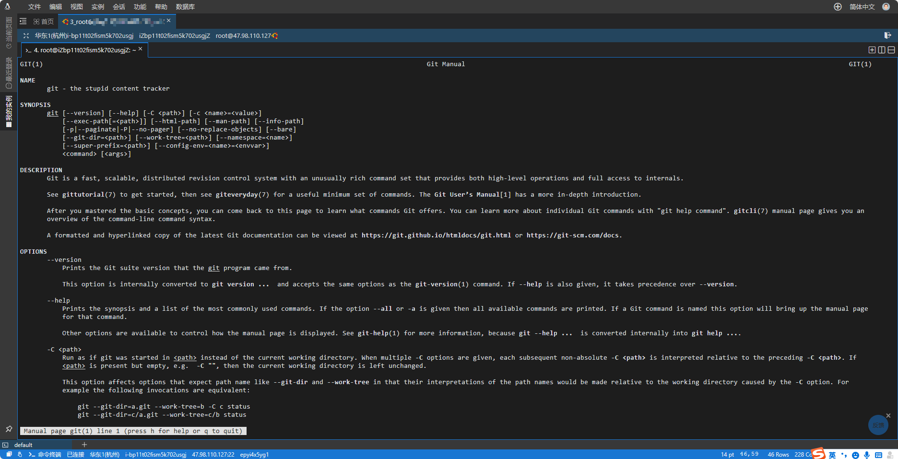
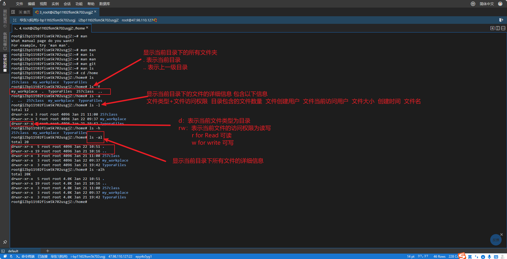
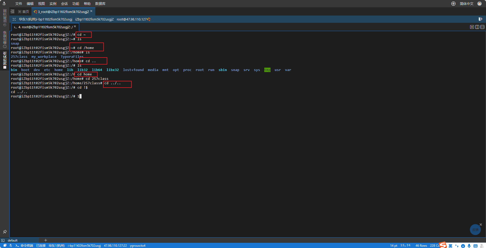
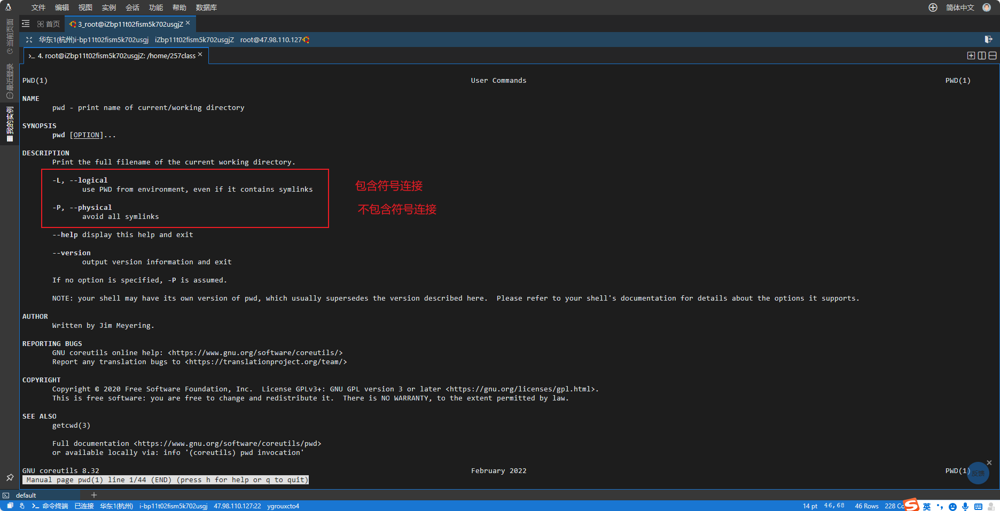
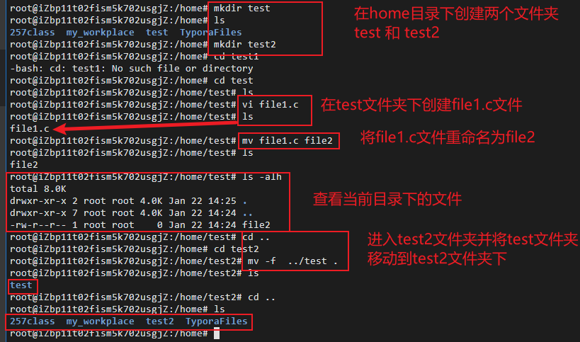
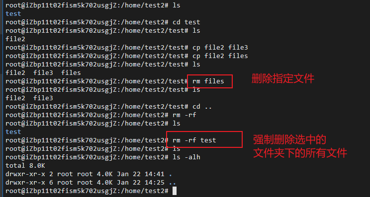

# linux命令：

## 一、 man (manul) 操作手册


命令格式：`man <linux命令>`

命令参数：

使用man + 需要查找的Linux命令，可以获取当前Linux命令的操作手册，因为是本地读取，所以不需要联网。在其他命令工具中，也可以使用 `-h` `--h` `-help` `--help`来获取操作手册。



------

## 二、 ls (List) 查看当前目录文档

命令格式：`ls`

命令参数：`-f` `-alh` `-l` `-a`



```cmd
ls 
ls -a	# 显示当前目录下所有文件信息
ls -l	# 显示文件的详细属性信息
ls -al	# 显示所有文件的详细属性信息
```

------

## 三、 cd (change directory) 进入工作目录

命令格式：`cd [路径名称]`

命令参数：` ` `/` `~` `..` `../..` `!$`

```cmd
cd    # 进入用户主目录；
cd /  # 进入根目录
cd ~  # 进入用户主目录；
cd ..  # 返回上级目录（若当前目录为“/“，则执行完后还在“/"；".."为上级目录的意思）；
cd ../..  # 返回上两级目录；
cd !$  # 把上个命令的参数作为cd参数使用。
```



------

## 四、 pwd (Print working direction) 查看当前工作路径.

命令格式：`pwd [选项]`

命令参数：

- `-P` 输出物理路径，不输出符号连接路径。
- `-L` 输出连接路径，包含符号链接(symbolic link，即快捷方式)。



------

## 五、 mv (Move file) 移动或重命名文件

命令格式：`mv [格式] [源文件名] [目标文件名]`

命令参数：

- `-f` 强制覆盖已有的文件。

```cmd
mv file1.md file2.md # 对现有文件进行重命名操作
mv file1.md /floder # 移动文件到文件夹floder下并保留原有的文件名
mv Dir1 /floder/Dir2 # 移动指定目录Dir1到floder文件夹下并重命名为Dir2
mv -f /home/* . #将/home目录中所有的文件都移动到当前工作目录中，若遇到文件已存在则直接覆盖
```



------

## 六、 rm (remove) 删除指定文件

命令格式：`rm [参数] [文件名]`

命令参数：`-d` `-f` `-rf` `-rf /*` 

- `-d` 删除没有子文件的空目录
- `-f` 强制删除
- `-rf` 强制删除工作目录内所有的子文件
- `-rf /*` 强制删除系统内所有文件



------

## 七、 vi (Visual Editor) 文本编辑器

命令格式：`vi [文件名]`

命令参数：

使用  `vi`  命令编辑文件时如果没有这个文件，则自动创建这个文件。使用  **vi**  命令编辑文件时，默认以只读方式进入这个文件，在单击  **i**  后方可对文件进行插入和修改。在编辑完成后，按`Esc`，输入`:wq` 方可退出文件。

------

## 八、 sudo (super user do) 授权普通用户执行管理员命令

命令格式：`sudo [参数] [命令]`

```cmd
sudo mkdir floder # 执行特权指令新建文件夹floder
```

命令参数：`-u` 

修改当前登录用户：

1. 执行`sudo passwd root`命令，输入密码和新密码
2. 执行`su`命令
3. 即可修改当前登录用户为root用户

------

## 九、 touch 创建空文件和修改时间戳

命令格式：`touch [参数] [文件名]`

命令参数：`-d`

- `-d` 设置时间与日期

```cmd
touch file.txt # 创建指定名称的空文件
touch file{1..5}.txt # 创建多个指定名称的空文件
touch -d "2024-01-22 14:58" file.txt # 修改指定文件的查看时间和修改时间
```

------

## 十、 cp (copy) 复制文件

命令格式：`cp [参数] [原文件名] [目标文件名]`

命令参数：`-r` `-f`

- `-r` 复制指定的目录，并定义新的目录名称
- `-f` 将指定文件复制到/etc目录中，并覆盖已有文件

```cmd
cp -r Dir1 Dir2 #复制目录Dir1，并定义新的目录名称为Dir2
cp -f File1.txt /Dir2 # 将指定文件复制到/Dir2目录中，并覆盖已有文件
```

------

## 十一、 mkdir (Make Direction) 新建、重命名、移动目录文件

命令格式：`mkdir [参数] [目录名]`

命令参数：`-p`

```cmd
mkdir Dir1 # 创建目录文件Dir1
mkdir Dir3 Dir4 Dir5 # 创建多个目录文件
mkdir -p /Dir1/Dir2/Dir3/Dir4/Dir5 # 多级嵌套创造文件夹
```

------

## 十二、 cat (concatenate files and print) 预览文档内容

命令格式： `cat [参数] [文件名]`

命令参数：`-n` 

- `-n` 输出文档内容时显示行号

```cmd
cat file.c	# 预览文档file.c的内容
cat -n file.c # 预览文档file.c的内容，并显示行号
```

------

## 十三、 gcc (GNU Compiler Collection) C/C++编译器

命令格式：`gcc [参数] [文件名] [-o] [可执行文件名]`

命令参数：`-o` `-E` `-S` `-c` 

- `-o` 编译指定文件，并生成可执行文件
- `-E` 对源程序进行预处理，并生成`.i`文件

- `-S` 对预处理后的`.i`文件进行汇编操作，并生成`.s`文件
- `-c` 对汇编处理后的`.s`文件进行编译操作生成`.o`文件

```cmd
gcc File.c 
gcc File.c -o linux # 编译指定文件，并生成可执行文件
gcc -E File.c -o linux.i # 对源程序进行预处理，并生成`.i`文件
gcc -S File.i -o linux.s # 对预处理后的`.i`文件进行汇编操作，并生成`.s`文件
gcc -c File.s -o linux.o # 对汇编处理后的`.s`文件进行编译操作生成`.o`文件
gcc File.o -o linux # 对编译处理后的指定文件进行链接操作
```

编译包括四个阶段：

- 预编译（Preprocessing）

- 编译（Compilation）

- 汇编（Assembly）

- 链接（Linking）

编译完后生成的文件类型为`.exe`文件，文件描述为-rwxr-xr-x文件。

------

## 十四、 ifconfig (network interfaces configuring) 设置网络设备参数信息

命令格式：`ifconfig [参数] [网卡名] [动作]`

命令参数：`-a` `-v` `-s` 

- `-a` 显示所有网卡状态
- `-v` 显示执行工程的详细信息
- `-s` 显示剪短状态列表

命令动作：`add` `down` `del` `up` 

- `add` 设置网络设备的IP地址
- `down` 关闭指定的网络设备
- `del` 删除网络设备的IP地址
- `up` 启动指定的网络设备

```cmd
root@iZbp11t02fism5k702usgjZ:~# ifconfig
eth0: flags=4163<UP,BROADCAST,RUNNING,MULTICAST>  mtu 1500
        inet 172.26.227.166  netmask 255.255.240.0  broadcast 172.26.239.255
        inet6 fe80::216:3eff:fe27:8c6c  prefixlen 64  scopeid 0x20<link>
        ether 00:16:3e:27:8c:6c  txqueuelen 1000  (Ethernet)
        RX packets 1025506  bytes 1004767395 (1.0 GB)
        RX errors 0  dropped 0  overruns 0  frame 0
        TX packets 533410  bytes 298301872 (298.3 MB)
        TX errors 0  dropped 0 overruns 0  carrier 0  collisions 0

lo: flags=73<UP,LOOPBACK,RUNNING>  mtu 65536
        inet 127.0.0.1  netmask 255.0.0.0
        inet6 ::1  prefixlen 128  scopeid 0x10<host>
        loop  txqueuelen 1000  (Local Loopback)
        RX packets 594219  bytes 420423978 (420.4 MB)
        RX errors 0  dropped 0  overruns 0  frame 0
        TX packets 594219  bytes 420423978 (420.4 MB)
        TX errors 0  dropped 0 overruns 0  carrier 0  collisions 0
```

