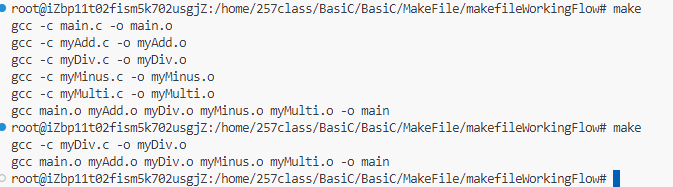

# makefile基础

## 0. C语言文件编译流程。你必须明白！

预编译->编译->汇编->链接

1. 预编译所做的事情：

   C++文件：`gcc -E [文件名.cpp] > [预处理文件名.ii]`：生成`.ii`文件

   C语言文件：`gcc -E [文件名.c] > [预处理文件名.i]`：生成`.i`文件

   - 展开头文件 ：`#include <stdio.h>`
   - 宏替换
   - 去掉代码中的注释
   - 条件编译

2. 编译

   `gcc -E [预处理文件名.i]`：生成`.s`文件(汇编文件)

3. 汇编

   `gcc -c [编译文件名.s]`：生成`.o`文件

4. 链接

   `gcc [汇编文件名.o]`：生成`.exe`文件

```cmd
# 示例代码
gcc -E main.c > main.i
gcc -S main.i
gcc -c main.s
gcc main.o
```


------

## 2. 一个make解决所有

在工作目录下有多个文件需要编译时，需要大量的编译时间。

使用makefile编译程序，makefile只会编译工作目录中改动的部分代码。

这也是使用makefile编译程序的核心目的。

**用makefile节省你的工作时间。**

- 如果target是最新生成的，那么make不会执行makefile文件中的任何命令；
- 如果target不存在或者target不是最新的，那么make会执行makefile文件中生成target所关联的命令，并根据需要递归地执行生成其他依赖文件的命令；
- 如果target关联的某些源代码文件被修改，或者target的某些依赖文件缺失，那么make会执行命令生成最新的依赖文件，并执行makefile文件中生成target所关联的命令。



------

## 3. **man man man makefile！**学会怎么使用makefile。

```cmd
make [选项] [目标] # 执行选定目标(target)命令
make # 默认执行第一个makefile命令
```

一个makefile文件中包含多个makefile命令。

一个完整的makefile命令包含：

1. 目标：**target**
2. 依赖：**dependence**
3. 命令：**command**

一个正确的makefile的基本格式：

```makefile
target:dependences1 dependences2……
<tab>commands1 commands2……
```

**注意**：

- command列表中的每一个**命令**用`一个空格`隔开
- dependence列表中的每一个**依赖**用`一个空格`隔开
- 其余任何地方不能出现空格
- makefile文件中的注释用`#`


------

## 4. 用makefile命名你的makefile！禁止套娃！makefile编译过程。


当文件中同时存在`makefile`文件与`Makefile`文件时

- 使用`make`命令会优先执行`makefile`文件。当没有找到`makefile`文件时，会转而寻找洽谈文件。
- 如果想要执行`Makefile`文件，需要使用`make -f Makefile`。

**如果我写了很多个makefile文件，天知道我应该执行哪个！所以，只写一个叫makefile的makefile吧**

------

## 5. makefile选项，选择适合你的方式。

- `-f` 选择`makefile`文件作为`make`命令的输入文件。
- `-B` 无条件执行所有目标。
- `-n` 只打印命令不执行命令。


------

## 6. ERROR！是makefile的问题？不，是你的问题！

- 依赖和目标拼写错误。
- <tab>写成了空格。
- 重复编译同一目标。
- 也许是其他文件的问题。


------

## 7. 写一个makefile吧！

```makefile
main:main.o myAdd.o myDiv.o myMinus.o myMulti.o
	gcc main.o myAdd.o myDiv.o myMinus.o myMulti.o -o main

myAdd.o:myAdd.c
	gcc -c myAdd.c -o myAdd.o

myMinus.o:myMinus.c
	gcc -c myMinus.c -o myMinus.o

myMulti.o:myMulti.c
	gcc -c myMulti.c -o myMulti.o

myDiv.o:myDiv.c
	gcc -c myDiv.c -o myDiv.o

main.o:main.c
	gcc -c main.c -o main.o

clean:
	@rm -rf *.o main
```

首先，你得有这些：


把上面的代码复制到makefile里面吧。

**然后？make！**

```cmd
make
```

接下来会发生什么呢？


首先。


之前说过，一个`make`命令会优先找文件夹下有没有`makefile`文件。

结果就是，找到了。

可是你没有告诉`make`它的执行`目标(target)`。

那么它会默认将第一个`target`作为它的生成目标。

Oh！你的`target`叫`main`，你的最终目标是一个叫`main`的可执行文件。

那么要用到那些文件来达成你这个目标呢？

`main.o` `myAdd.o` `myDiv.o` `myMinus.o` `myMulti.o` 

上面的就是你的`dependence`列表了。

也就是生成你的`目标(target)`需要用到的`依赖(dependence)`。

注意到它们之间有空格，这是必须的。


接下来，编译？递归？或者说栈？


`make`会根据你的`makefile文件`中描述的`依赖(dependence)`关系来生成你的`目标(target)`。

如果`目标(target)`的依赖下面还有依赖怎么办？

那当然是一层层套娃，其实就是一个自下而上的`递归`，直到所有的`依赖(dependence)`都被满足了。

这个目标才会被编译，而编译的过程就是递归调用一层一层`return`的过程。


最终，你的目标(target)实现了！

看看吧选择你的文件夹下多了一个`main`文件。

执行它，就是你想要的结果。


担心程序有bug？

那你最好使用`-g`的编译语句来书写你的makefile。

------

## 8. 全是字母？别担心，用变量吧。

1. 系统变量

   - `$@`：表示目标文件的完整名称。

   - `$^`：表示所有不重复的依赖文件

   ```makefile
   # 用$@替换上述代码中的目标文件，即[target]
   # 用$……替换上述代码中的依赖文件，即[dependence]
   main:main.o myAdd.o myDiv.o myMinus.o myMulti.o
   	gcc $^ -o $@
   
   myAdd.o:myAdd.c
   	gcc -c $^ -o $@
   
   myMinus.o:myMinus.c
   	gcc -c $^ -o $@
   
   myMulti.o:myMulti.c
   	gcc -c $^ -o $@
   
   myDiv.o:myDiv.c
   	gcc -c $^ -o $@
   
   main.o:main.c
   	gcc -c $^ -o $@
   
   clean:
   	@rm -rf *.o main
   ```


2. 系统常量

   - `RM`：删除

   - `CC`：C语言编译程序

   ```makefile
   # 用$(CC)替换上述代码中的gcc编译命令
   main:main.o myAdd.o myDiv.o myMinus.o myMulti.o
   	$(CC) $^ -o $@
   
   myAdd.o:myAdd.c
   	$(CC) -c $^ -o $@
   
   myMinus.o:myMinus.c
   	$(CC) -c $^ -o $@
   
   myMulti.o:myMulti.c
   	$(CC) -c $^ -o $@
   
   myDiv.o:myDiv.c
   	$(CC) -c $^ -o $@
   
   main.o:main.c
   	$(CC) -c $^ -o $@
   
   clean:
   	@$(RM) *.o main
   ```

3. 自定义变量

   - 使用`[常量名]=[值]`的形式定义自定义常量
   - 使用`$()`取自定义变量的值
   - 注意使用自定义变量不能与系统的`环境变量名`重复，否则`makefile`文件无法正常执行
   
   ```makefile
   OBJS=main.o myAdd.o myDiv.o myMinus.o myMulti.o
   # 变量自定义赋值
   TARGET=main
   
   # 变量取值用$()
   $(TARGET):$(OBJS)
   	$(CC) $^ -o $@
   
   myAdd.o:myAdd.c
   	$(CC) -c $^ -o $@
   
   myMinus.o:myMinus.c
   	$(CC) -c $^ -o $@
   
   myMulti.o:myMulti.c
   	$(CC) -c $^ -o $@
   
   myDiv.o:myDiv.c
   	$(CC) -c $^ -o $@
   
   main.o:main.c
   	$(CC) -c $^ -o $@
   
   clean:
   	@$(RM) *.o main
   ```
   
   这只是一些简单的变量，其他的等待后续补充吧。
   
   是不是简单了很多？别担心，还会更简单的！

------

## 9. 还是有太多冗余了，也许我该考虑更好的方法。模式匹配是个不错的选择。

一些简单的简单的`makefile模式匹配`

- `%[目标]:%[依赖]`：我想不用我解释了。

- `wildcard`：匹配文件。

​	使用实例：获取指定目录下所有的.c文件。

- `patsubst`：模式匹配与替换。

​	使用实例：指定目录下所有的.c文件替换成.o文件。

```makefile
# 使用文件匹配替换依赖[dependence]
OBJS=$(patsubst %.c, %.o, $(wildcard ./*.c))
# 变量自定义赋值
TARGET=main

# 变量取值用$()
$(TARGET):$(OBJS)
	$(CC) $^ -o $@

# 模式匹配 %[目标]:%[依赖]
%.o:%.c
	$(CC) -c $^ -o $@

# 伪目标(伪文件)，指执行命令，不生成文件
.PHONY: clean

clean:
	@$(RM) *.o main

# `wildcard`：匹配文件 ()
# `patsubst`：模式匹配与替换
show:
	@echo $(wildcard ./*.c)
	@echo $(patsubst %.c, %.o, $(wildcard ./*.c))
```

`tip`：有个小概念，什么是伪目标？或者该叫他伪文件。

所有的目标(target)最终都会生成一个同名的目标文件。

也许有时候我不希望它生成。

这个时候就可以用`.PHONY: clean`来修饰这个`目标(target)`。

当需要生成这个`目标(target)`时，不会生成文件，而只是执行命令。

------

## 10. Triple Star！最重要的一集。makefile动态库。


最无聊的概念时间：

动态库就是：`windows`中的`.dll`文件，`linux`中的`.so`文件。


那么它有什么特点？

不会把代码编译到二进制文件中，而是在运行时候才会去加载，所以只需要一个地址。

不会编译成二进制文件？也就是不能反向学习了。


***用于生成动态库的编译常用参数：***

- `-fPIC` 产生位置无关的代码。

- `-shared` 共享。
- `-l` (小写L)，手动指定动态库。
- `-I` (大写i)，指定头文件目录，默认当前目录.
- `-L` 手动指定库文件搜索目录, 默认只链接共享目录。


如何生成一个动态库？

`gcc -c [源文件名].c -o [自定义文件名].o`

`gcc -shared -fPIC [待生成文件名].o -o [lib生成文件名].so`

**必须是`.o`文件！**

**必须是`.o`文件！！**

**必须是`.o`文件！！！**

这样就好了。

当然了作为动态库文件，命名时必须以`lib`开头，自定义但没有完全自定义。


生成好了，没有报错，怎么用？

正确的：`gcc *.c -lMyAdd -L./ -o main`

错误的：`gcc -o main main.c -L./ -lMyAdd`

**注意命令顺序**

还是一个命令解决。

这样就使用生成的动态库文件编译好了一个程序。


但是出错了？意料之中，这里有两个简单的解决办法。

运行时手动指定动态库目录：

```cmd
MacOS:
DYLD_LIBRARY_PATH=./src_so
export DYLD_LIBRARY_PATH
Linux:
LD_LIBRARY_PATH=./src_so
export DYLD_LIBRARY_PATH
```

`cp libMyAdd.so /usr/lib/`将文件拷贝到`/usr/lib/`文件夹下。


还是不行？

问[`OpenAI`](https://chat18.aichatos.xyz/#/chat/1706331925787)吧。

但是尽量跟用户手册搭配使用哦。

## 11. 世界是绝对的运动和相对的静止。makefile静态库！(我都懒得提)

静态链接库的生成方式：

`target`为以`.a`为后缀名的文件。

```makefile
$(AR) -r $(target) $^
```

如何使用静态库或者动态库，：

`gcc *.c -lMyAdd -L./ -o main`

**注意命令的书写书序，一定是动态或者静态库文件在其他文件之前。**


静态链接库：会把静态库的代码编译到二进制中，当程序编译完成后，该文件可以删除。

缺点： 程序体积过大，并且库中的内容如果有更新，则需要重新编译生成程序。


只有缺点？

是的，只有缺点。


所以，别用了。


你问我玩意用到了？

[`OpenAI`](https://chat18.aichatos.xyz/#/chat/1706331925787)吧，别烦了。


