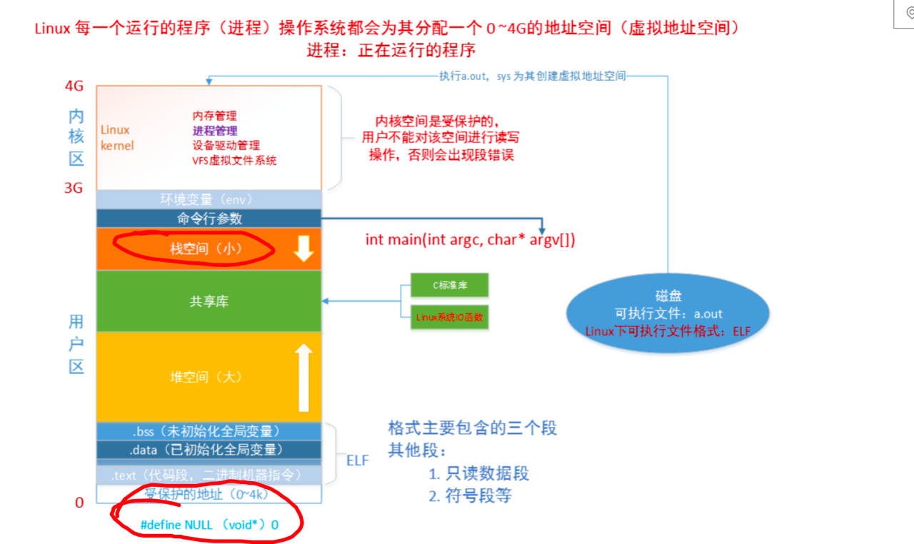

bzero()：将一块地址指向的内存后的N个地址的数据设置为0

二级指针：


gdb调试：

​	gcc -g [文件名]：debug方式编译文件

​	下载gdb调试器

​		apt install gdb

​	使用gdb调试

```cmd
gdb a.out # 进入gdb调试,必须是exe文件

b [行号] # 在这一行添加断点
b [函数名] # 在函数处添加断点

info b # 查看断点信息

del [断点序号] # 删除断点

run # 运行函数
s # 进入函数内部
n # 进入下一行
p &[变量] # 打印变量地址
```


Segmentation fault (core dumped)

​	段错误，一定是地址的问题

gcc -g demoCharPointer.c

gdb a.out

run

```Cmd
root@iZbp11t02fism5k702usgjZ:/home/257class/BasiC/BasiC/pointer# gcc -g demoCharPointer.c
root@iZbp11t02fism5k702usgjZ:/home/257class/BasiC/BasiC/pointer# gdb a.out
GNU gdb (Ubuntu 12.1-0ubuntu1~22.04) 12.1
Copyright (C) 2022 Free Software Foundation, Inc.
License GPLv3+: GNU GPL version 3 or later <http://gnu.org/licenses/gpl.html>
This is free software: you are free to change and redistribute it.
There is NO WARRANTY, to the extent permitted by law.
Type "show copying" and "show warranty" for details.
This GDB was configured as "x86_64-linux-gnu".
Type "show configuration" for configuration details.
For bug reporting instructions, please see:
<https://www.gnu.org/software/gdb/bugs/>.
Find the GDB manual and other documentation resources online at:
--Type <RET> for more, q to quit, c to continue without paging--c
    <http://www.gnu.org/software/gdb/documentation/>.

For help, type "help".
Type "apropos word" to search for commands related to "word"...
Reading symbols from a.out...
(gdb) run
Starting program: /home/257class/BasiC/BasiC/pointer/a.out 
[Thread debugging using libthread_db enabled]
Using host libthread_db library "/lib/x86_64-linux-gnu/libthread_db.so.1".
len:8

Program received signal SIGSEGV, Segmentation fault.
0x0000555555555192 in main (argc=1, argv=0x7fffffffe198) at demoCharPointer.c:12
12          strcpy(ptr, "hello world");
(gdb) 
```


字符串与字符数组的内存分配：

- 字符数组在声明时自动在`栈`空间分配内存；
- 字符串指针分配的内存在一块非法地址`NULL`，表示地址为`0x00`；
- 系统中程序员分配的空间为堆空间，可以使用`malloc`函数初始化申请空间。



检查堆泄漏的代码：

```cmd
valgrind --tool=memcheck --leak-check=yes --show-reachable=yes ./[需要检查的.exe文件]
```

1. 野指针
2. malloc申请的内存没有被释放
3. 踩内存


代码规范

​	所有的malloc申请 的空间都需要验证是否为空。


