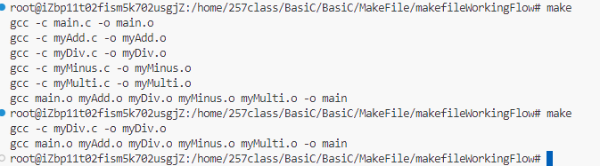

1. 字符串又被称为字符串常量，地址在全局区

2. 如果定义与声明的参数列表不同，会报错

3. 预编译->编译->汇编->链接

   1. 预编译所做的事情：

      C++文件：`gcc -E [文件名.cpp] > [预处理文件名.ii]`：生成`.ii`文件

      C语言文件：`gcc -E [文件名.c] > [预处理文件名.i]`：生成`.i`文件

      - 展开头文件 ：`#include <stdio.h>`
      - 宏替换
      - 去掉代码中的注释
      - 条件编译

   2. 编译

      `gcc -E [预处理文件名.i]`：生成`.s`文件(汇编文件)

   3. 汇编

      `gcc -c [编译文件名.s]`：生成`.o`文件

   4. 链接

      `gcc [汇编文件名.o]`：生成`.exe`文件

4. `makefile`:

   `makefile`的优点：节省编译时间，只编译改动的部分

   也是它的核心目的

   

   - 同时存在Makefile 和 makefile 的文件。 **优先执行makefile文件**，想要执行Makefile时，需要使用`make -f Makefile`。

     - 优先执行小写的`makefile`文件，以后都写`makefile`文件名，直接`make`执行。

   - `makefile`最基本要素：**目标**：`target`，**依赖**：`dependence`，命令**：`command`

     基本格式：

     `target`:`dependences1` `dependences2` ...

     ​	`command1` `command2` ...

     `command`前加`@`，表示这条命令在执行时不输出。

   - `make`后不加`[target]`，默认执行第一条命令

   - `make [target]`，会执行相应`[target]`目标

   - 常用参数：

     - `-B` 无条件执行所有目标
     - `-f` 执行指定文件
     - `-n` 只打印命令不执行

   - `makefile问题`

     - 依赖和目标拼写错误
     - 空白处有空格
     - 重复编译同一目标

   - `makefile变量`

     ```makefile
     main:main.o myAdd.o myDiv.o myMinus.o myMulti.o
     	gcc main.o myAdd.o myDiv.o myMinus.o myMulti.o -o main
     
     myAdd.o:myAdd.c
     	gcc -c myAdd.c -o myAdd.o
     
     myMinus.o:myMinus.c
     	gcc -c myMinus.c -o myMinus.o
     
     myMulti.o:myMulti.c
     	gcc -c myMulti.c -o myMulti.o
     
     myDiv.o:myDiv.c
     	gcc -c myDiv.c -o myDiv.o
     
     main.o:main.c
     	gcc -c main.c -o main.o
     
     clean:
     	@rm -rf *.o main
     ```

     1. 系统变量

     - `$@`：表示目标文件的完整名称。

     ```makefile
     # 用$@替换上述代码中的目标文件，即[target]
     main:main.o myAdd.o myDiv.o myMinus.o myMulti.o
     	gcc main.o myAdd.o myDiv.o myMinus.o myMulti.o -o $@
     
     myAdd.o:myAdd.c
     	gcc -c myAdd.c -o $@
     
     myMinus.o:myMinus.c
     	gcc -c myMinus.c -o $@
     
     myMulti.o:myMulti.c
     	gcc -c myMulti.c -o $@
     
     myDiv.o:myDiv.c
     	gcc -c myDiv.c -o $@
     
     main.o:main.c
     	gcc -c main.c -o $@
     
     clean:
     	@rm -rf *.o main
     ```

     - `$^`：表示所有不重复的依赖文件

     ```makefile
     # 用$……替换上述代码中的依赖文件，即[dependence]
     main:main.o myAdd.o myDiv.o myMinus.o myMulti.o
     	gcc $^ -o $@
     
     myAdd.o:myAdd.c
     	gcc -c $^ -o $@
     
     myMinus.o:myMinus.c
     	gcc -c $^ -o $@
     
     myMulti.o:myMulti.c
     	gcc -c $^ -o $@
     
     myDiv.o:myDiv.c
     	gcc -c $^ -o $@
     
     main.o:main.c
     	gcc -c $^ -o $@
     
     clean:
     	@rm -rf *.o main
     ```

     2. 系统常量

     - `RM`：删除
     - `CC`：C语言编译程序

     ```makefile
     # 用$(CC)替换上述代码中的gcc编译命令
     main:main.o myAdd.o myDiv.o myMinus.o myMulti.o
     	$(CC) $^ -o $@
     
     myAdd.o:myAdd.c
     	$(CC) -c $^ -o $@
     
     myMinus.o:myMinus.c
     	$(CC) -c $^ -o $@
     
     myMulti.o:myMulti.c
     	$(CC) -c $^ -o $@
     
     myDiv.o:myDiv.c
     	$(CC) -c $^ -o $@
     
     main.o:main.c
     	$(CC) -c $^ -o $@
     
     clean:
     	@$(RM) *.o main
     ```

     3. 自定义常量

     - 使用`[常量名]=[值]`的形式定义自定义常量
     - 使用`$()`取自定义变量的值

     ```makefile
     OBJS=main.o myAdd.o myDiv.o myMinus.o myMulti.o
     # 变量自定义赋值
     TARGET=main
     
     # 变量取值用$()
     $(TARGET):$(OBJS)
     	$(CC) $^ -o $@
     
     myAdd.o:myAdd.c
     	$(CC) -c $^ -o $@
     
     myMinus.o:myMinus.c
     	$(CC) -c $^ -o $@
     
     myMulti.o:myMulti.c
     	$(CC) -c $^ -o $@
     
     myDiv.o:myDiv.c
     	$(CC) -c $^ -o $@
     
     main.o:main.c
     	$(CC) -c $^ -o $@
     
     clean:
     	@$(RM) *.o main
     ```

   - `makefile伪目标`

     当只想执行目标命令而不希望生成目标文件时使用

     `.PHONY: [目标]`，注意中间有个空格

     ```makefile
     # 伪目标(伪文件)，指执行命令，不生成文件
     .PHONY: clean
     
     clean:
     	@$(RM) *.o main
     ```

   - `makefile模式匹配`

     `%[目标]:%[依赖]`

     ```makefile
     OBJS=main.o myAdd.o myDiv.o myMinus.o myMulti.o
     # 变量自定义赋值
     TARGET=main
     
     # 变量取值用$()
     $(TARGET):$(OBJS)
     	$(CC) $^ -o $@
     
     # 模式匹配 %[目标]:%[依赖]
     %.o:%.c
     	$(CC) -c $^ -o $@
     
     # 伪目标(伪文件)，指执行命令，不生成文件
     .PHONY: clean
     
     clean:
     	@$(RM) *.o main
     ```

     `wildcard`：匹配文件

     使用实例：获取指定目录下所有的.c文件

     `patsubst`：模式匹配与替换

     使用实例：指定目录下所有的.c文件替换成.o文件

     ```makefile
     show:
     	@echo $(wildcard ./*.c)
     	@echo $(patsubst %.c, %.o, $(wildcard ./*.c))
     ```

     ```makefile
     # 使用文件匹配替换依赖[dependence]
     OBJS=$(patsubst %.c, %.o, $(wildcard ./*.c))
     # 变量自定义赋值
     TARGET=main
     
     # 变量取值用$()
     $(TARGET):$(OBJS)
     	$(CC) $^ -o $@
     
     # 模式匹配 %[目标]:%[依赖]
     %.o:%.c
     	$(CC) -c $^ -o $@
     
     # 伪目标(伪文件)，指执行命令，不生成文件
     .PHONY: clean
     
     clean:
     	@$(RM) *.o main
     
     # `wildcard`：匹配文件 ()
     # `patsubst`：模式匹配与替换
     show:
     	@echo $(wildcard ./*.c)
     	@echo $(patsubst %.c, %.o, $(wildcard ./*.c))
     ```

   - `makefile动态库`

     `windows`中的`.dll`文件，`linux`中的`.so`文件

     不会将代码编译为二进制文件，而是在运行时才会加载，因此只需要一个地址

     常用参数：

     - `-fPIC` 产生位置无关的代码。

     - `-shared` 共享。
     - `-l` (小写L)，手动指定动态库。
     - `-I` (大写i)，指定头文件目录，默认当前目录.
     - `-L` 手动指定库文件搜索目录, 默认只链接共享目录。

     生成动态库的命令：

     `gcc -c [源文件名].c -o [自定义文件名].o`

     **so文件必须以lib开头**

     `gcc -shared -fPIC [待生成文件名].o -o [lib生成文件名].so`

     使用动态库的命令：

     **注意命令顺序**

     正确的：`gcc *.c -lMyAdd -L./src_so -o main`

     错误的：`gcc -o main main.c -L./ -lMyAdd`

     `LD_LIBRARY_PATH`

     运行时手动指定动态库目录：

     ```cmd
     MacOS:
     DYLD_LIBRARY_PATH=./src_so
     export DYLD_LIBRARY_PATH
     Linux:
     LD_LIBRARY_PATH=./src_so
     export DYLD_LIBRARY_PATH
     ```

     `cp libMyAdd.so /usr/lib/`将文件拷贝到`/usr/lib/`文件夹下。

   - `makefile 静态库`

     静态链接库：会把静态库的代码编译到二进制中，当程序编译完成后，该文件可以删除。

     缺点： 程序体积过大，并且库中的内容如果有更新，则需要重新编译生成程序。

     ```cmd
     
     ```

     

​		


​		


