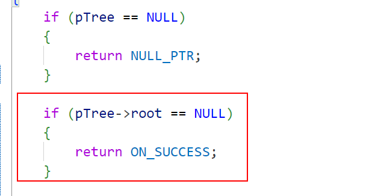

1.根结点的父节点为NULL。

2.树的层次遍历：

- 判断树的根结点是否为空

  

- (void **) 强制类型转换

- 注意函数需要传入的参数

- 队列用完需要释放队列

3.树的高度

- 层次遍历时，更新树的高度

4.树的销毁

5.树的前驱后继节点

- 前驱节点
- 后继节点

6.删除节点

- 如果要删除的节点是叶子节点：直接删
- 如果要删除的节点有两个叶子节点：找到它的前驱节点，复制前驱结点的值到当前节点，删除这个前驱节点
  - 前驱结点一定是度为1，或者度为0的节点
- 如果要删除的节点是度为1的节点：
  - 判断它的父节点是否为空：
    - 若为空，将根节点设置为这个节点的左节点
    - 不为空，将这个节点的父节点指向这个节点的左节点

