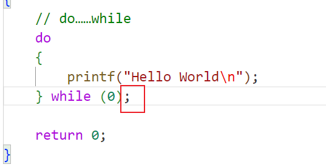
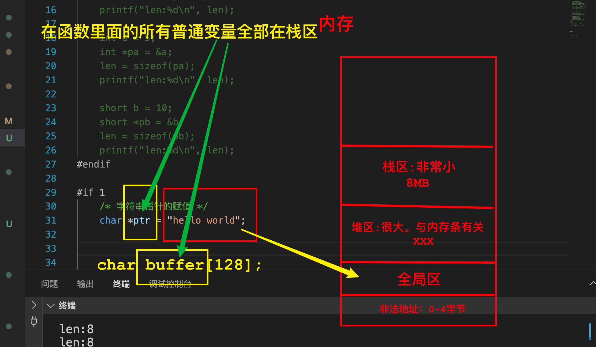

C语言循环语句

​	while

​	dowhile

​	++ 前置++和后置++

​	for循环

​	第一段初始化，临时变量，作用于只在当前for循环中

​	第二段判断条件

​	执行顺序为 初始化->条件判断->执行分括号内的代码->执行第三段->条件判断->执行分括号内的代码->执行第三段……

C语言数组

​	连续存储空间

​	存放相同数据类型

​	memset函数清理脏数据

​	数组长度

C语言内存

​	函数里的所有普通变量(数据类型修饰的叫做变量)全部在栈区

​	内存四区：非法地址0-4字节->全局区(没有大小概念)->堆区(很大，跟内存条有关)->栈区(很小 8MB)->...

​	数组元素存放在连续的内存空间

C语言函数

​	函数三要素：函数名，函数参数，函数返回值

C语言格式化输出

​	%d 整数

​	%s 字符串

​	%p 地址

C语言字符串

​	字符串存放在全局区

C语言指针

​	

不申请临时空间交换两个数

​	两种方法

​	

