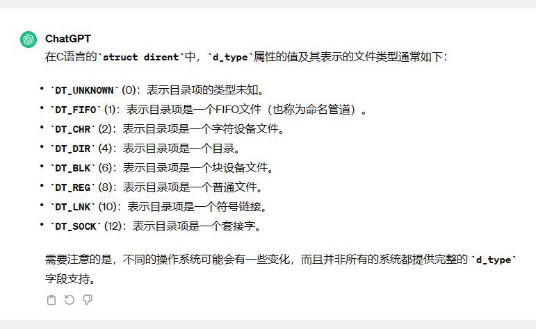

1. `open`函数

   ```c
   int open(const char *pathname, int flags);
   int open(consy char *pathname, int flags, mode_tmode);
   ```

   打开指定的路径的文件，若没有当前文件，则创建一个。

   成功返回一个文件描述符。

   - `0`标准输入
   - `1`标准输出
   - `2`标准出错
   - 因此文件描述符会从3开始。

   一个进程最多可以打开`1024`个文件。

   追加模式，在文件末尾处写。

   flags：

   - `O_RDONLY`
   - `O_WRONLY`
   - `O_RW`

2. `close()`

   `close`函数释放的文件资源可以给下一个文件继续使用。

   重新打开的文件会使用最小的文件描述符。

3. 命令行参数`argv`：用空格分隔

4. 读数据

   读数据长度小于缓冲区大小，预留一个`\0`

5. `md5sum`校验文件内容是否相同

6. 自定义可执行程序命令全局可用：

   加上全局可执行路径

   1. 将需要全局使用的可执行文件复制到路径`/user/local/bin`中
   2. 使用`ln -sv`给这个文件加上一个软连接到路径`/user/local/bin`中即可全局使用。

7. `lseek`改变文件偏移量

8. `stat`

9. `man 1` 命令

   `man 2` 函数

10.   打印时间方法

    ```c
    localtime(&(statBuffer.st_atime));
    printf("atime:%s\n", ctime(&(statBuffer.st_atime)));
    ```

11. `access`查询是否具有某种权限

​	读，写，可执行，文件是否存在

12. `opendir`
13. `truncate`
14. `readdir`



15. `getcwd`

    获取当前工作目录