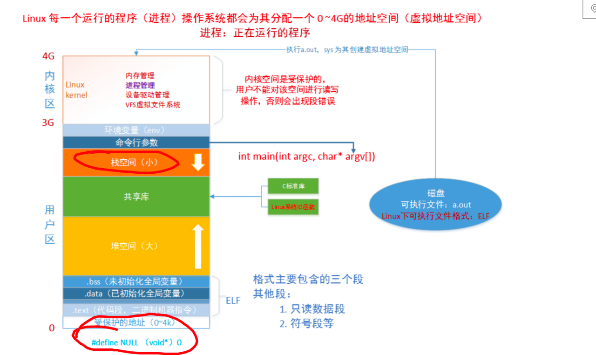

1. 操作系统工作在硬件与软件之间。

2. 操作系统向上提供的接口(函数)统称为`系统调用`

3. 虚拟存储地址：

   Linux每一个运行的程序，操作系统都会给它分配一个`0-4G`的地址空间。

   

   - 3-4G为内核空间(kernel)；
   - 1-3G为用户空间(user):
     - NULL
     - 全局区
     - 代码区
     - 栈空间
       - 栈空间很小，会发生栈溢出。

     - 共享库
     - 堆空间
       - 一般与内存条大小有关。

     - 命令行参数......
     - 环境变量：`PATH:=`

   内核空间是受操作系统保护的空间，不能直接访问。

   程序员只能通过操作系统系统调用来使用内核空间，系统调用结束后，将结果返回给用户空间。

4. 系统调用与库函数：

   - 库函数分为：1.需要调用系统调用的函数 2.不需要调用系统调用的函数。
   - 系统调用会调用`Call函数`切换到内核空间。会耗费一定的`CPU`时间。频繁使用系统调用会浪费资源和效率。

5. 系统资源和效率：

   - 不能兼顾。

6. 文件描述符：

   - 第一位。
      - `d`目录。
      - `-`普通文件。
      - `l`软链接。
   - `rwx`
      - `r`可读。
      - `w`可写。
      - `x`可执行程序。
         - 使用`chmod -x [可执行文件名]`剥夺可执行权限。
         - 使用`chmod +x [可执行文件名]`赋予可执行权限。