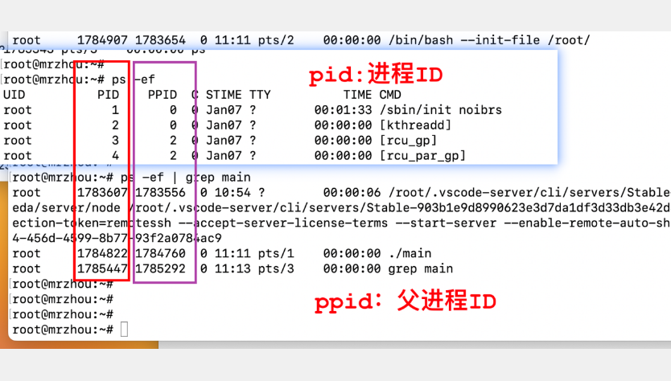

# 系统编程之——进程管理

1. 进程、程序与代码

2. 命令`top`(任务管理器) windows `ctrl alt .`

   动态显示运行中的程序。

   查看执行的程序。

   `M` 按照内存排序。

   `P` 按照CPU排序。

   

3. 面试题：什么情况下会导致CPU飙升？

   - 死循环。

4. 命令`ps -ef`查看运行的所有进程。

   `ps -ef | grep mian`

   `ps`查看的进程信息：

   UID：用户ID

   PID：进程ID

   PPID：父进程ID

   

5. 命令`grep` 过滤命令。

   `grep -v grep` 忽略`grep`

6. 命令`kill -9 [PID]`  杀死进程ID

   发送指定信号到指定进程 信号值从0-15 -9强制终止进程

   kill -l 查看所有的信号

   killall [进程名称] 结束指定进程

7. 命令`./main &` 后台执行程序

8. 函数`sleep`休眠函数

   执行这个函数的进程会让出CPU资源，不会占用资源。

9. 进程的状态：运行、就绪、阻塞

10. `ps`查看进程状态。

    使用以下命令：

    1. `ps -ef`

    2. `ps auxf`查看进程状态

       进程状态：

       - R运行
       - S休眠
       - T停止
       - Z僵尸进程
       - 。。。

11. 进程号 0-32767 进程号PID唯一

    PID进程号

    PPID父进程id

    PGID进程组号

    每一个进程都被放在/proc/文件夹下对应一个进程号目录文件

    

    目录下存放的内容

    

12. ls -al cwd 获取当前的工作目录

13. `df -h`

    

14. 函数`getpid()`获取被调用进程的进程号。返回调用进程的进程号。

    `getppid()`获取父进程的进程id

    

    

    所有进程的祖先进程都是`init`进程，即零号进程

15. 函数进程创建`fork()`

    // 1.(优)速度快    效率

    // 2.(缺)占用资源多  资源

    // 3.压力测试(设备性能瓶颈，设备相关)

    当前是父进程，返回子进程的pid号。

    当前是子进程，返回0；

    孩子进程：创建的进程。

    父进程：创建进程的进程。

    子进程在独立的内存空间中执行。

    

    父进程结束，子进程没有退出，子进程就会变为孤儿进程。

    

    子进程结束，父进程没有回收资源，子进程就会变成僵尸进程，僵尸进程依然会占用系统空间。

    

    守护进程，僵尸进程和孤儿进程。

    fork函数创建完进程之后，就会有第二个内存空间存放子进程。两个程序执行不同的语句。

    

    此外，由于操作系统的异步性，每次程序执行的顺序是不可知的，因此每次打印的结果可能不同。当不同进程需要访问相同的内存空间时，会产生并发和共享两种问题需要解决。

16. `vfork`函数功能与fork相同，但是总会让父进程先执行。

17. 父进程与子进程fork函数创建的子进程直接复制父进程的所有内容，除了计时器和进程号。因此，fork函数相当于复制了一份当前进程的内容，代价巨大。

    读时复制，写时共享。

    

18. 父子进程的地址空间：

    父子进程的变量(包括全局变量和局部变量)占用独立的地址空间。

19. 打开文件的权限控制，按需取用

20. 进程间通信方式：

    - 文件通信。

21. 文件退出函数`exit()` 

22. 父进程进行文件资源回收`wait()`函数，等待子进程终止。

23. 父进程进行文件资源回收`waitpid()`函数，等待子进程终止。

24. strace -p 19437 检测检测是否是用户态阻塞，strace卡死就是用户态阻塞

    

    gdb attach [进程号] 检测阻塞。一般不用，gdb挂久了会导致僵尸进程。

    

    应用层阻塞，一定是代码出问题了。

25. 孤儿进程

    父进程终止，子进程还在运行。孤儿进程危害不大。

26. 僵尸进程

    子进程终止，父进程尚未回收子进程资源。

