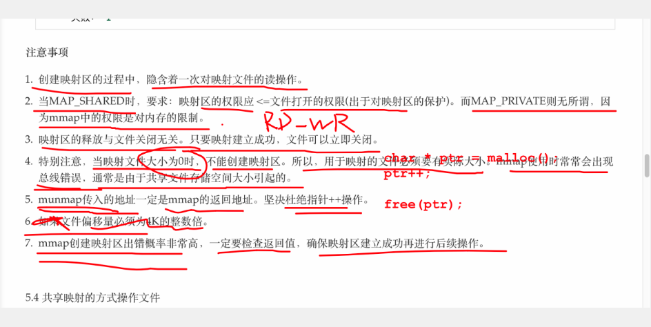
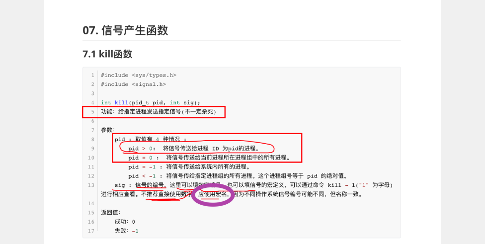

1. 库函数的底层就是系统调用。

   exit()函数底层调用_exit()

2. 进程通信方式：命名管道`FIFO`

   创建方式

   - `mkfifo [管道名称]`命令创建有名管道。
   - `mkfifo()`函数。

   命名管道可以在不具备亲属关系的进程之间通信。

3. 由内核告知read函数可以读取数据。

   `read()`是会阻塞的函数。

   当没有数据时，read函数就会阻塞，当有新的数据可以读取时，由内核通知read函数。

   可以将read函数看做一个条件执行的函数，而内核的提醒就是条件满足。

4. 进程通信方式：共享存储映射`mmap()`

   注意事项

   

5. 信号`kill`：

   - 简单
   - 不能携带大量的信息
   - 满足某个条件才能发送

   信号的注册

   信号的产生

   信号的处理

   基础信号

   - SIGHUP 用户退出shell，系统向所有进程发送当前信号
   - SIGINT Ctrl+C
   - SIGQUIT Ctrl+\
   - SIGKILL 终止进程
   - SIGUSE1 程序员自己定义
   - SIGUSE2 程序员自己定义
   - SIGSEGV 段错误
   - SIGFEP 发生计算错误
   - SIGPIPE 向一个没有读端的管道发送数据
   - SIGCHLD 子进程结束时，父进程会收到这个信号
   - SIGSTOP 停止进程的执行

   信号的默认动作：

   - 

6. 在man手册中`/`后加搜索内容查询指定数据

7. `KILL`函数

   

