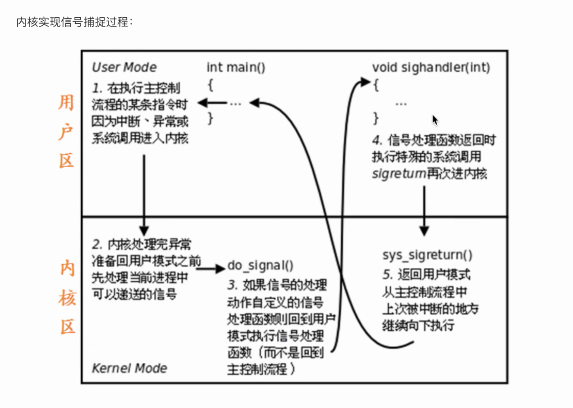

常用信号默认动作：

- kill 函数 int killl (pid_t id, int sig);

- root用户可以给任何用户发信号

- raise函数给当前进程发信号 int raise(int sig)

- abort函数给自己发送终止信号 int abort(void)

  默认给自己发送一个终止信号，即6号信号SIGABRT

- vi编辑器GG到末尾，gg到最前面，4gg到第四行，yy复制

- cp -r 复制文件夹

- alarm闹钟函数，类似定时器功能

  unsigned int alarm(unsigned int sceonds);

  设定定时器闹钟，在seconds之后，内核会给自己发送一个指定的信号SIGALRM，进程收到信号后，默认动作是终止。

  取消定时器alarm(0)。

  定时器与进程状态无关，无论进程处于什么状态，都能运行

- setitimer函数

  设置更加精确的定时器时间

信号捕捉:

- 一个进程收到信号的时候可以:

  - 执行系统默认的动作。
  - 忽略此信号。
  - 执行自定义信号处理函数。SIGKILL和SIGTOP必须执行默认的信号处理动作

  signal函数：**注册信号**处理函数。确定收到信号的后的处理函数的入口地址，次函数不会阻塞

  typedef void(*sighandler_t)(int);

  sighandler_t signal(int signum, sighandler_t handler);

  handler参数:

  - SIG_IGN忽略
  - SIG_DFL默认
  - 自定义函数地址
  
  

避免僵尸进程

- 若调用进程没有子进程，该函数会立即返回。若子进程结束，函数依然会返回。
- 使用SIGCHLD信号自定义回调函数来避免僵尸进程

钩子函数命名必须要有Handler

