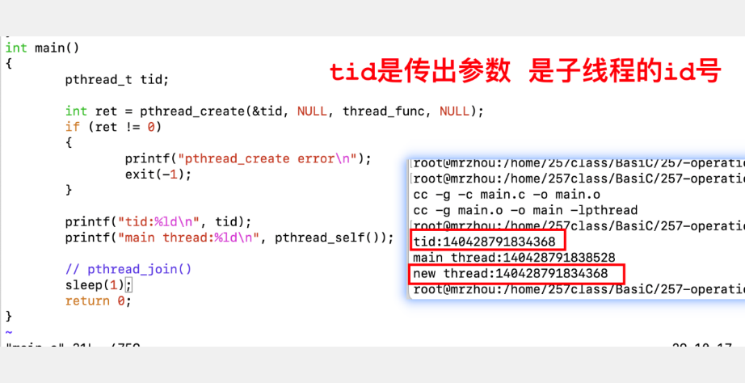

# 线程

## 轻量级进程

进程：资源分配的基本单位

线程：CPU调度的基本单位

线程是操作系统调度的最小单位。

线程依托进程而存在，线程的创建也是基于进程的。

如果知识单独的进程，进程又被称为主进程或主线程

线程也称轻量级进程PCB

进程和线程在底层函数都是一样的

每个线程都有自己的线程号。

线程花费的线程少。

## 线程号


## 线程函数

1. `pthread_t pthread_self(void)` 返回当前线程的线程号

2. `int pthread_create(pthread_t *thread, const pthread_attr_t *attr, void *(*start_routine) (void *), void *arg);`创建线程。

   不能使用错误信息perror函数打印错误信息。

   这个函数耗时。

3. `int pthread_join(pthread_t thread, void **retval);`线程资源回收。是一个阻塞函数

   等待线程结束并回收线程资源，类似wait

4. 进程退出`pthread_exit`

   

5. 线程退出，传出参数要用static修饰

```c
  // 线程退出
  // 1.static 修饰的变量在程序结束时才会释放
  // 2.malloc
  // 局部变量退出
  // int retStatus = -1;
  static int retStatus = -1;
  pthread_exit(&retStatus);
```

6. 线程取消

   对于处于detach状态的线程，不能使用pthread_join函数调用它。

7. 线程分离`int pthread_detach(pthread_t thread);`

   分离的线程还是依赖当前线程。只是将回收动作交给系统完成。

   **开辟线程之后必须先分离**

   


