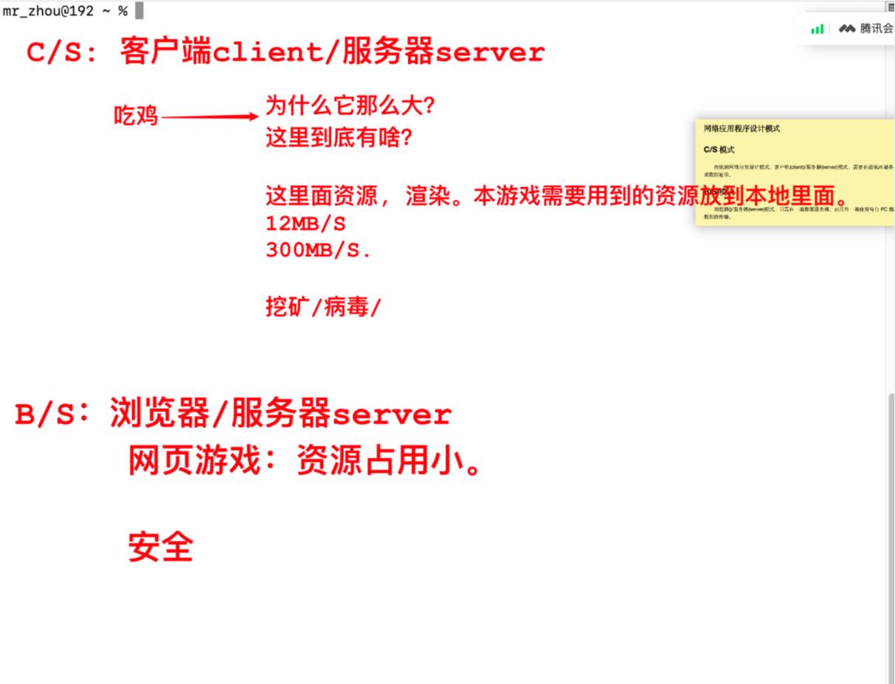

# OSI七层网络模型&TCP/IP模型

## 物理层

设备：双绞线 - 网络，光纤 - 光模块(速度快)

## 数据链路层 - 二层

设备：交换机(switch)，网卡

交换机特点：

- 端口特别多；
- -request 请求报文采用广播方式。
- -response 请求报文采用单播回复。
- 有一个MAC地址表。

ARP通信的五元组：

- 源IP，sip
- 目的IP，dip
- 源MAC，smac
- 目的MAC，dmac
- 协议。

ARP命令：

- arp -a 查看当前主机号的所有mac地址。
- arp -d 删除MAC地址ARP表。

当当前的MAC地址表没有找到目的MAC时，会广播当前的交换机的所有连接主机，更新MAC地址表。

协议：ARP用于获取对方的MAC地址。

地址：MAC地址

MAC地址：6字节48位

前3个字节：协会指定，生产网卡的厂商被制定好的。

后3个字节：厂商自己分配。

## 网络层 - 三层

设备：路由器，将光信号转换为数字信号

地址：IP地址

IP地址：192.168.0.1/24

子网掩码：255.255.255.0

- IP地址分为两部分，第一部分主机位，第二部分网络位。
- IP&子网掩码：主机位，即前24位。

路由分为：

- 静态路由：手动配置
- 动态路由：RIP等
- 策略路由：计算机自主学习

路由器中有IP路由表：

IP地址	下一跳/网关	(每个域名也对应一个IP地址)

上网就是通过路由器上网。PC->交换机->路由器。

WAN口：连接的是网线。

LAN口：连接电视机，连接台式机。

LAN口其实就是一台小型的交换机。

​	192.168.0.1~192.168.0.255之间

## 传输层

设备：防火墙

协议：TCP UDP

## 应用层

应用层，表示成，会话层

协议：DHCP(无线网分配IP)，SNMP(报表)，SMTP(邮件协议)，HTTP/HTTPS，FTP，SSH

# 网络程序应用模型

## C/S模式

客户端服务器模式。

网络游戏。

大型网络游戏，缓存和资源等游戏需要用到的资源存储在本地，使用时在本地渲染。

## B/S模式

浏览器服务器模式。

网页游戏。

资源放在服务器，只在使用时通过网络传输和渲染。

