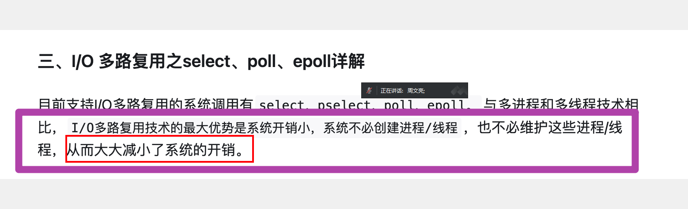

# 并发

[IO多路复用——深入浅出理解select、poll、epoll的实现 - 知乎 (zhihu.com)](https://zhuanlan.zhihu.com/p/367591714)

多路：多个socket网络连接。

复用：复用一个线程，使用一个线程来检查多个文件描述符(socket)的就绪状态。

多路复用技术：select，poll，epoll。

select：具有超强的跨平台特性。

## IO模式

- 阻塞blockingIO - 阻塞IO

## thread

方式：

每一个客户端进来，服务器开一个线程。

开辟线程并发的缺点：

频繁开辟和销毁线程是一个非常影响效率的事情。

客户端无节制地涌入，无法保证资源的使用。

## 多路复用 select/epoll

select能够实现单进程并发：如单进程数据库redis。

底层动态数组。

是阻塞函数

优点：

- 跨平台，适用于mac，linux，windows

缺点：

- 能够监视的文件描述符小于1024个

select需要解决的缺陷：

1. 每次调用select，都需要把被监控的fds集合从用户态空间拷贝到内核态空间，高并发场景下这样的拷贝会使得消耗的资源是很大的。
2. 能监听端口的数量有限，单个进程所能打开的最大连接数由FD_SETSIZE宏定义，监听上限就等于fds_bits位数组中所有元素的二进制位总数，其大小是32个整数的大小（在32位的机器上，大小就是3232，同理64位机器上为3264），当然我们可以对宏FD_SETSIZE进行修改，然后重新编译内核，但是性能可能会受到影响，一般该数和系统内存关系很大，具体数目可以`cat /proc/sys/fs/file-max`察看。32位机默认1024个，64位默认2048。
3. 被监控的fds集合中，只要有一个有数据可读，整个socket集合就会被遍历一次调用sk的poll函数收集可读事件：由于当初的需求是朴素，仅仅关心是否有数据可读这样一个事件，当事件通知来的时候，由于数据的到来是异步的，我们不知道事件来的时候，有多少个被监控的socket有数据可读了，于是，只能挨个遍历每个socket来收集可读事件了。
4. 在内核态下用轮训的方式检查需要读的文件描述符。

epoll：

只适用于linux。性能强。底层红黑树。

epoll_create：创建一个epoll句柄

epoll_ctl：向epoll对象中添加、修改删除要管理的连接

epoll_wait：等待其管理的连接上的 IO 事件

epoll的两种触发方式 - 边缘触发和水平触发

epoll水平触发(LT)：只要读缓冲区不为空，写缓冲区不满，那么epoll_wait就会一直返回就绪，水平触发是epoll的默认工作方式

epoll边缘触发(ET)：

## 线程池

## libevent() - 底层select/epoll

## git  /  分支，冲突

## 数据库sqlite

IO数据库：

SQL Server

Oracle

Mysql

Sqlite3：轻量级，小于400KB

MongoDB

内存数据库：

Redis

