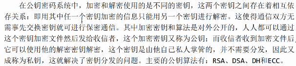

# openssl

## 对称加密

加密产生的秘文长度与明文传播的股相同

- CBC
- CFP
- OFB
- ...

#### 摘要算法

能产生特殊输出格式，无论用户输入什么长度的原始数据，得到的秘文长度都是固定的。

被摘要的数据内容与源数据密切相关，只要原始数据稍有改变，输出的摘要边完全不同。

- MD2
- MD4
- MD5 
- SHA
- SHA-1/266/512

最常用的加密算法就是MD5和SHA1：

- MD5输出16字节

- SHA1输出20字节

  git log的commitid的加密算法就是SHA1，出错率一亿分之一

  git版本回退：git reset --hard [commitid]

#### 公钥算法

主要公钥算法：RSA、DSA、DH、ECC

ssh公钥

ssh-keygen生成ssh公钥，存放在.ssh文件夹中

ssh公钥算法RSA

##### RSA加密算法

- 可以用于数字加密和数字签名。

#### 回调函数

OpenSSL使用了大量的回调函数

随机数就是通过OpenSSL生成的

HTTPS = HTTP + SSL

HTTP协议不安全，因此使用了SSL加密算法对HTTP协议进行了升级。

AF，AC可以对HTTPS进行破解

HTTPS端口号443

