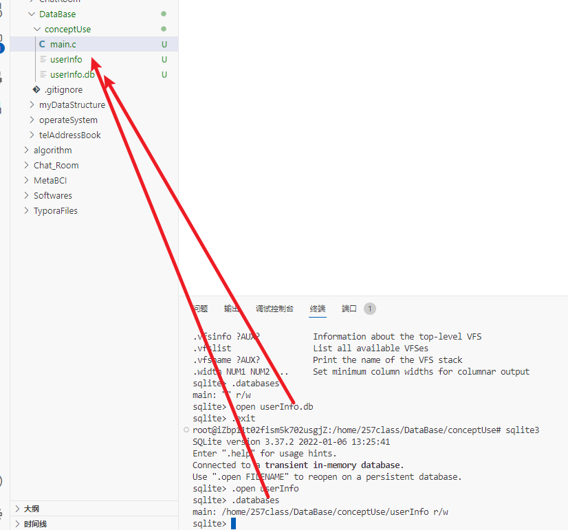

# 数据库

压缩算法的底层是哈夫曼树

zip压缩算法与gz压缩算法

tar命令：解压命令

scp 跨源复制

## sqlite3

大小写不敏感

.schema [表名]

.databases 列出数据库名称及其锁依赖的文件

.show 显示当前的设置值

create table tablename{

column1 datatype，

。。。

columnn datatype，

primary key 

}；

创建数据库：sqlite3 databaseName.db之后进入sqlite3使用.open databaseName.db可以打开数据库

进入到数据库可以查看当前的数据库

创建数据库：

查看当前数据库的数据表 .table

查看当前数据表创建信息：.schema tablename

删除表 drop table tablename

插入语句：insert into tablename [(column1 ， column2， 。。。， columnN)] 

values(value1, value2, ... valuen);

字符串用单引号表示

select查询语句

查询数据库速度很慢，尽量一次拿完所有数据

atoi字符串转换int(不安全函数)

strtol字符串转整形

`const char * __restrict__ __nptr`

`endptr`

