## 数据链路层 - 二层 - 数据帧

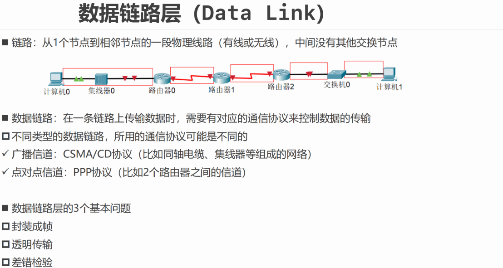

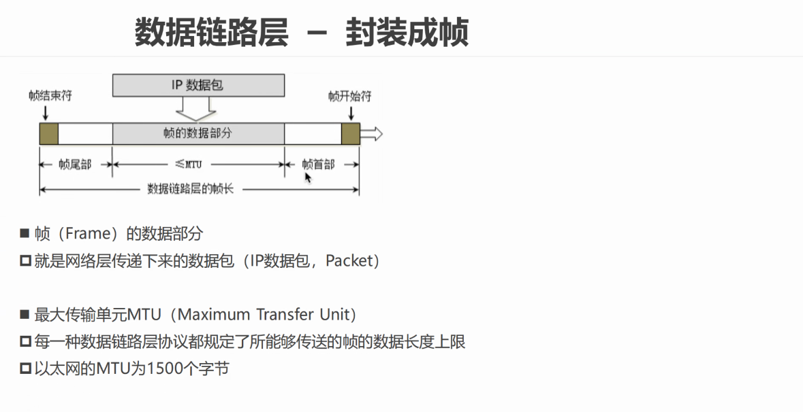

MTU：

最大传输单元。

规定了所能传输的数据长度上限。以太网的最大传输单元为1500字节。

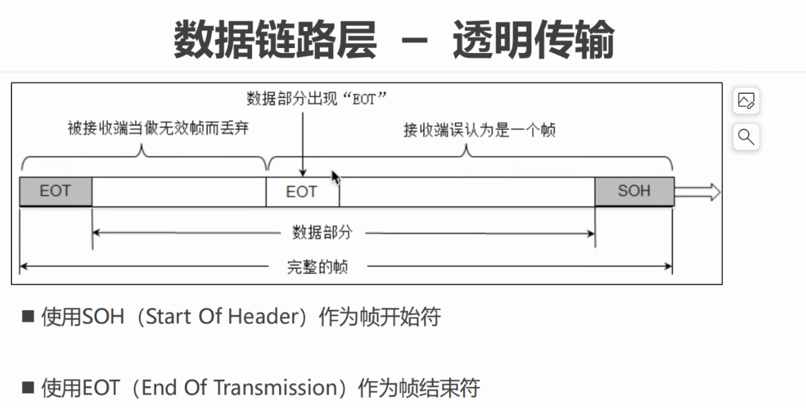

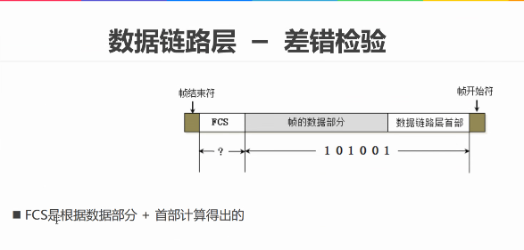

二层是首部：目的MAC，源MAC，网络类型

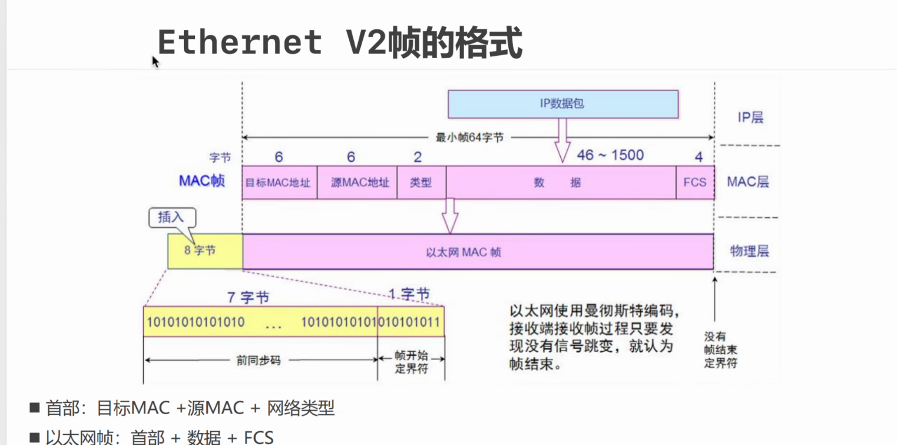

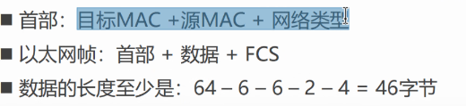

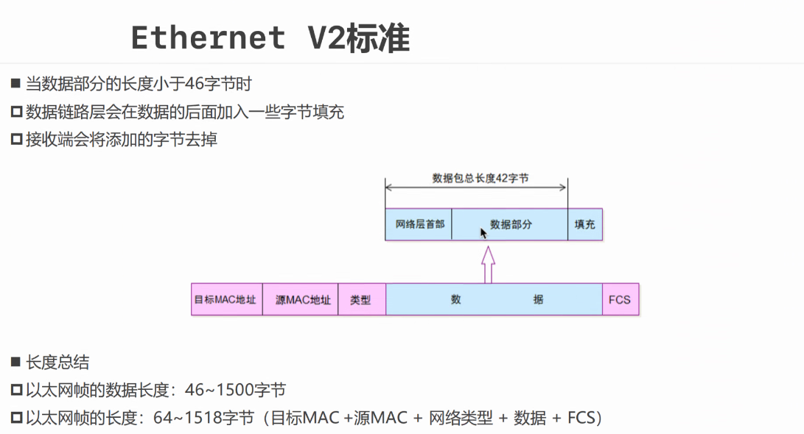

二层设备

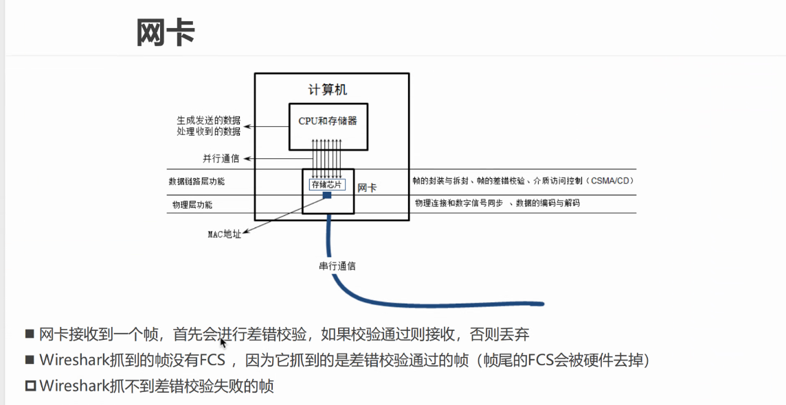

wireshark：网络抓包工具

由于kernel会出问题，使用DPDK

DPDK：将网卡抓到的包复制到DPDK(应用层协议栈)。

shynet：

## 网络层  - 三层 - 数据包

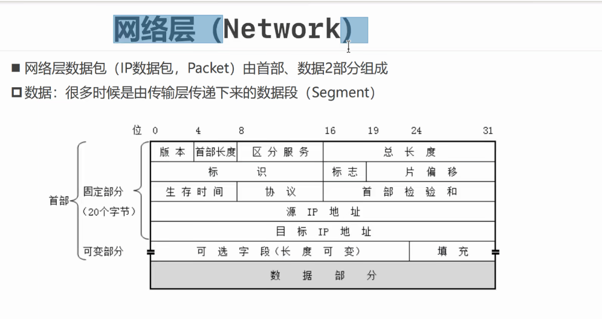

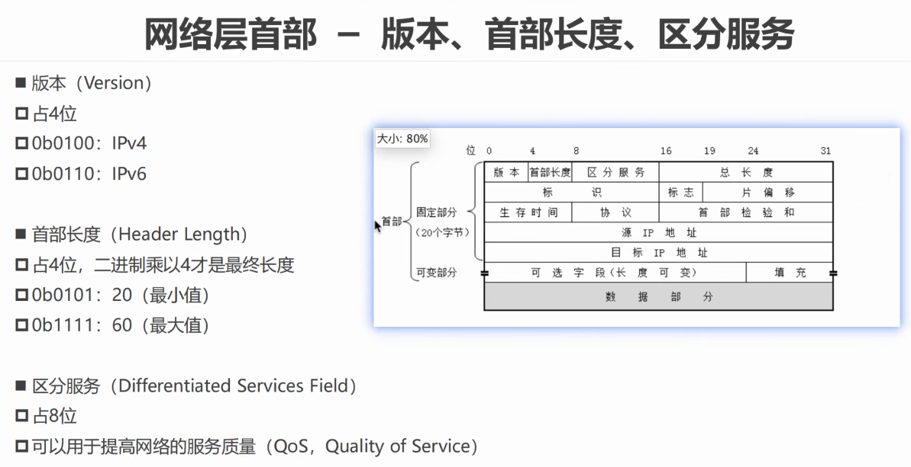

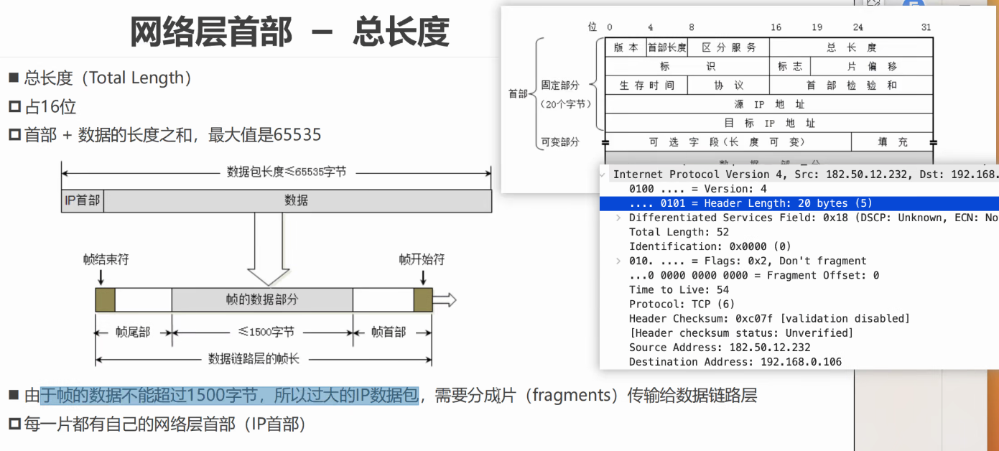

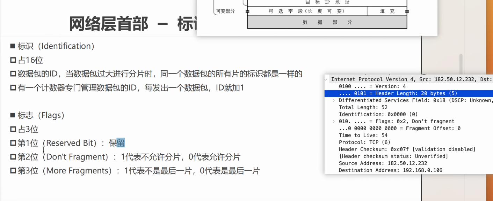

分片重组：将网络包的分片根据片便移重新组合为新的数据包

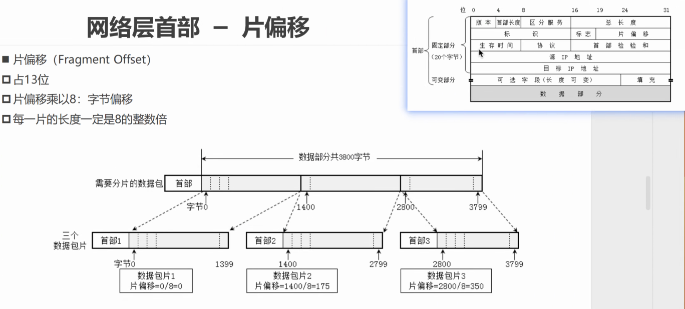

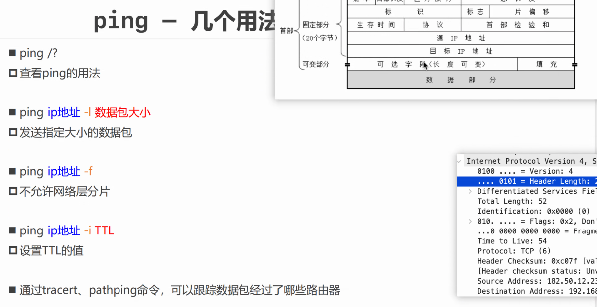

ping 默认64字节

ttl：生存时间，当ttl为64时自动丢弃当前网络包

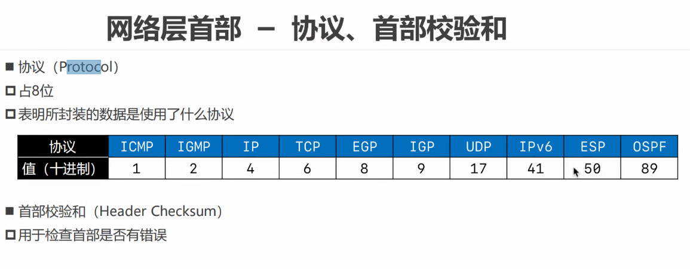

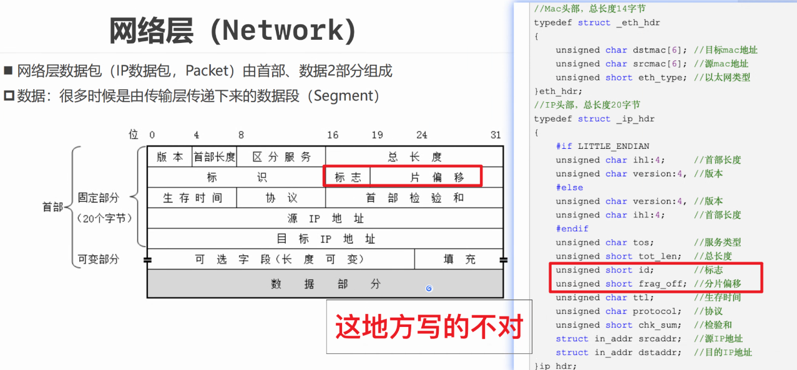

位域：

