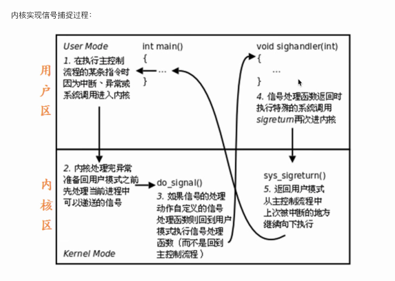

# 信号

#### **信号发送命令**

- `kill -[信号] [进程id]`- 给特定的进程发送特定的信号。

#### **信号相关函数**

##### ` int killl (pid_t id, int sig);` - 给任意进程发送任意信号。

- `pid_t id` 需要发送信号的进程ID。
- `int sig` 需要发送的信号。

##### `int raise(int sig);` - 给当前进程发送任意信号。

- `int sig` 需要发送的信号编号。

##### ` int abort(void);` - 给自己发送终止信号。

- 默认给自己发送一个终止信号，即6号信号`SIGABRT`。

##### `unsigned int alarm(unsigned int sceonds);` - 闹钟函数，在指定时间后给自己发送信号`SIGALRM`。

设定定时器闹钟，在seconds之后，内核会给自己发送一个指定的信号SIGALRM，进程收到信号后，默认动作是终止。

定时器与进程状态无关，无论进程处于什么状态都可以运行。

- `alarm(0)` 取消定时器。

- `unsigned int sceonds` 指定的时间，单位：秒。

- `int setitimer(int which, const struct itimerval *new_value, struct itimerval *old_value);` 设定更加精确的定时器时间。

##### `sighandler_t signal(int signum, sighandler_t handler);` - **注册信号**处理函数。确定收到信号的后的处理函数的入口地址，此函数不会阻塞。

- `int signum` 指定的信号。

- `sighandler_t handler` 信号处理函数方法。
  1. `SIG_IGN` 忽略。`SIGKILL`和`SIGTOP`必须执行默认的信号处理动作。
  2. `SIG_DFL` 默认。
  3. 自定义处理函数地址。

- 自定义信号处理函数执行过程。

  

#### **信号发送权限**

- `root用户`可以给任意用户发送信号。
- `其他用户`只能给当前用户的进程发送信号。

#### 使用信号处理函数避免僵尸进程：

- 使用`wait`函数的进程如果没有子进程，该函数会立刻返回；若子进程结束，函数依然会返回。

- 由于`signal`函数不依赖于进程执行的特点。

  可以使用自定义`SIGCHLD`信号处理函数，在自定义的函数中回收子进程的资源，来避免僵尸进程，同时可以防止父进程一直等待子进程的资源回收导致父进程等待时间过长的问题。

**示例代码**

```c

#include<stdio.h>
#include<unistd.h>
#include<sys/types.h>
#include<stdlib.h>
#include<sys/wait.h>
#include <signal.h>
void signal_wait(int isig)
{
	wait(NULL);
	printf("child is cleaned\n");
}
int main(void)
{
	pid_t pid=fork();
	char *s=NULL;
	if(signal(SIGCHLD,signal_wait)==SIG_ERR){
		perror("install signal_wait");
	}
	if(pid<0){
		perror("fork creat ");
	}else if(pid>0){//父进程
		sleep(1);
		s="this is parent process";
	}else{//pid=0//子进程
		s="this is child process";
	}
	printf("%s bye\n",s);
	return 0;
}
```

