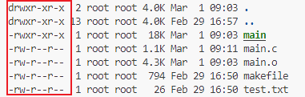

# 系统编程基础

### 操作系统实现的功能

操作系统工作在硬件与软件之间，向下控制硬件工作，向上为软件提供各自系统调用，即应用程序接口。

### 系统调用

操作系统向上提供的接口(函数)统称为`系统调用`，操作系统上层的应用程序只能通过系统调用进入内核空间，执行内核命令

### 应用程序的内存分区

Linux每一个运行的程序，操作系统都会给它分配一个`0-4G`的虚拟地址空间。

- `3-4G`为内核空间(kernel)。
- `1-3G`为用户空间(user)。
  - 非法地址空间：`NULL`
  - 全局区：字符串常量存放在此处。
  - 代码区：应用程序的代码存放位置。
  - 栈空间：自动申请和释放内存空间。

  - 共享库：存放库文件。
  - 堆空间：`malloc`申请的空间
    - 一般与内存条大小有关。

  - 命令行参数：`const char * argv[]`
  - 环境变量：`PATH:=`

### 内核空间与用户空间

   内核空间是受操作系统保护的空间，不能直接访问。

   程序员只能通过操作系统系统调用来使用内核空间，系统调用结束后，将结果返回给用户空间。

### 系统调用与库函数

- 库函数分为：1.需要调用系统调用的函数 2.不需要调用系统调用的函数。
- 系统调用会调用`Call函数`切换到内核空间。会耗费一定的`CPU`时间。频繁使用系统调用会浪费资源和效率。

### 文件描述符

- 第一位。
  - `d`目录。
  - `-`普通文件。
  - `l`软链接。
- `rwx`
  - `r`可读。
  - `w`可写。
  - `x`可执行程序。
    - 使用`chmod -x [可执行文件名]`剥夺可执行权限。
    - 使用`chmod +x [可执行文件名]`赋予可执行权限。

### 命令行参数

`./main [param1] [param2]`使用命令行参数。

`params`存放在`main`函数的`argv`参数中。