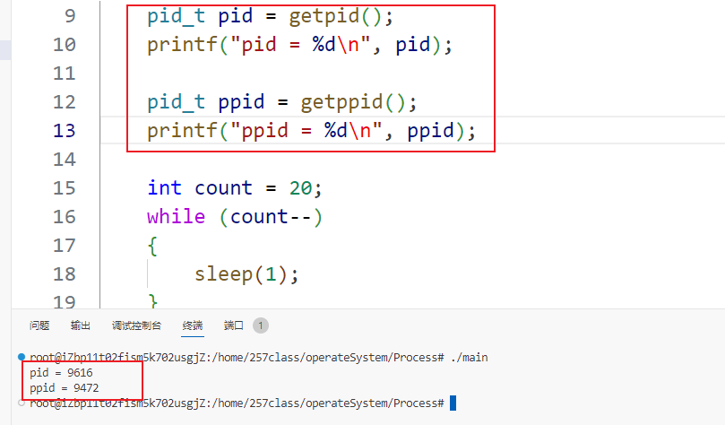
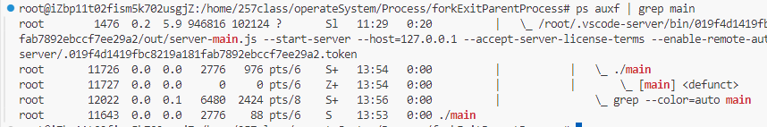

# 进程——资源分配的基本单位

1. 命令`top`(任务管理器) ，类似`windows`的`ctrl alt .`。

   作用：动态显示运行中的**进程**。查看正在执行的**进程**。

   命令：

   - `M` 按照内存排序。
   - `P` 按照CPU排序。

   

2. 命令`ps -ef`查看运行的所有进程。

   `ps -ef | grep mian`查看运行中的带有`mian`的进程。

   `ps`查看的进程信息：

   进程信息词条：

   - `UID`：用户ID。

   - `PID`：进程ID。

   - `PPID`：父进程ID。

   

3. 命令`grep` 过滤命令。

   常用参数：`-v`

   - `grep -v grep` 忽略`grep`

4. 命令`kill`。

   作用：发送指定信号到指定进程

   用法：`kill [信号] [进程ID]`

   常用信号：

   - `-9`强制终止进程。

   常用参数：

   - `-l` 查看所有的信号信息

5. 可执行程序后加`&`，后台运行可执行程序。

6. `ps`查看进程状态。

   常用命令：

   1. `ps -ef`

   2. `ps auxf`查看进程状态

      进程状态：

      - R运行
      - S休眠
      - T停止
      - Z僵尸进程
      - 。。。

7. 进程号`PID`。一般为 `0-32767` 且进程号PID唯一。

   `PID`进程号。

   `PPID`父进程号。

   `PGID`进程组号。

   每一个进程都对应/proc/文件夹下一个对应进程号的目录文件：

   

   目录下存放的内容：

   

8. 命令`ls -al cwd` 获取当前的工作目录。

9. 命令`df -h` 查看当前运行中的程序的内存和CPU占用情况。

10. 函数`getpid()`获取被调用进程的进程号。返回调用进程的进程号。

    函数`getppid()`获取父进程的进程号。返回调用进程的父进程的进程号。

    

    

    所有进程的祖先进程都是`init`进程，即零号进程。

11. 函数进程创建`fork()`

    // 1.(优)速度快    效率

    // 2.(缺)占用资源多  资源

    // 3.压力测试(设备性能瓶颈，设备相关)

    当前是父进程，返回子进程的pid号。

    当前是子进程，返回0；

    孩子进程：创建的进程。

    父进程：创建进程的进程。

    子进程在独立的内存空间中执行。

    

    父进程结束，子进程没有退出，子进程就会变为孤儿进程。

    

    子进程结束，父进程没有回收资源，子进程就会变成僵尸进程，僵尸进程依然会占用系统空间。

    

    守护进程，僵尸进程和孤儿进程。

    fork函数创建完进程之后，就会有第二个内存空间存放子进程。两个程序执行不同的语句。

    

    此外，由于操作系统的异步性，每次程序执行的顺序是不可知的，因此每次打印的结果可能不同。当不同进程需要访问相同的内存空间时，会产生并发和共享两种问题需要解决。

12. 函数`vfork()`，功能与fork相同，但是总会让父进程先执行。

13. 父进程与子进程fork函数创建的子进程直接复制父进程的所有内容，除了计时器和进程号。因此，fork函数相当于复制了一份当前进程的内容，代价巨大。

    为了防止资源的浪费，采取了读时复制，写时共享的策略使用子进程。

14. 父进程和子进程占用独立的地址空间。

15. 进程间通信的方式：

    - 无名管道通信。
    - 有名管道通信。
    - `mmap`内存映射函数。

16. 进程退出函数`exit()`，底层调用系统调用`_exit()`。

17. 父进程进行文件资源回收函数`wait()`函数，等待子进程终止。

    函数`waitpid()`与`wait()`函数功能相同。

18. 检查检查阻塞的方法

    1. 命令`strace -p 19437` 检测检测是否是用户态阻塞，`strace`卡死就是用户态阻塞

    

    2. `gdb attach [进程号]` 检测阻塞。一般不用，因为`gdb`挂久了会导致僵尸进程。

    

    当发生应用层阻塞时，一定是代码的问题导致的阻塞。

19. 孤儿进程与僵尸进程

    - 孤儿进程

      父进程先于子进程结束，子进程交由操作系统管理，操作系统将当前子进程挂到自己的子进程下。

      父进程终止，子进程还在运行。孤儿进程危害不大。

    - 僵尸进程
    
      子进程终止，父进程尚未回收子进程资源。

