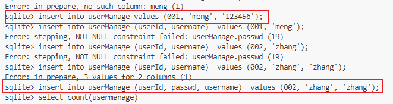

# SQLite3

## sqlite简介

### 什么是SQLite？

SQLite是一个进程内的库，实现了自给自足的、无服务器的、零配置的、事务性的 SQL 数据库引擎。它是一个零配置的数据库，这意味着与其他数据库不一样，您不需要在系统中配置。

就像其他数据库，SQLite 引擎不是一个独立的进程，可以按应用程序需求进行静态或动态连接。SQLite 直接访问其存储文件。

### SQLite的优点

- 不需要一个单独的服务器进程或操作的系统（无服务器的）。
- SQLite 不需要配置，这意味着不需要安装或管理。
- 一个完整的 SQLite 数据库是存储在一个单一的跨平台的磁盘文件。
- SQLite 是非常小的，是轻量级的，完全配置时小于 400KiB，省略可选功能配置时小于250KiB。
- SQLite 是自给自足的，这意味着不需要任何外部的依赖。
- SQLite 事务是完全兼容 ACID 的，允许从多个进程或线程安全访问。
- SQLite 支持 SQL92（SQL2）标准的大多数查询语言的功能。
- SQLite 使用 ANSI-C 编写的，并提供了简单和易于使用的 API。
- SQLite 可在 UNIX（Linux, Mac OS-X, Android, iOS）和 Windows（Win32, WinCE, WinRT）中运行。

### SQLite 命令

与关系数据库进行交互的标准 SQLite 命令类似于 SQL。命令包括 CREATE、SELECT、INSERT、UPDATE、DELETE 和 DROP。这些命令基于它们的操作性质可分为以下几种：

#### DDL - 数据定义语言

|  命令  |                          描述                          |
| :----: | :----------------------------------------------------: |
| CREATE | 创建一个新的表，一个表的视图，或者数据库中的其他对象。 |
| ALTER  |    修改数据库中的某个已有的数据库对象，比如一个表。    |
|  DROP  |   删除整个表，或者表的视图，或者数据库中的其他对象。   |

#### DML - 数据操作语言

|  命令  |      描述      |
| :----: | :------------: |
| INSERT | 创建一条记录。 |
| UPDATE |   修改记录。   |
| DELETE |   删除记录。   |

#### DQL - 数据查询语言

|  命令  |              描述              |
| :----: | :----------------------------: |
| SELECT | 从一个或多个表中检索某些记录。 |

## SQLite命令

进入SQLite数据库：`sqlite3`

获取SQLite数据库帮助文档：`.help`

一部分常用的SQLite命令：

- `.databases` 列出数据库的名称及其所依赖的文件。
- `.exit` 退出SQLite提示符。
- `.schema [表名]` 显示创建表的create语句。
- `.show` 显示各种设置的当前值。
- `.header on` 显示数据表的列名。
- `.mode column` 格式化输出数据表的元素。

## SQLite数据类型

### SQLite 存储类

每个存储在 SQLite 数据库中的值都具有以下存储类之一：

| 存储类  |                             描述                             |
| :-----: | :----------------------------------------------------------: |
|  NULL   |                      值是一个 NULL 值。                      |
| INTEGER | 值是一个带符号的整数，根据值的大小存储在 1、2、3、4、6 或 8 字节中。 |
|  REAL   |       值是一个浮点值，存储为 8 字节的 IEEE 浮点数字。        |
|  TEXT   | 值是一个文本字符串，使用数据库编码（UTF-8、UTF-16BE 或 UTF-16LE）存储。 |
|  BLOB   |          值是一个 blob 数据，完全根据它的输入存储。          |

SQLite 的存储类稍微比数据类型更普遍。INTEGER 存储类，例如，包含 6 种不同的不同长度的整数数据类型。

### Boolean 数据类型

SQLite 没有单独的 Boolean 存储类。相反，布尔值被存储为整数 0（false）和 1（true）。

### Date 与 Time 数据类型

SQLite 没有一个单独的用于存储日期和/或时间的存储类，但 SQLite 能够把日期和时间存储为 TEXT、REAL 或 INTEGER 值。

| 存储类  | 日期格式                                                     |
| :------ | :----------------------------------------------------------- |
| TEXT    | 格式为 "YYYY-MM-DD HH:MM:SS.SSS" 的日期。                    |
| REAL    | 从公元前 4714 年 11 月 24 日格林尼治时间的正午开始算起的天数。 |
| INTEGER | 从 1970-01-01 00:00:00 UTC 算起的秒数。                      |

## 建立SQLite数据库

### 创建数据库：

- `$ sqlite3 DatabaseName.db` 创建一个数据库。
- `.open DatabaseName.db` 进入创建的数据库。
- 进入到数据库后可以使用`.databases`来查看数据库列表中的数据库。

### 创建数据表：

CREATE TABLE 语句的基本语法如下：

```sqlite
CREATE TABLE database_name.table_name(
   column1 datatype  PRIMARY KEY(one or more columns),
   column2 datatype,
   column3 datatype,
   .....
   columnN datatype,
);
```

CREATE TABLE 是告诉数据库系统创建一个新表的关键字。

- 可以使用`.tables`查看当前数据库中创建的数据表。
- 可以使用`.schema [表名]`命令查看当前数据表的创建信息。

### 删除数据表

DROP TABLE 语句的基本语法如下。您可以选择指定带有表名的数据库名称，如下所示：

```sqlite
DROP TABLE database_name.table_name;
```

### 查询语句

SQLite 的 **SELECT** 语句用于从 SQLite 数据库表中获取数据，以结果表的形式返回数据。这些结果表也被称为结果集。

SQLite 的 SELECT 语句的基本语法如下：

```sqlite
SELECT column1, column2, columnN FROM table_name;
```

在这里，column1, column2...是表的字段，他们的值即是您要获取的。如果您想获取所有可用的字段，那么可以使用下面的语法：

```sqlite
SELECT * FROM table_name;
```

### 插入语句

INSERT INTO 语句有两种基本语法，如下所示：

```sqlite
INSERT INTO TABLE_NAME [(column1, column2, column3,...columnN)]  
VALUES (value1, value2, value3,...valueN);
```

在这里，column1, column2,...columnN 是要插入数据的表中的列的名称。

如果要为表中的所有列添加值，您也可以不需要在 SQLite 查询中指定列名称。但要确保值的顺序与列在表中的顺序一致。SQLite 的 INSERT INTO 语法如下：

```sqlite
INSERT INTO TABLE_NAME VALUES (value1,value2,value3,...valueN);
```

插入语句中的字符串用单引号表示



可以使用选择语句和插入语句的嵌套，将数据填充到另一个表中。

```sqlite
INSERT INTO first_table_name [(column1, column2, ... columnN)] 
   SELECT column1, column2, ...columnN 
   FROM second_table_name
   [WHERE condition];
```

### 修改语句

#### 修改表项：

SQLite 的 **UPDATE** 查询用于修改表中已有的记录。可以使用带有 WHERE 子句的 UPDATE 查询来更新选定行，否则所有的行都会被更新。

带有 WHERE 子句的 UPDATE 查询的基本语法如下：

```sqlite
UPDATE table_name
SET column1 = value1, column2 = value2...., columnN = valueN
WHERE [condition];
```

#### 删除表项

SQLite 的 **DELETE** 查询用于删除表中已有的记录。可以使用带有 WHERE 子句的 DELETE 查询来删除选定行，否则所有的记录都会被删除。

带有 WHERE 子句的 DELETE 查询的基本语法如下：

```sqlite
DELETE FROM table_name
WHERE [condition];
```

## SQLite中的运算符

### SQLite 比较运算符

假设变量 a=10，变量 b=20，则：

| 运算符 | 描述                                                         |       实例        |
| ------ | :----------------------------------------------------------- | :---------------: |
| ==     | 检查两个操作数的值是否相等，如果相等则条件为真。             | (a == b) 不为真。 |
| =      | 检查两个操作数的值是否相等，如果相等则条件为真。             | (a = b) 不为真。  |
| !=     | 检查两个操作数的值是否相等，如果不相等则条件为真。           |  (a != b) 为真。  |
| <>     | 检查两个操作数的值是否相等，如果不相等则条件为真。           |  (a <> b) 为真。  |
| >      | 检查左操作数的值是否大于右操作数的值，如果是则条件为真。     | (a > b) 不为真。  |
| <      | 检查左操作数的值是否小于右操作数的值，如果是则条件为真。     |  (a < b) 为真。   |
| >=     | 检查左操作数的值是否大于等于右操作数的值，如果是则条件为真。 | (a >= b) 不为真。 |
| <=     | 检查左操作数的值是否小于等于右操作数的值，如果是则条件为真。 |  (a <= b) 为真。  |
| !<     | 检查左操作数的值是否不小于右操作数的值，如果是则条件为真。   |  (a !< b) 为假。  |
| !>     | 检查左操作数的值是否不大于右操作数的值，如果是则条件为真。   |  (a !> b) 为真。  |

### SQLite 逻辑运算符

下面是 SQLite 中所有的逻辑运算符列表。

| 运算符  |                             描述                             |
| :-----: | :----------------------------------------------------------: |
|   AND   | AND 运算符允许在一个 SQL 语句的 WHERE 子句中的多个条件的存在。 |
| BETWEEN | BETWEEN 运算符用于在给定最小值和最大值范围内的一系列值中搜索值。 |
| EXISTS  |   EXISTS 运算符用于在满足一定条件的指定表中搜索行的存在。    |
|   IN    |     IN 运算符用于把某个值与一系列指定列表的值进行比较。      |
| NOT IN  | IN 运算符的对立面，用于把某个值与不在一系列指定列表的值进行比较。 |
|  LIKE   | LIKE 运算符用于把某个值与使用通配符运算符的相似值进行比较。  |
|  GLOB   | GLOB 运算符用于把某个值与使用通配符运算符的相似值进行比较。GLOB 与 LIKE 不同之处在于，它是大小写敏感的。 |
|   NOT   | NOT 运算符是所用的逻辑运算符的对立面。比如 NOT EXISTS、NOT BETWEEN、NOT IN，等等。**它是否定运算符。** |
|   OR    |  OR 运算符用于结合一个 SQL 语句的 WHERE 子句中的多个条件。   |
| IS NULL |         NULL 运算符用于把某个值与 NULL 值进行比较。          |
|   IS    |                     IS 运算符与 = 相似。                     |
| IS NOT  |                  IS NOT 运算符与 != 相似。                   |
|  \|\|   |          连接两个不同的字符串，得到一个新的字符串。          |
| UNIQUE  |  UNIQUE 运算符搜索指定表中的每一行，确保唯一性（无重复）。   |

### SQLite 位运算符

| 运算符 |                             描述                             |                             实例                             |
| :----: | :----------------------------------------------------------: | :----------------------------------------------------------: |
|   &    | 如果同时存在于两个操作数中，二进制 AND 运算符复制一位到结果中。 |              (A & B) 将得到 12，即为 0000 1100               |
|   \|   |  如果存在于任一操作数中，二进制 OR 运算符复制一位到结果中。  |              (A \| B) 将得到 61，即为 0011 1101              |
|   ~    | 二进制补码运算符是一元运算符，具有"翻转"位效应，即0变成1，1变成0。 | (~A ) 将得到 -61，即为 1100 0011，一个有符号二进制数的补码形式。 |
|   <<   |  二进制左移运算符。左操作数的值向左移动右操作数指定的位数。  |              A << 2 将得到 240，即为 1111 0000               |
|   >>   |  二进制右移运算符。左操作数的值向右移动右操作数指定的位数。  |               A >> 2 将得到 15，即为 0000 1111               |

## SQLite 子句

- where 子句。SQLite的 **WHERE** 子句用于指定从一个表或多个表中获取数据的条件。如果满足给定的条件，即为真（true）时，则从表中返回特定的值。

- SQLite 的 AND 和 OR 运算符用于编译多个条件来缩小在 SQLite 语句中所选的数据。这两个运算符被称为连接运算符。

- like子句。SQLite 的 **LIKE** 运算符是用来匹配通配符指定模式的文本值。如果搜索表达式与模式表达式匹配，LIKE 运算符将返回真（true），也就是 1。这里有两个通配符与 LIKE 运算符一起使用：

  - 百分号 （%）
  - 下划线 （_）

  百分号（%）代表零个、一个或多个数字或字符。下划线（_）代表一个单一的数字或字符。这些符号可以被组合使用。

- SQLite 的 **LIMIT** 子句用于限制由 SELECT 语句返回的数据数量。

  带有 LIMIT 子句的 SELECT 语句的基本语法如下：

  ```sqlite
  SELECT column1, column2, columnN 
  FROM table_name
  LIMIT [no of rows]
  ```

  下面是 LIMIT 子句与OFFSET 子句一起使用时的语法：

  ```sqlite
  SELECT column1, column2, columnN 
  FROM table_name
  LIMIT [no of rows] OFFSET [row num]
  ```

  SQLite 引擎将返回从下一行开始直到给定的 OFFSET 为止的所有行。

  在某些情况下，可能需要从一个特定的偏移开始提取记录。下面是一个实例，从第三位开始提取 3 个记录：

  ```sqlite
  sqlite> SELECT * FROM COMPANY LIMIT 3 OFFSET 2;
  ```

  这将产生以下结果：

  ```cmd
  ID          NAME        AGE         ADDRESS     SALARY
  ----------  ----------  ----------  ----------  ----------
  3           Teddy       23          Norway      20000.0
  4           Mark        25          Rich-Mond   65000.0
  5           David       27          Texas       85000.0
  ```

- SQLite 的 **ORDER BY** 子句是用来基于一个或多个列按升序或降序顺序排列数据。

  ORDER BY 子句的基本语法如下：

  ```sqlite
  SELECT column-list 
  FROM table_name 
  [WHERE condition] 
  [ORDER BY column1, column2, .. columnN] [ASC | DESC];
  ```

  - **ASC** 默认值，从小到大，升序排列
  - **DESC** 从大到小，降序排列

- SQLite Group By子句。SQLite 的 **GROUP BY** 子句用于与 SELECT 语句一起使用，来对相同的数据进行分组。在 SELECT 语句中，GROUP BY 子句放在 WHERE 子句之后，放在 ORDER BY 子句之前。

- SQLite Having 子句。HAVING 子句允许指定条件来过滤将出现在最终结果中的分组结果。WHERE 子句在所选列上设置条件，而 HAVING 子句则在由 GROUP BY 子句创建的分组上设置条件。

- SQLite Distinct 关键字。SQLite 的 **DISTINCT** 关键字与 SELECT 语句一起使用，来消除所有重复的记录，并只获取唯一一次记录。有可能出现一种情况，在一个表中有多个重复的记录。当提取这样的记录时，DISTINCT 关键字就显得特别有意义，它只获取唯一一次记录，而不是获取重复记录。

## SQLite接口

| 序号 |                          API & 描述                          |
| ---- | :----------------------------------------------------------: |
| 1    | **sqlite3_open(const char \*filename, sqlite3 \**ppDb)** 该例程打开一个指向 SQLite 数据库文件的连接，返回一个用于其他 SQLite 程序的数据库连接对象。如果 *filename* 参数是 NULL 或 ':memory:'，那么 sqlite3_open() 将会在 RAM 中创建一个内存数据库，这只会在 session 的有效时间内持续。如果文件名 filename 不为 NULL，那么 sqlite3_open() 将使用这个参数值尝试打开数据库文件。如果该名称的文件不存在，sqlite3_open() 将创建一个新的命名为该名称的数据库文件并打开。 |
| 2    | **sqlite3_exec(sqlite3\*, const char \*sql, sqlite_callback, void \*data, char \**errmsg)** 该例程提供了一个执行 SQL 命令的快捷方式，SQL 命令由 sql 参数提供，可以由多个 SQL 命令组成。在这里，第一个参数 *sqlite3* 是打开的数据库对象，*sqlite_callback* 是一个回调，*data* 作为其第一个参数，errmsg 将被返回用来获取程序生成的任何错误。sqlite3_exec() 程序解析并执行由 **sql** 参数所给的每个命令，直到字符串结束或者遇到错误为止。 |
| 3    | **sqlite3_close(sqlite3\*)** 该例程关闭之前调用 sqlite3_open() 打开的数据库连接。所有与连接相关的语句都应在连接关闭之前完成。如果还有查询没有完成，sqlite3_close() 将返回 SQLITE_BUSY 禁止关闭的错误消息。 |
| 4    | `int sqlite3_get_table(sqlite3* db,char* order,char*** dResult,int *nRow,int *nColnm,char **errmsg);`使用`sql`语句`order`对数据库db进行查询，row传回数据的行数，column传回数据的列数，`dResult`传回查询的到的结果集。 |


