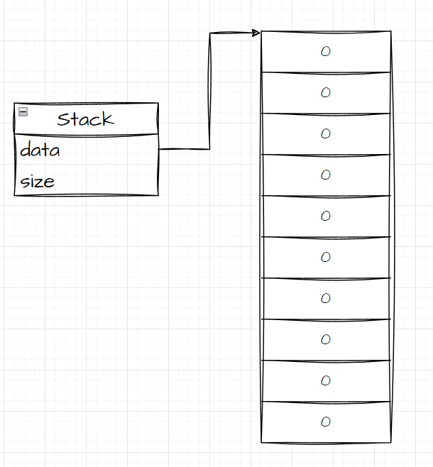
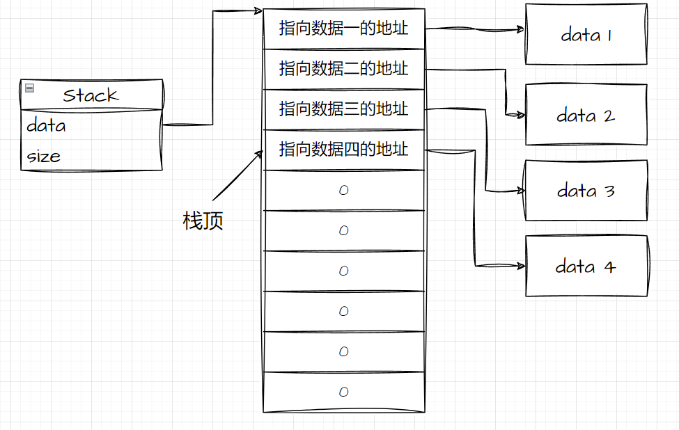
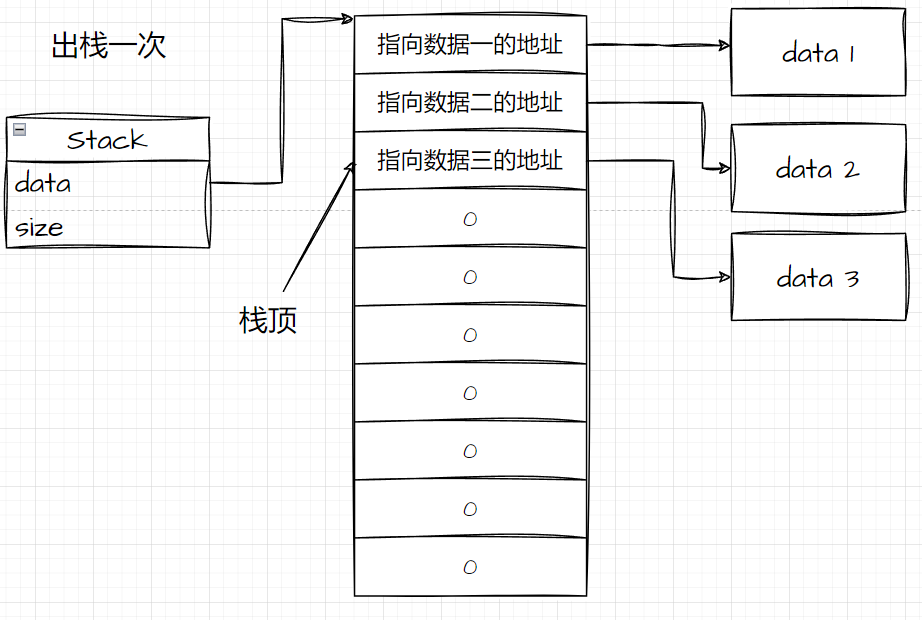

## 一、操作受限的数据结构

不同于数组链表等数据结构，栈是一种操作受限的数据结构。

栈的操作受限主要体现在：

- 用户在操作栈时只允许对栈顶元素进行操作以及查询栈元素个数。
- 对最上层的数据的操作只允许：查询、新增和删除。

## 二、栈需要实现的功能列表

#### 初始化栈

初始化操作主要是为了给栈分配一个初始的空间大小用来存放数据。

#### 元素入栈

数据的入栈操作只允许向栈顶插入数据，即数组的尾插、链表的头插。

#### 元素出栈

数据出栈时，栈会立刻从当前的数据中删除这个数据，并将元素个数减一。

#### 查询栈顶元素

返回当前栈顶存储的数据，但不将元素出栈。

#### 查询栈元素个数

返回当前栈的数据个数。

#### 检查是否为空

返回当前栈的元素个数是否为0。

#### 销毁栈

释放当前栈的存储空间。

除此以外栈没有其他的向上提供的接口。