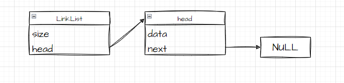
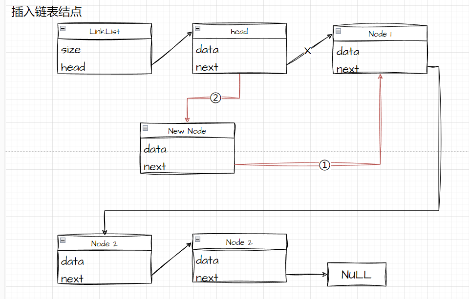
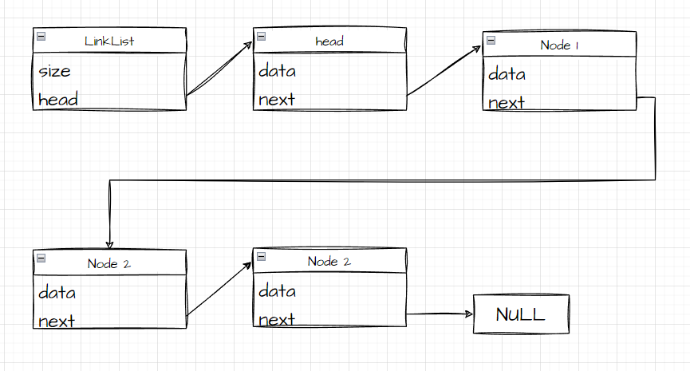
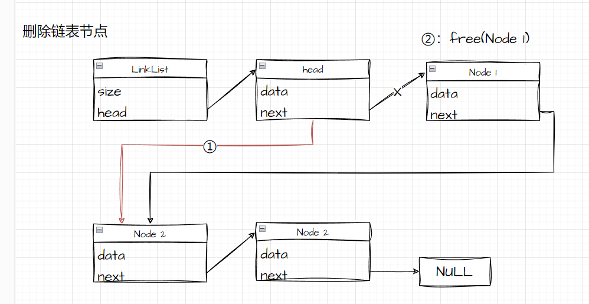

## 一、链表的数据结构

```c
typedef struct LinkNode LinkNode;
typedef struct LinkList LinkList;

struct LinkNode
{
    // 数据域
    ELEMENTTYPE data;
    // 指针域
    struct LinkNode *next;
};

struct LinkList
{
    // 节点个数
    int size;
    // 链表头结点(虚拟头结点)
    LinkNode *head;
};

```

------

## 二、链表需要实现的功能列表

### 初始化与销毁

**链表初始化状态：**



```c
/* 链表初始化
 * @param **pList 要初始化的链表
 * @return 非零表示初始化失败
 */
int linkListInit(LinkList **pList);
```

**初始化函数：**

- 判空。

- 申请链表存储空间，包括链表数据数量，以及头尾指针。
- 动态申请链表头尾结点的结点数据。
- 将链表的头尾指针指向头为结点。

```c
/* 链表销毁
 * @param *pList 要操作的数组
 * @return 非零表示失败
 */
int linkListDestory(LinkList *pList);
```

**链表销毁函数：**

- 判空。
- 记录链表头结点，并销毁链表空间。
- 依次销毁每一个节点的内存空间。
- 删除头结点的内存空间

### 链表的插入

```c
/* 链表头插
 * @param *pList 要插入数据的链表
 * @param data 要插入的数据
 * @return 非零表示插入失败
 */
int linkListHeadInsert(LinkList *pList, ELEMENTTYPE data);

/* 链表尾插
 * @param *pList 要插入数据的链表
 * @param data 要插入的数据
 * @return 非零表示插入失败
 */
int linkListTailInsert(LinkList *pList, ELEMENTTYPE data);

/* 链表任意位置插入
 * @param *pList 要插入数据的链表
 * @param pos 要插入的位置
 * @param data 要插入的数据
 * @return 非零表示插入失败
 */
int linkListAppointPosInsert(LinkList *pList, int pos, ELEMENTTYPE data);
```

**链表头插：**

- 调用链表任意位置插入函数并设置位置值为0。

**链表尾插：**

- 调用链表任意位置插入函数并设置位置值为`pList->size`。

**链表任意位置插入：**

- 判空。
- 判断插入位置是否合法。
- `malloc`新建一个结点空间，并对节点进行初始化和判空。
- 新建一个临时变量。
- 如果是尾插入，直接将这个临时变量指向尾结点，并设置尾结点移动标志位为`1`。
- 如果不是尾插入，将这个变量移动到需要插入的节点的前一个位置。
- 将节点插入到链表中。并根据尾结点移动标记位判断是否需要移动尾结点。

**插入链表示意图：**



### 链表遍历与查询

**链表结构示意图：**



```c
/* 链表遍历
 * @param *pList 需要遍历的数组
 * @param *printFunc打印链表数据的函数
 * @return 非零表示遍历失败
 */
int linkListForeach(LinkList *pList, int (*printFunc)(ELEMENTTYPE));
```

**链表遍历：**

- 判空。
- 新建临时节点`travelNode`，将其指向第一个数据。
- 调用`printFinc`函数打印这个节点的数据。
- 节点`travelNode`指向下一个节点。
- 重复以上两步知道`travelNode`为空。

```c
/* 获取链表长度
 * @param *pList 要查询的数组
 * @param *pSize 查询到的数组大小存放的数据指针
 * @return 非零表示查询失败
 */
int linkListGetSize(LinkList *pList, int *pSize);
```

**查询链表长度：**

- 判空。
- 返回链表长度数据。

### 链表删除

```c
/* 链表头删
 * @param *pList 要查询的数组
 * @return 非零表示查询失败
 */
int linkListHeadDelete(LinkList *pList);

/* 链表尾删
 * @param *pList 要查询的数组
 * @param *pSize 查询到的数组大小存放的数据指针
 * @return 非零表示查询失败
 */
int linkListTailDelete(LinkList *pList);

/* 链表删除任意位置
 * @param *pList 要查询的数组
 * @param pos 删除的位置信息
 * @return 非零表示查询失败
 */
int linkListAppointPosDelete(LinkList *pList, int pos);

/* 链表删除任意值
 * @param *pList 要操作的数组
 * @param data 需要删除的数据
 * @param compareFunc 比较器，1表示相同，0表示不同
 * @return 非零表示失败
 */
int linkListAppointDataDelete(LinkList *pList, ELEMENTTYPE data, int (*compareFunc)(ELEMENTTYPE, ELEMENTTYPE));
```

**链表头删：**

- 调用链表任意位置删除，并设置位置为0。

**链表尾删：**

- 调用链表任意位置删除，并设置位置为0。

**链表任意位置删除：**

- 判空。
- 判断删除位置是否合法。
- 新建临时节点`travelNode`，将其指向第一个数据。
- 判断是否需要移动尾结点位置，并设置尾结点移动标志位。
- 移动临时节点`travelNode`到需要删除的节点的前一个节点。
- 删除临时节点`travelNode`的下一个节点。
- 判断是否需要移动尾节点的位置。
- 释放删除的节点数据。

**链表删除指定数据：**

- 判空。
- 使用查找函数查找当前链表中是否存在于传递的数据信息相同的数据，并找到这个数据的位置。
- 调用删除任意位置删除函数删除这个节点。

**删除链表示意图：**



### 链表查询

```c
/* 获取链表头的元素
 * @param *pList 要操作的数组
 * @param data 传出参数，返回的数据
 * @return 非零表示失败
 */
int doubleLinkListGetHeadPositionData(DoubleLinkList *pList, ELEMENTTYPE *data);

/* 获取链表尾部元素
 * @param *pList 要操作的数组
 * @param data 传出参数，返回的数据
 * @return 非零表示失败
 */
int doubleLinkListGetTailPositionData(DoubleLinkList *pList, ELEMENTTYPE *data);

/* 获取链表任意位置元素
 * @param *pList 要操作的数组
 * @param pos 需要获取的元素位置
 * @param data 传出参数，返回的数据
 * @return 非零表示失败
 */
int doubleLinkListGetAppointPositionData(DoubleLinkList *pList, int pos, ELEMENTTYPE *data);
```

**链表查询指定位置数据：**

- 判空。
- 判断查询位置合法性。
- 新建一个`travelNode`用于返回节点数据。
- 如果查询的位置是队尾所在的元素位置，将队尾指针赋给`travelNode`。
- 如果查询的元素不是队尾元素，遍历链表知道要查询的数据位置。
- 返回`travelNode`的`data`数据给传出参数。

**链表查询头结点数据：**

- 调用查询任意位置元素数据。
- 将`pos`参数设置为`0`。

**链表查询尾结点数据：**

- 调用查询任意位置元素数据。
- 将`pos`参数设置为`pList->size - 1`。


