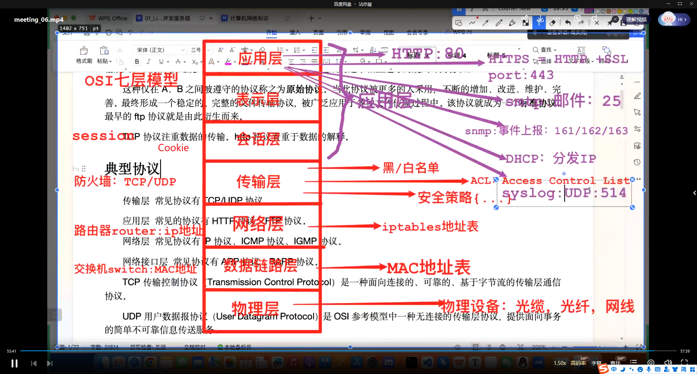

# OSI七层网络模型&TCP/IP模型

## 一层 - 物理层

#### 相关设备

- 双绞线
- 光缆

- 光纤

- 光模块

#### 作用

在不同的设备间传输数字信号。

## 二层 - 数据链路层

#### 相关设备

- 交换机
- 网卡

#### 作用

维护一张MAC地址表，保存了当前网络主机号下所有的MAC地址。

当当前的MAC地址表中没有找到相应的目的MAC时，会广播和当前交换机连接的所有主机，并更新当前的MAC地址表。

#### MAC地址格式

位数 - 6字节48位，前三个字节为生产厂商的编号，后三位随机指定。

#### 通信方式

ARP通信：

- 源IP，sip
- 目的IP，dip
- 源MAC，smac
- 目的MAC，dmac
- 协议编号。

ARP命令：

- arp -a 查看当前主机号的所有mac地址。
- arp -d 删除MAC地址ARP表。

## 三层 - 网络层

#### 相关设备

- 路由器，将光纤的光信号转换为数字信号。

#### IP地址 - IPv4和IPv6

地址格式实例：

IP地址：192.168.0.1/24

子网掩码：255.255.255.0

- IP地址分为两部分，第一部分主机位，第二部分网络位。
- IP&子网掩码：主机位，即前24位。

#### 路由器路由方式

- 静态路由：手动配置。
- 动态路由：RIP等。
- 策略路由：计算机自主学习。

#### 路由表格式

IP地址 - 下一跳/网关

#### 连接网络的过程

PC->交换机->路由器。

## 四层 - 传输层

#### 相关设备

- 防火墙

#### 相关协议

TCP - 可靠传输

UDP - 不可靠传输

## 应用层

包括应用层，表示层，会话层。

#### 相关协议

- DHCP - IP分配协议
- SNMP - 报表
- SMTP - 邮件传输协议
- HTTP/HTTPS - 超文本传输协议
- FTP - 文件传输协议
- SSH - 

## 网络应用程序的两类模型

#### C/S模式

客户端服务器模式。

网络游戏 - 资源占用多，且容易携带病毒。

大型网络游戏，缓存和资源等游戏需要用到的资源存储在本地，使用时在本地渲染。

#### B/S模式

浏览器服务器模式。

网页游戏 - 资源占用小，相对安全。

资源放在服务器，只在使用时通过网络传输和渲染。

