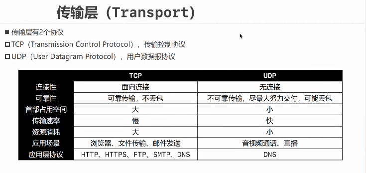
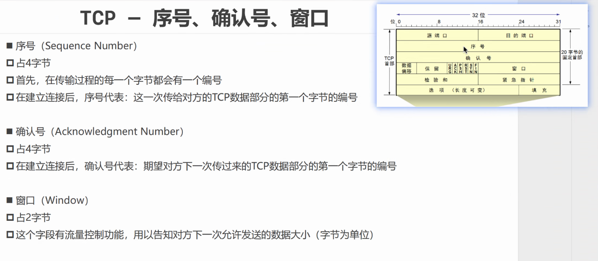
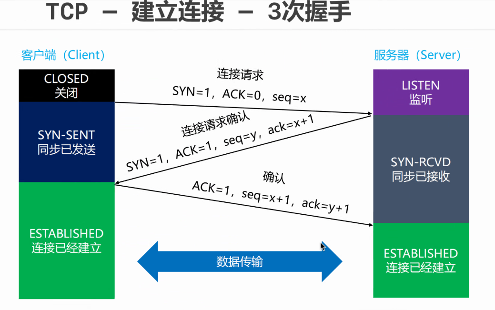
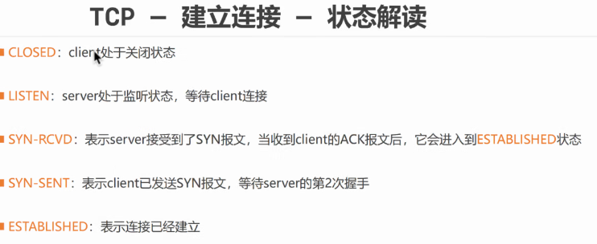
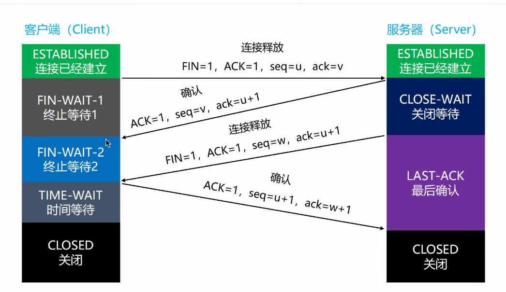
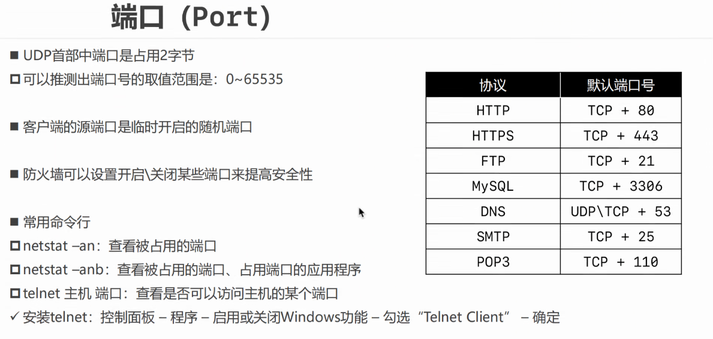
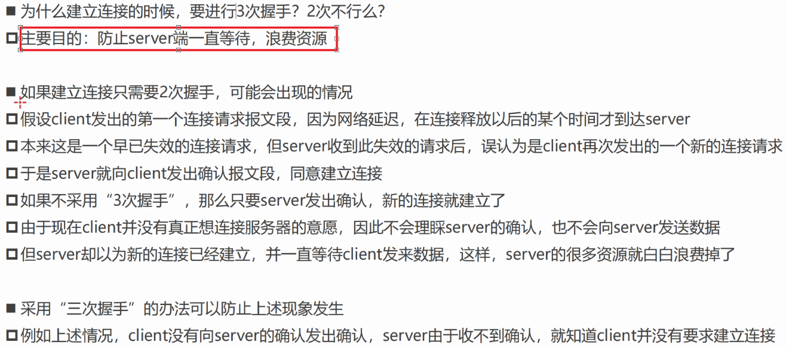

# 传输层

## 传输层的几种传输协议

### TCP和UDP协议

- 由于TCP需要解包和进行差错校验的奇偶校验码的插入，因此会更慢。

- 每1500字节，TCP协议多20个字节的大小。
- TCP包更大，因此占用带宽更多。

一般来说，上传速度比下载速度要慢很多。

#### TCP- 传输控制协议

TCP协议是面向连接的可靠传输协议，因此传输控制协议需要做到：

- 差错校验
- 可靠传输
- 连接管理
- 流量控制
- 拥塞控制

##### TCP数据格式

##### 可靠传输

TCP的可靠传输通过通知等待协议ARQ，也就是自动超时重传来实现：

接收端接收来自传输端的数据报，并及时地做出回应表示已经收到了当前数据包，当数据包发出后一段时间么有收到接收端的确认信号时，发送端就会自动重发当前数据包。

##### 流量控制

- 当接收端的缓存区已满，而发送方还在不断发送数据时，接收方会直接丢弃放不进来的数据包。
- 通过确认报文中的窗口字段大小来控制发送方的发送速率。
- 发送方的窗口大小不能大于接收方的窗口大小
- 当发送方收到接收窗口大小为0时，会自动停止发送数据

##### 拥塞控制

目的：为了放置过多的数据注入到网络中，避免网络中的路由器绘制链路堵塞。

拥塞控制需要网络全局的所有设备和协议协调工作才能实现。

##### 连接控制

###### 建立连接：

发送方会先发送一个数据包给接收方，设置SYN字段为1，ACK字段为0，seq字段为x：

- SYN字段为1，表示这是应用于一个建立连接的请求信息。

- ACK字段为0，表示发送方还没有收到连接确认。
- seq字段为x表示当前传输的是序号为x数据包。

当接收端收到来自发送方的ACK为0的数据包时，会做出确认收到当前数据包的回应，也就是可靠连接中的确认收到数据包。设置SYN字段为1，ACK字段为1，seq字段为y，ack字段为x+1：

- SYN字段为1，表示这是一个应用于建立连接的请求信息。

- ACK字段为1，表示这是当前接收端以及直到了发送端会和自己建立请求，并且接收端以及做好了建立请求的准备，向发送方发送确认字段，发送方发送一个序号为y的数据包，表示当前发送的数据包序号为y。ack确认号为x+1，表示当前接收端已经确认收到了发送端的序号为x数据。

- 当发送端收到上一个数据包时，发送端就知道接收端已经做好了建立连接的准备，但是发送端是否已经准备好发送数据对于接收端是未知的。因此，发送端再发送一个数据包，用以告知接收端已经准备好发送数据包。

  将ACK设置为1，表示发送端收到了序号为y的接收端的确认信息，并返回确认号y+1给接收端。

至此，数据发送的连接才算建立完成。

###### 连接的状态：

###### 断开连接：

与建立连接的过程类似，FIN为1表示连接释放，ACK为1表示数据包确认信息。

当最后一个数据包传输完毕，且收到发送方的连接释放信号，接收端会发送一个确认收到连接释放的数据包以及接收端释放连接的数据包给发送端。由于可靠传输的特性，当发送端确认收到接收端的连接释放数据包时才算传输断开结束。

#### UDP - 用户数据包协议

首先，UDP是无连接的协议，减少了建立和释放连接的开销。也正是因为这种情况，UDP的传输是不可靠的，经常会出现数据的丢失，因此良好的差错校验是必须的。

但是由于UDP协议是面向无连接的协议，因此在发现数据包出错之后，数据包会直接被丢弃，并要求重发。

UDP传输协议的数据格式：

首部 - 8字节：

- 2字节源端口号
- 2字节目的端口号
- 2字节UDP长度
- 2字节UDP校验和

自下而上从网络层传输上来的数据字段中的源IP地址、目的IP地址和UDP长度组成一个伪首部，这个伪首部与UDP首部和数据字段共同计算出一个检验和存储到UDP首部中。

UDP协议的数据字段就是首部加上数据字段。

## 传输层识别数据传输位置的标志 - 端口号

## 常问的面试题

