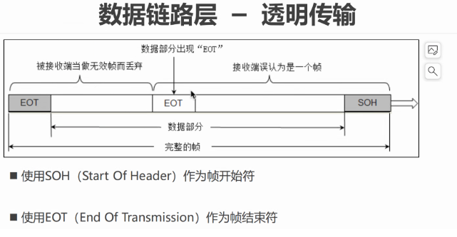
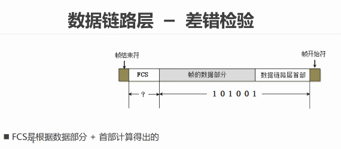
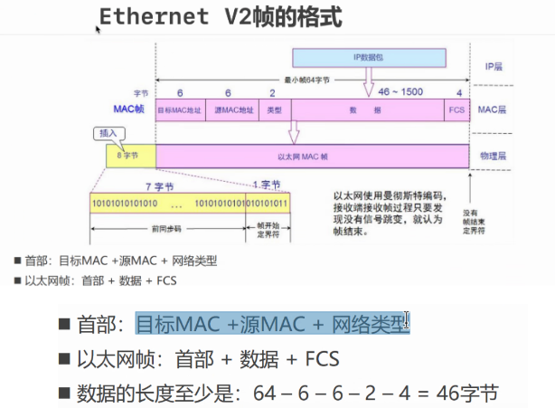
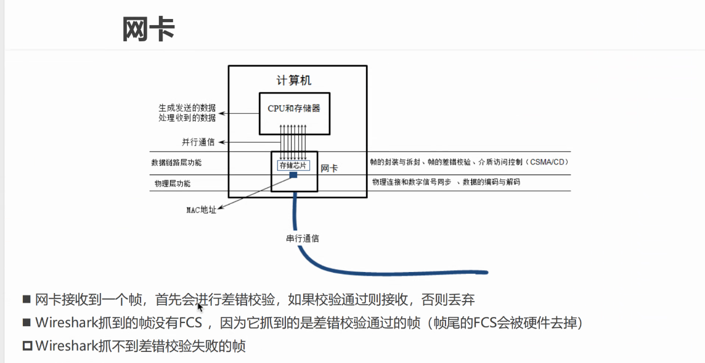

# 二层 - 数据链路层

## 相关概念

链路 - 从一个节点到相邻的节点的一端物理路线，中间没有其他的交换节点。

数据链路 - 在一条链路上传输数据时，需要有对应的通信协议来传输，而不同的类型的数据链路，所使用的通信协议可能会不同：

- 广播 - CSMA/CD协议，例如集线器、同轴电缆之间的信道
- 点对点通信 - PPP协议，例如路由器之间的信道

## 数据链路层需要解决的问题

### 封装成帧

帧：数据链路层传输数据的单位，或者说是将上层网络层传输下来的数据包加上一个帧头、帧尾、帧结束符和帧开始符。

值得注意的是，数据链路层有一个最大传输单元MTU：

- 每一种书籍链路层的传输协议都规定了锁传输的帧的数据长度的上线。
- 以太网的传输上限是`1500`个字节。

### 透明传输

 

### 差错校验

## 二层的数据格式

在以太网中，对于数据链路层的数据帧格式规定了以下内容：

数据链路层在上层网络层传输下来的数据包的基础上，添加了一下数据字段：

- 首部：包括目的MAC地址，源MAC地址以及传输的网络类型，共14个字节。

- 尾部加上4个字节的FCS。

- 当数据部分的长度小于46字节时：

  传送端会在数据的后面添加一些填充字节；

  接收端会将填充字节删去。

- 以太网的数据帧长度在46 - 1500字节，加上数据链路层添加的18个字节的首部和FCS共64 - 1518个字节。

在物理层时：

- 会在64 - 1518个字节的数据帧前加上：首部前面加上8个字节的同步吗以及帧开始的界定符，用于在目的设备上解包。

## 二层的设备 - 网卡

网络抓包工具：WireShark。

DPDK：将网卡抓到的包复制到DPDK(应用层协议栈)。

