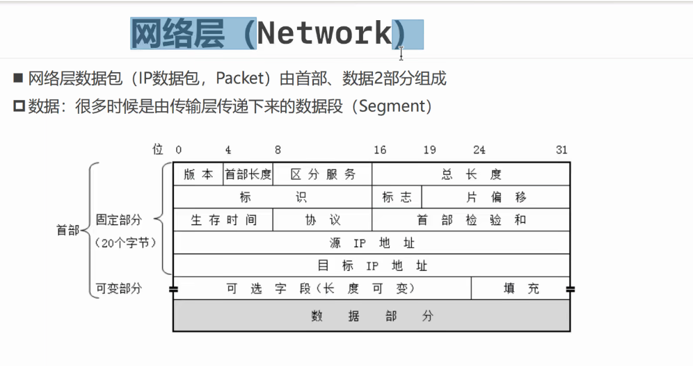
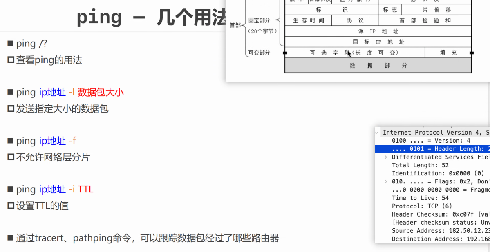

# 三层 - 网络层

## 网络层的数据格式

1. **版本（Version）**：4位。指示网络层协议的版本号，如 IPv4 或 IPv6。
2. **头部长度（Header Length）**：4位。指示网络层头部的长度，以 32 位字（4 字节）为单位。
3. **服务类型（Service Type）**：8位。用于指示数据包的服务质量要求，包括优先级、延迟、吞吐量和可靠性等。
4. **总长度（Total Length）**：16位。指示整个数据包的长度，包括网络层头部和数据部分。
5. **标识（Identification）**：16位。用于唯一标识数据包的序号，用于数据包的分片和重组。
6. **标志（Flags）**：3位。包括分片标志（DF）、更多分片（MF）和保留位（Reserved）。
   - DF（Don't Fragment）：如果设置为1，则禁止数据包进行分片。
   - MF（More Fragments）：如果设置为1，则表示还有更多分片。
7. **片偏移（Fragment Offset）**：13位。指示当前数据包在原始数据报中的偏移量，用于数据包的重组。
8. **生存时间（Time to Live，TTL）**：8位。指示数据包在网络中的最大生存时间（跳数），每经过一个路由器 TTL 减1，当 TTL 为0时数据包被丢弃。
9. **协议（Protocol）**：8位。指示上层协议，如 ICMP（1）、TCP（6）、UDP（17）等。
10. **头部校验和（Header Checksum）**：16位。用于校验网络层头部的完整性，防止头部被篡改或损坏。
11. **源 IP 地址（Source IP Address）**：32位。指示数据包的源 IP 地址。
12. **目标 IP 地址（Destination IP Address）**：32位。指示数据包的目标 IP 地址。
13. **可选字段**：
14. **填充**：

## ping命令 - 判断网络连通性

默认传输64字节

