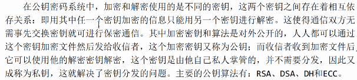

# OpenSSL

## 什么是OpenSSL

OpenSSL 是一个开源的密码学工具包，提供了各种加密算法和协议的实现，包括 SSL/TLS 协议、对称加密算法、非对称加密算法、哈希函数等。它最初是为了提供安全套接字层（SSL）和传输层安全（TLS）协议的实现而创建的，用于加密网络通信，保护数据的机密性和完整性。

OpenSSL 提供了丰富的功能和工具，包括：

1. **SSL/TLS 协议实现**：OpenSSL 提供了 SSL/TLS 协议的实现，使得应用程序可以使用 SSL/TLS 协议来建立安全的通信连接。
2. **加密算法**：OpenSSL 支持多种对称和非对称加密算法，如 AES、DES、RSA、DSA、ECC 等。
3. **数字证书**：OpenSSL 支持 X.509 数字证书的生成、管理和验证，用于身份验证和加密密钥交换。
4. **哈希函数**：OpenSSL 提供了常用的哈希函数，如 SHA-1、SHA-256、MD5 等，用于数据完整性校验和消息摘要。
5. **SSL/TLS 客户端和服务器工具**：OpenSSL 提供了命令行工具，用于创建 SSL/TLS 客户端和服务器，以便进行测试和调试。
6. **安全套接字编程接口**：OpenSSL 提供了 C 语言的 API，使开发人员可以在应用程序中直接使用 OpenSSL 的功能来实现安全的通信。
7. **加密随机数生成器**：OpenSSL 提供了用于生成安全的伪随机数的函数和工具，用于密码学应用中的密钥生成和加密过程中的随机性要求。

总的来说，OpenSSL 是一个功能强大的密码学工具包，被广泛应用于网络安全领域，为应用程序提供了安全通信和数据保护的基础设施。

## 对称加密

加密产生的秘文长度与明文传播的股相同

- CBC
- CFP
- OFB
- ...

#### 摘要算法

能产生特殊输出格式，无论用户输入什么长度的原始数据，得到的秘文长度都是固定的。

被摘要的数据内容与源数据密切相关，只要原始数据稍有改变，输出的摘要边完全不同。

- MD2
- MD4
- MD5 
- SHA
- SHA-1/266/512

最常用的加密算法就是MD5和SHA1：

- MD5输出16字节

- SHA1输出20字节

  git log的commitid的加密算法就是SHA1，出错率一亿分之一

  git版本回退：git reset --hard [commitid]

#### 公钥算法

主要公钥算法：RSA、DSA、DH、ECC

ssh公钥

ssh-keygen生成ssh公钥，存放在.ssh文件夹中

ssh公钥算法RSA

##### RSA加密算法

- 可以用于数字加密和数字签名。

#### 回调函数

OpenSSL使用了大量的回调函数

随机数就是通过OpenSSL生成的

HTTPS = HTTP + SSL

HTTP协议不安全，因此使用了SSL加密算法对HTTP协议进行了升级。

AF，AC可以对HTTPS进行破解

HTTPS端口号443

