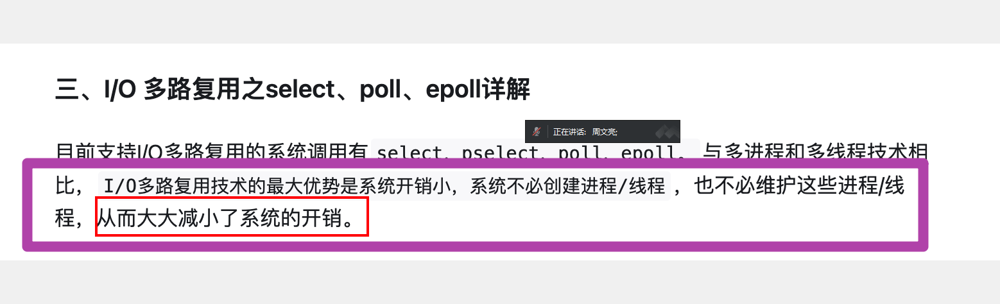
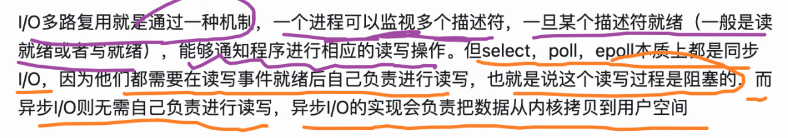

# 并发

参考

[IO多路复用——深入浅出理解select、poll、epoll的实现 - 知乎 (zhihu.com)](https://zhuanlan.zhihu.com/p/367591714)

多路：多个socket网络连接。

复用：复用一个线程，使用一个线程来检查多个文件描述符(socket)的就绪状态。

现阶段多路复用的常用技术：select，poll，epoll。

select：具有超强的跨平台特性。

## IO模式

- 阻塞IO
- 非阻塞IO
- 信号驱动IO
- 异步IO
- IO多路复用

## 并发方式一 - pthread_create

方式：每一个客户端进来，服务器开一个线程。

开辟线程并发的缺点：

频繁开辟和销毁线程是一个非常影响效率的事情。

客户端无节制地涌入，无法保证资源的使用。

## 并发方式二 - 多路复用 select

select能够实现单进程并发：如单进程数据库redis。底层使用动态数组实现，其本质是一个阻塞函数。





优点：

- 跨平台，适用于mac，linux，windows

缺点：

- 能够监视的文件描述符数量有限制，最多1024个

select需要解决的缺陷：

1. 每次调用select，都需要把被监控的fds集合从用户态空间拷贝到内核态空间，高并发场景下这样的拷贝会使得消耗的资源是很大的。
2. 能监听端口的数量有限，单个进程所能打开的最大连接数由FD_SETSIZE宏定义，监听上限就等于fds_bits位数组中所有元素的二进制位总数，其大小是32个整数的大小（在32位的机器上，大小就是3232，同理64位机器上为3264），当然我们可以对宏FD_SETSIZE进行修改，然后重新编译内核，但是性能可能会受到影响，一般该数和系统内存关系很大，具体数目可以`cat /proc/sys/fs/file-max`察看。32位机默认1024个，64位默认2048。
3. 被监控的fds集合中，只要有一个有数据可读，整个socket集合就会被遍历一次调用sk的poll函数收集可读事件：由于当初的需求是朴素，仅仅关心是否有数据可读这样一个事件，当事件通知来的时候，由于数据的到来是异步的，我们不知道事件来的时候，有多少个被监控的socket有数据可读了，于是，只能挨个遍历每个socket来收集可读事件了。
4. 在内核态下用轮训的方式检查需要读的文件描述符。

#### select系统调用的使用

```c
int select (int n, fd_set *readfds, fd_set *writefds, fd_set *exceptfds, struct timeval *timeout);
```

##### 函数参数

- readfds：内核检测该集合中的IO是否可读。如果想让内核帮忙检测某个IO是否可读，需要手动把文件描述符加入该集合。
- writefds：内核检测该集合中的IO是否可写。同readfds，需要手动把文件描述符加入该集合。
- exceptfds：内核检测该集合中的IO是否异常。同readfds，需要手动把文件描述符加入该集合。
- nfds：以上三个集合中最大的文件描述符数值 + 1，例如集合是{0,1,5,10}，那么 maxfd 就是 11
- timeout：用户线程调用select的超时时长。
  - 设置成NULL，表示如果没有 I/O 事件发生，则 select 一直等待下去。
  - 设置为非0的值，这个表示等待固定的一段时间后从 select 阻塞调用中返回。
  - 设置成 0，表示根本不等待，检测完毕立即返回。

##### 函数返回值

- 大于0：成功，返回集合中已就绪的IO总个数
- 等于-1：调用失败
- 等于0：没有就绪的IO

##### 操作select文件集合的函数

```cpp
// 将文件描述符fd从set集合中删除 
void FD_CLR(int fd, fd_set *set); 

// 判断文件描述符fd是否在set集合中 
int  FD_ISSET(int fd, fd_set *set); 

// 将文件描述符fd添加到set集合中 
void FD_SET(int fd, fd_set *set); 

// 将set集合中, 所有文件描述符对应的标志位设置为0
void FD_ZERO(fd_set *set);
```

##### select系统调用的过程

首先创建一个readfds作为select的传出参数的读集合，并将当前服务器的通信句柄加入到读集合中。

并且每当有客户端需要跟服务器通信时，便将客户端的通信句柄加入到readfds读集合中。

随后将当前的读集合作为传出参数使用select系统调用，函数执行过程中会自动检测哪些通信句柄此时具备读取请求，并检测是否可读，例如：

传入：文件描述符3,4,5,6,7,8。
传出：文件描述符3,5,7。

注意到当前传出参数的读集合中有文件描述符3，说明有客户端跟服务器连接。

并且次数读事件中有5和7，说明5号和7号通信句柄所表示的客户端需要跟服务器通信。

接下来处理这些请求即可。

**值得注意的是：**

readfds作为传出参数在select内部会改变readfds的值，如果直接使用这部分参数直接参与系统调用，则会丢失一部分客户端的文件描述符。下次客户端再次需要跟服务器通信则需要重新开辟空间，这显然是不合理的，因此需要复制这部分数据，使用备份的数据进行系统调用。

## 并发方式三 - epoll

epoll：只适用于linux。其优势是的性能强。底层数据结构使用红黑树实现。

与select不同的是，虽然epoll没有跨平台的特性，但是由于其底层使用红黑树实现，性能比起select更强。因此支持更多的线程挂载到服务器上，没有数量限制。

**epoll的函数主要有以下三个**

epoll_create：创建一个epoll句柄

epoll_ctl：向epoll对象中添加、修改删除要管理的连接

epoll_wait：等待其管理的连接上的 IO 事件

**epoll_create 函数**

```c
int epoll_create(int size);
```

- **功能：**该函数生成一个 epoll 专用的文件描述符。
- **参数size:** 用来告诉内核这个监听的数目一共有多大，参数 size 并不是限制了 epoll 所能监听的描述符最大个数，只是对内核初始分配内部数据结构的一个建议。自从 linux 2.6.8 之后，size 参数是被忽略的，也就是说可以填只有大于 0 的任意值。
- **返回值：**如果成功，返回poll 专用的文件描述符，否者失败，返回-1。

**epoll_ctl 函数**

```c
int epoll_ctl(int epfd, int op, int fd, struct epoll_event *event); 
```

- **功能：**epoll 的事件注册函数，它不同于 select() 是在监听事件时告诉内核要监听什么类型的事件，而是在这里先注册要监听的事件类型。
- **参数epfd:** epoll 专用的文件描述符，epoll_create()的返回值
- **参数op:** 表示动作，用三个宏来表示：

1. EPOLL_CTL_ADD：注册新的 fd 到 epfd 中；
2. EPOLL_CTL_MOD：修改已经注册的fd的监听事件；
3. EPOLL_CTL_DEL：从 epfd 中删除一个 fd；

- **参数fd:** 需要监听的文件描述符
- **参数event:** 告诉内核要监听什么事件，struct epoll_event 结构如:
- **events****可以是以下几个宏的集合：**
- EPOLLIN ：表示对应的文件描述符可以读（包括对端 SOCKET 正常关闭）；
- EPOLLOUT：表示对应的文件描述符可以写；
- EPOLLPRI：表示对应的文件描述符有紧急的数据可读（这里应该表示有带外数据到来）；
- EPOLLERR：表示对应的文件描述符发生错误；
- EPOLLHUP：表示对应的文件描述符被挂断；
- EPOLLET ：将 EPOLL 设为边缘触发(Edge Trigger)模式，这是相对于水平触发(Level Trigger)来说的。
- EPOLLONESHOT：只监听一次事件，当监听完这次事件之后，如果还需要继续监听这个 socket 的话，需要再次把这个 socket 加入到 EPOLL 队列里
- **返回值：**0表示成功，-1表示失败。

**epoll_wait函数**

```c
int epoll_wait(int epfd, struct epoll_event * events, int maxevents, int timeout); 
```

- **功能：**等待事件的产生，收集在 epoll 监控的事件中已经发送的事件，类似于 select() 调用。
- **参数epfd:** epoll 专用的文件描述符，epoll_create()的返回值
- **参数events:** 分配好的 epoll_event 结构体数组，epoll 将会把发生的事件赋值到events 数组中（events 不可以是空指针，内核只负责把数据复制到这个 events 数组中，不会去帮助我们在用户态中分配内存）。
- **参数maxevents:** maxevents 告之内核这个 events 有多少个 。
- **参数timeout:** 超时时间，单位为毫秒，为 -1 时，函数为阻塞。
- **返回值：**

1. 如果成功，表示返回需要处理的事件数目
2. 如果返回0，表示已超时
3. 如果返回-1，表示失败

epoll的两种触发方式 - 边缘触发和水平触发

epoll水平触发(LT)：只要读缓冲区不为空，写缓冲区不满，那么epoll_wait就会一直返回就绪，水平触发是epoll的默认工作方式

epoll边缘触发(ET)：