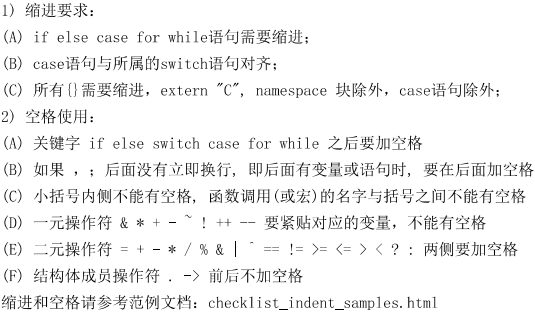
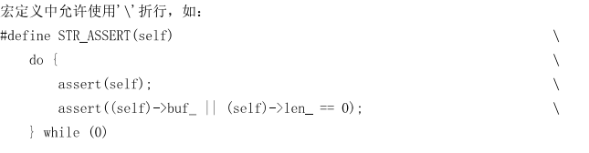
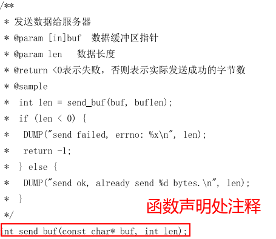

## 1. 缩进

- 一元操作符紧贴被操作数。
- 二元操作符两端加空格。
- 后面紧跟括号的条件、分支、循环语句等，与括号之间加一个空格。
- `case`语句跟`switch`语句在列上对齐。

## 2. 语句

**`int num1 = 10, num2 = 20;` 这类语句理应被禁止。**

## 3. 大括号

- 左花括号`{`与右花括号`}`应该独占一行。
- 左花括号`{`与上一条语句的起始位置对齐。
- 右花括号`}`与左花括号`{`。
- 且左花括号`{`与右花括号`}`里面的语句应该缩进，但是除了`switch`语句里的`case`与`default`。

## 4. 代码长度与折行符`\`

- 似乎只有在`宏定义`中才不得不使用折行符。
- 过长的字符串可以用`"string1"`<回车>`"string2"`代替使用折行符。
- 过长的的函数参数列表可以使用多行对齐的方式。

## 5. 注释

- 注释应该解释的是代码中无法直接反映出来的信息。例如：

  - 参数返回值的含义、约束。
  - 外部数据的含义、约束。
  - 函数、模块之间的协作关系。
  - 多个变量、函数之间的关系。

- 必须添加的注释有：

  - 文件头：解释功能、文件修改日期、修改内容等。
  - 全局变量：解释功能。
  - 常量：解释功能。
  - 类型：包括枚举、结构体等自定义类型。
  - 宏定义：解释功能。
  - 函数：解释功能、参数与返回值的意义。
  - 循环、分支、控制语句：解释功能和判断条件。

  

## 6. 命名

- 函数与变量需要`驼峰式`命名。
- 较重要，作用周期较长的变量需要`完整地反映它的作用`。
- 较简单，作用周期较短的变量使用`一个单词`命名。
- 命名应该使用由`英语`命名。
- 变量不应该容易混淆，例如`size`和`count`。
- 指针变量必须以`p`或者`ptr`开始。
- **避免应该变量用于多个用途。**

## 7. 避免魔数

- C语言中，除了`int`类型的变量，其余不能出现除了`-1,0,1`以外的数字。需要用宏定义替代，且宏定义的数字也应该是`2的倍数`。
- 函数返回值应该也只有`-1,0,1`，以及`枚举`类型。

## 8. static与extern

- 静态函数的声明和定义都在源文件中，且声明在宏的后面，其他成员函数的前面。
- 只在当前文件中使用的变量和函数用`static`修饰。
- 使用其他文件中的变量和函数用`extern`修饰。

## 9. 函数

- 函数`参数`尽可能少。
- `参数传递`尽可能使用`指针`，传递`地址`而不是`传值`。
- 函数命名尽可能反映函数的意图。
- 避免函数代码冗余。
- 尽可能`封装`冗余代码。
- 能在函数内部使用`传出参数`发出的讯息不要使用`返回值`。
- 返回值为`0`或者`>0`一般表示函数执行成功。
- 用`指针`替代`数组`。

## 10. 传出参数与传入参数

传入参数：

- 在函数内部不修改参数的值。
- 必须使用`const`修饰。

传出参数：

- 在函数内部需要修改参数的值。

## 11. 宏

- 宏里有可能引起优先级不确定问题的运算符时，必须有完备的括号。
- 函数头文件的编译开关必须用宏定义。

